# 矩阵的秩

## 1. 矩阵是由线性房产证的解演化而来的，初等行变化不改变矩阵的秩·

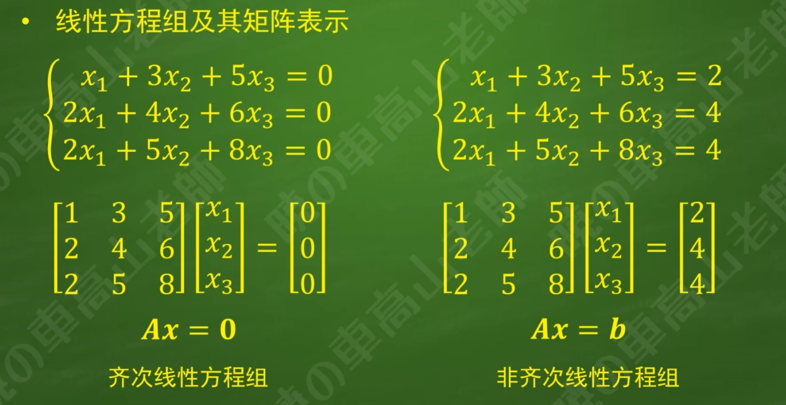
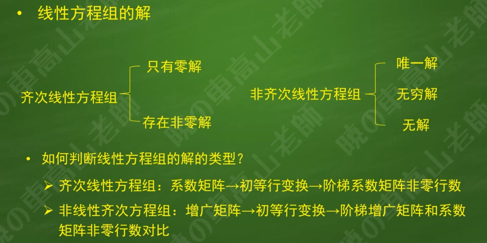

## 2. 初等行变化不改变矩阵的秩，矩阵的秩不超过矩阵的行数

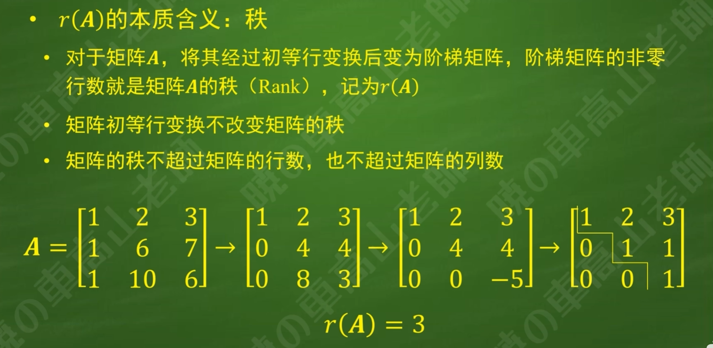

## 3. 线性方程组的解可以用秩来表达，n代表未知数的个数

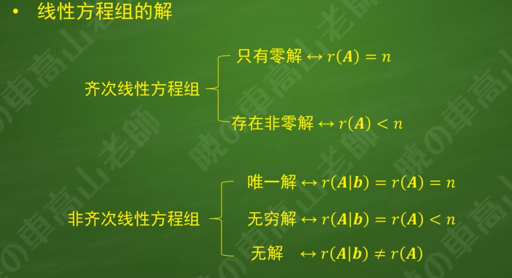
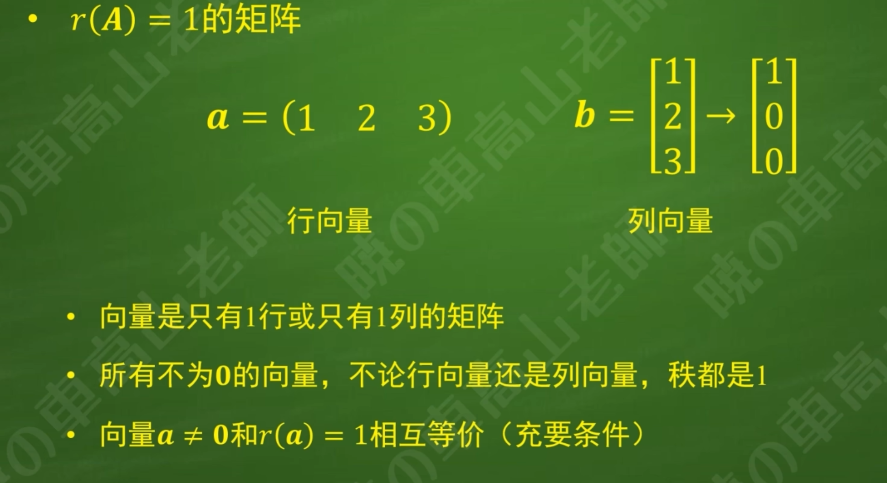

# 矩阵的乘法

## 1. 矩阵的乘法可以看作向量之间的复合映射

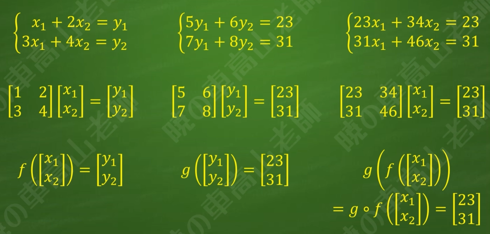
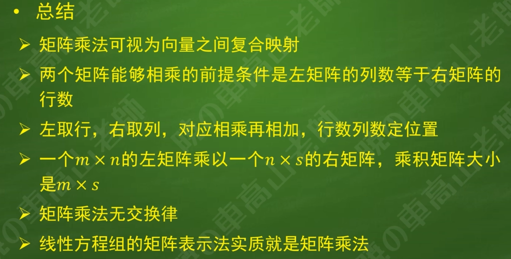

## 2. 零矩阵，原命题和逆否命题的真假性相同

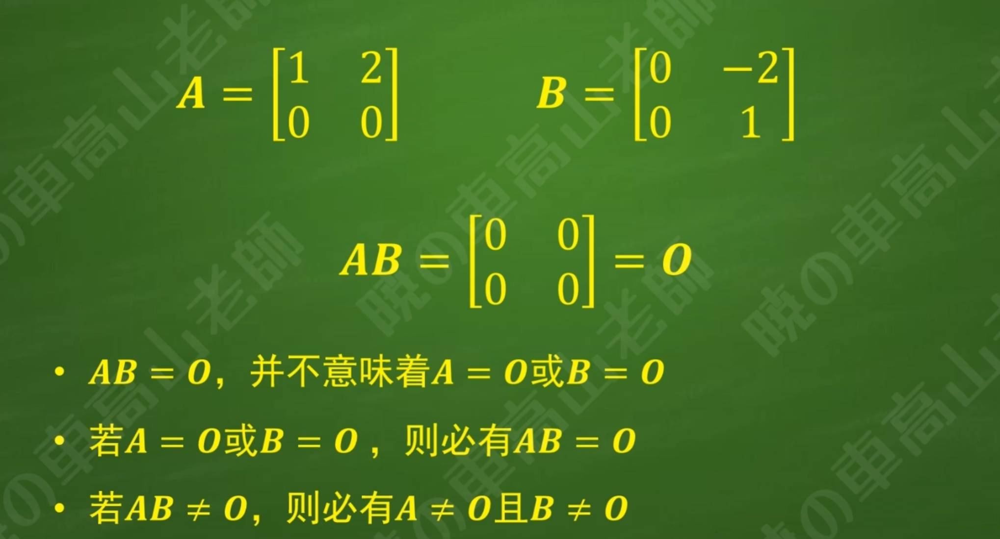

## 3. 对角阵

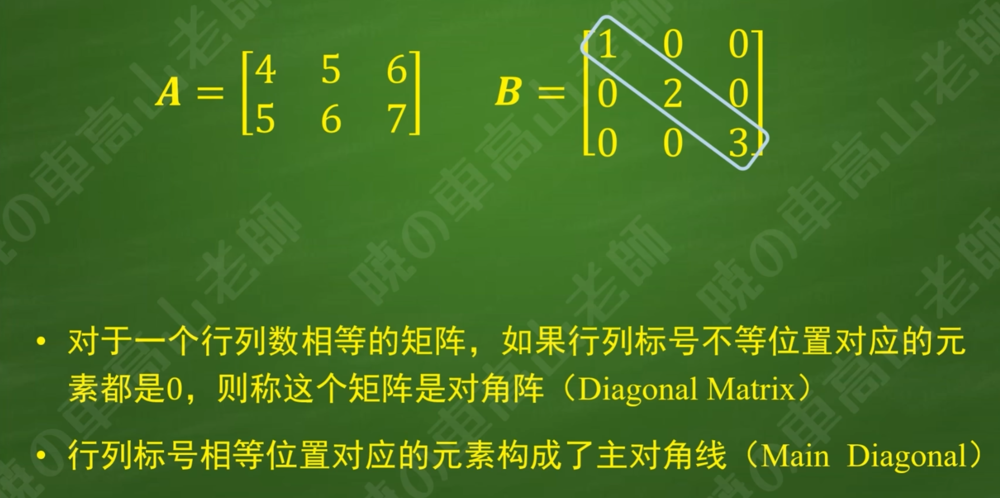

## 4. 单位阵，前乘和后乘的结果都为原矩阵

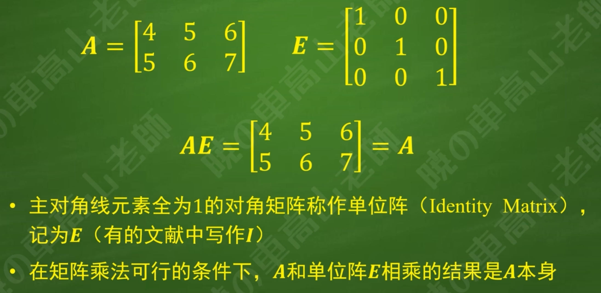

## 5. 向量和矩阵

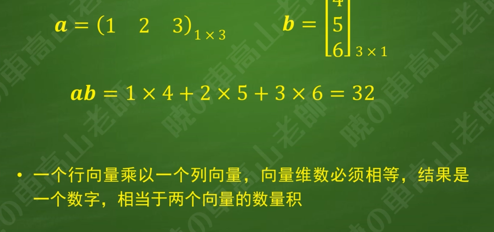
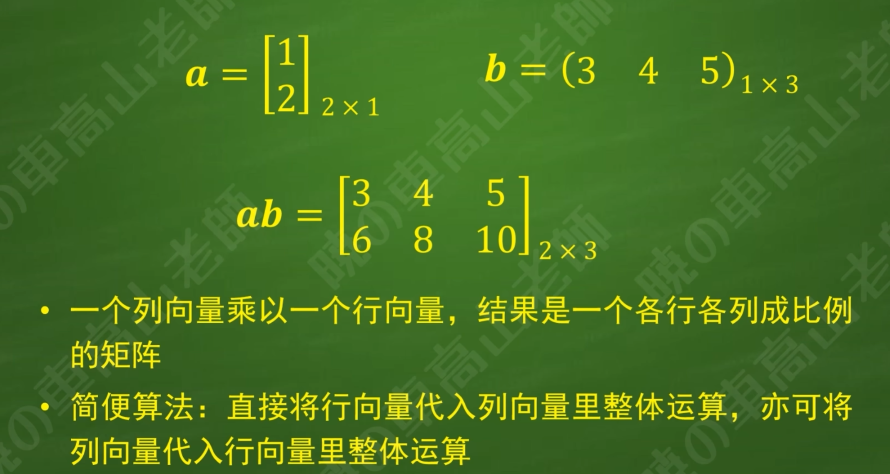
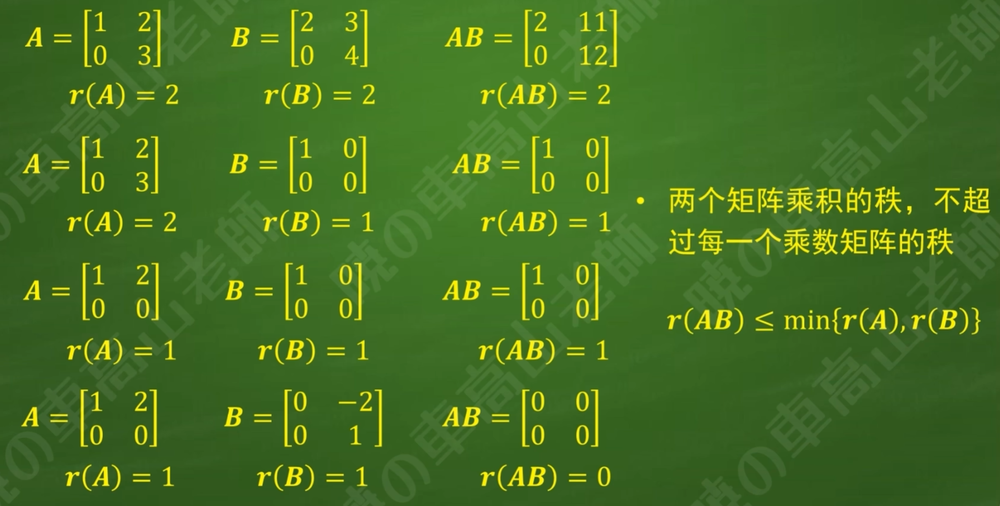
