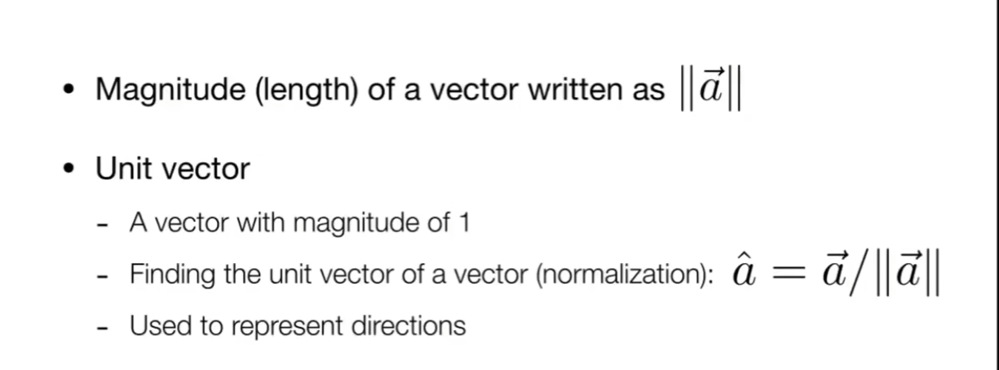
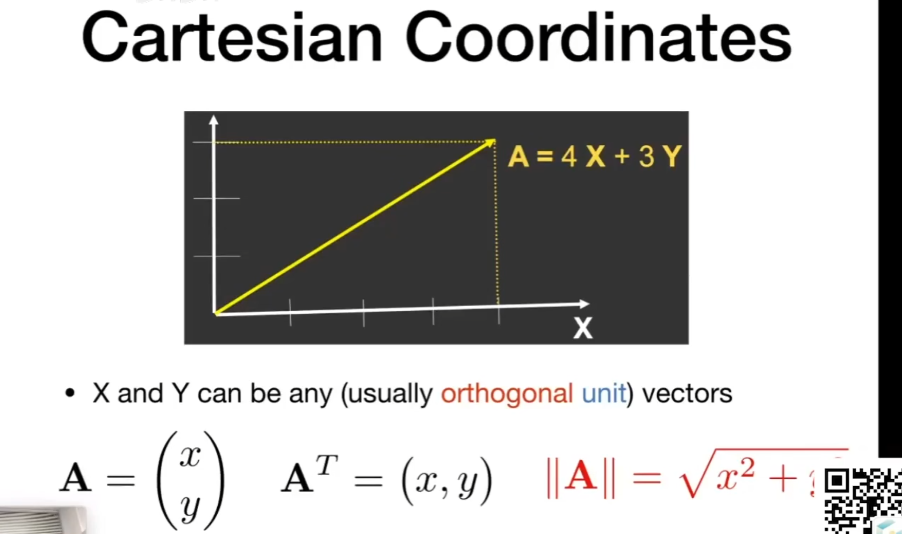
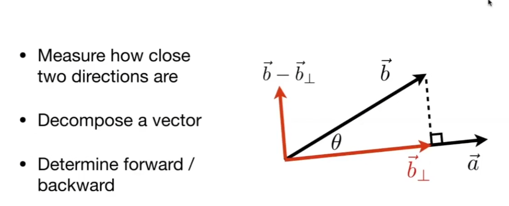

# 向量的定义

## 数学喜欢叫向量，物理喜欢叫矢量，有大小和方向

# 加法

## 向量的加法有平行四边形法则，三角形法则（首尾相连）

# 点积

## 向量可以用笛卡尔坐标系去表示，向量x和y默认都是列向量（教科书上经常是用行向量表示），向量的转置就是列向量和行向量的转换

## 向量的点乘经常用来算向量之间的夹角（通过余弦求夹角），向量满足交换律，结合律，分配律

## b在a上的投影

## b和a的垂直向量

## 检测看到的方向

