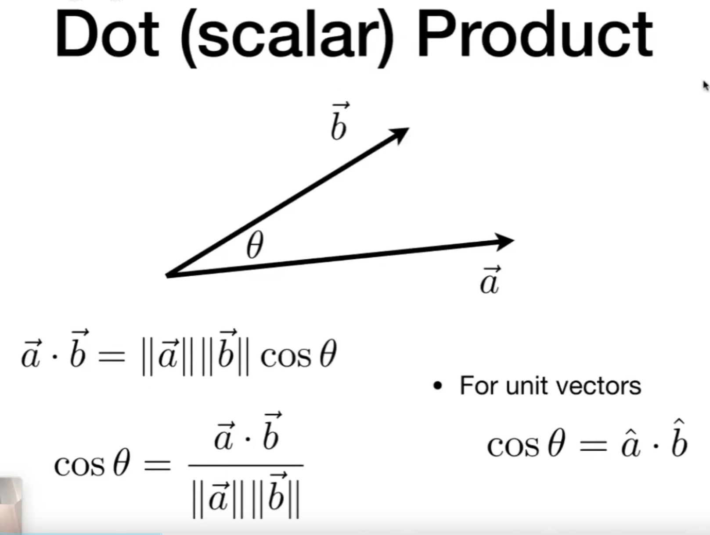
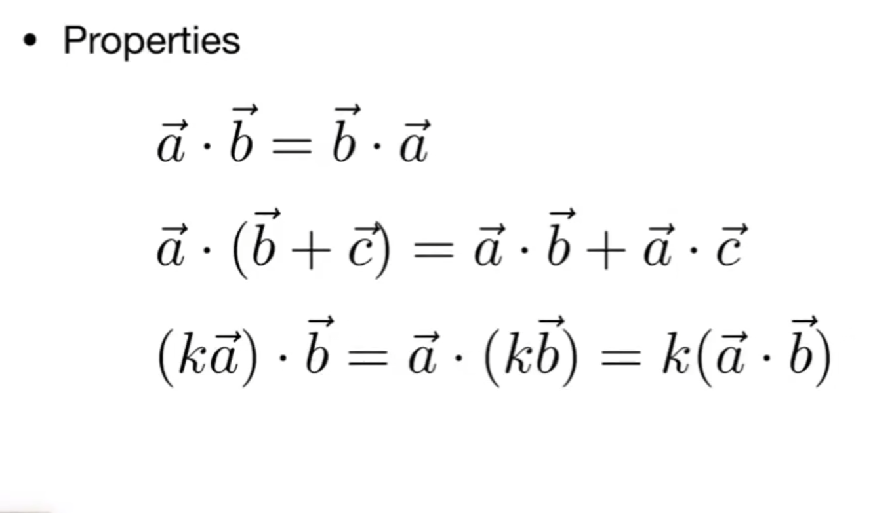
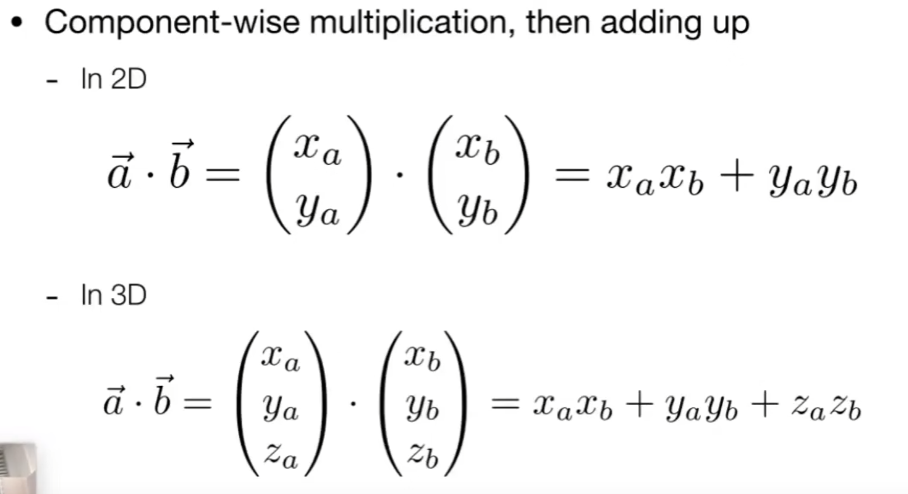
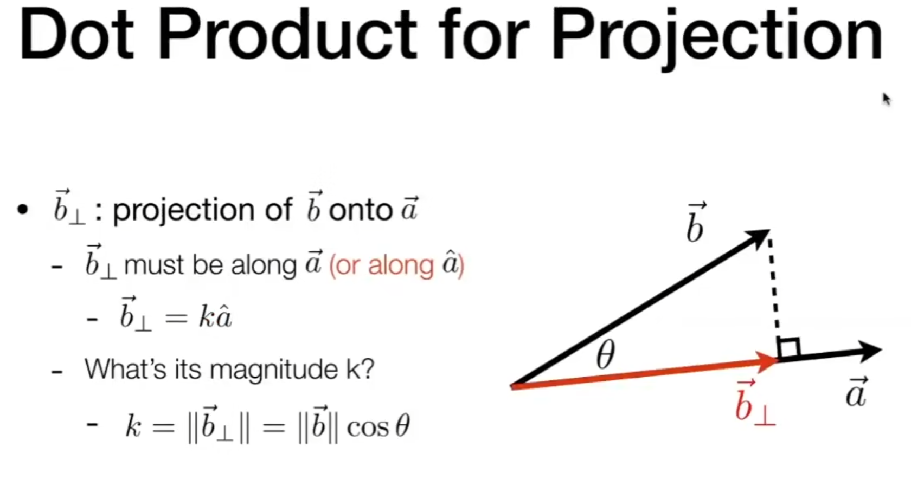
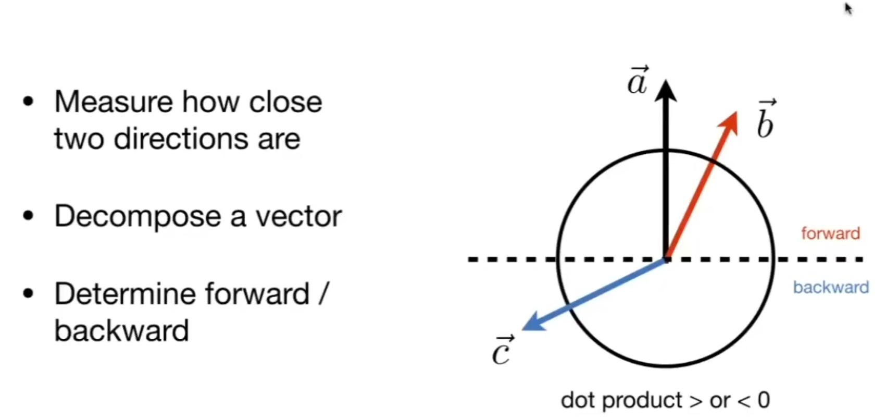
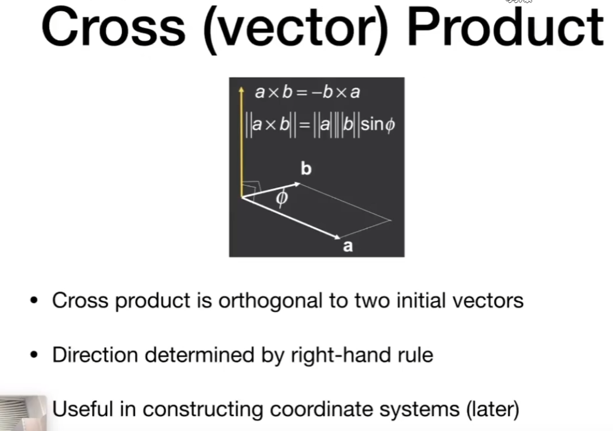
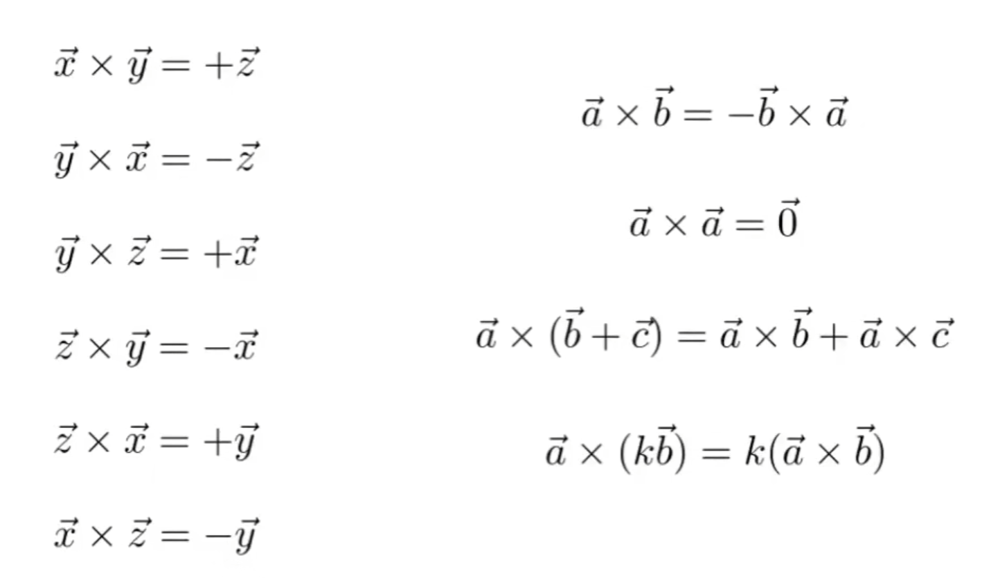
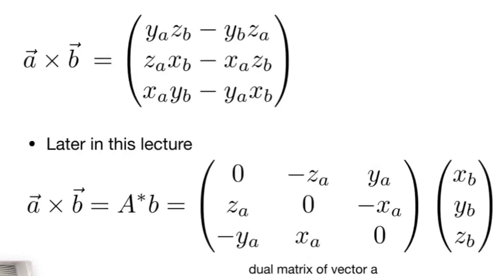
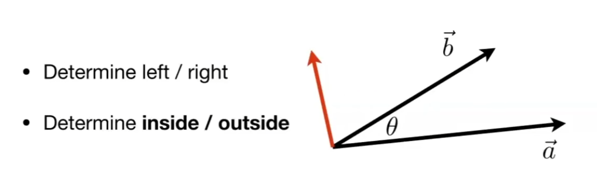

# 向量的定义

## 数学喜欢叫向量，物理喜欢叫矢量，有大小和方向

# 加法

## 向量的加法有平行四边形法则，三角形法则（首尾相连）

# 点积（点乘）

## 1. 向量可以用笛卡尔坐标系去表示，向量x和y默认都是列向量（教科书上经常是用行向量表示），向量的转置就是列向量和行向量的转换

## 2. 向量的点乘经常用来算向量之间的夹角（通过余弦求夹角），向量满足交换律，结合律，分配律

## 3. b在a上的投影

## 4. b和a的垂直向量

## 5. 检测看到的方向

# 叉积（叉乘）

## 1. 叉乘的结果也是一个向量，下图描述了它的大小并没有定义出它的方向，大小就是a向量和b向量围成的平行四边形面积

## 2. 叉乘的方向垂直于两个向量所在的平面（经常用来计算法线），可以用右上螺旋定则判断方向（右手坐标系，反之左手坐标系）

## 3. 不满足交换律

## 4. 向量的代数公式，也可以用矩阵去表示

## 5. 判断左和右

