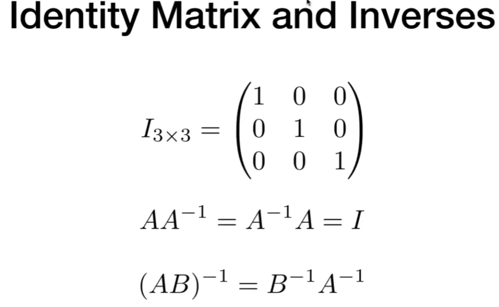
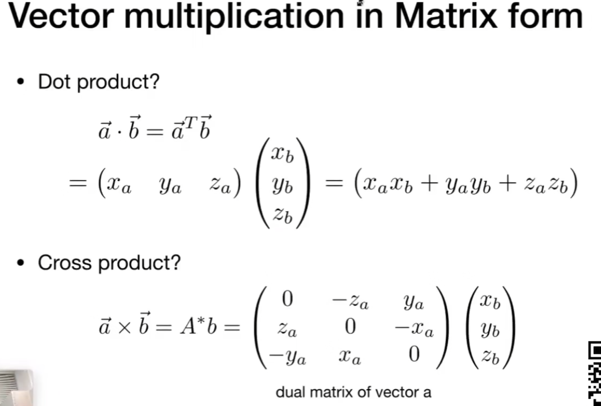
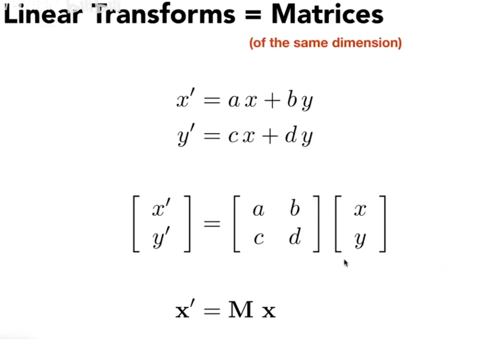
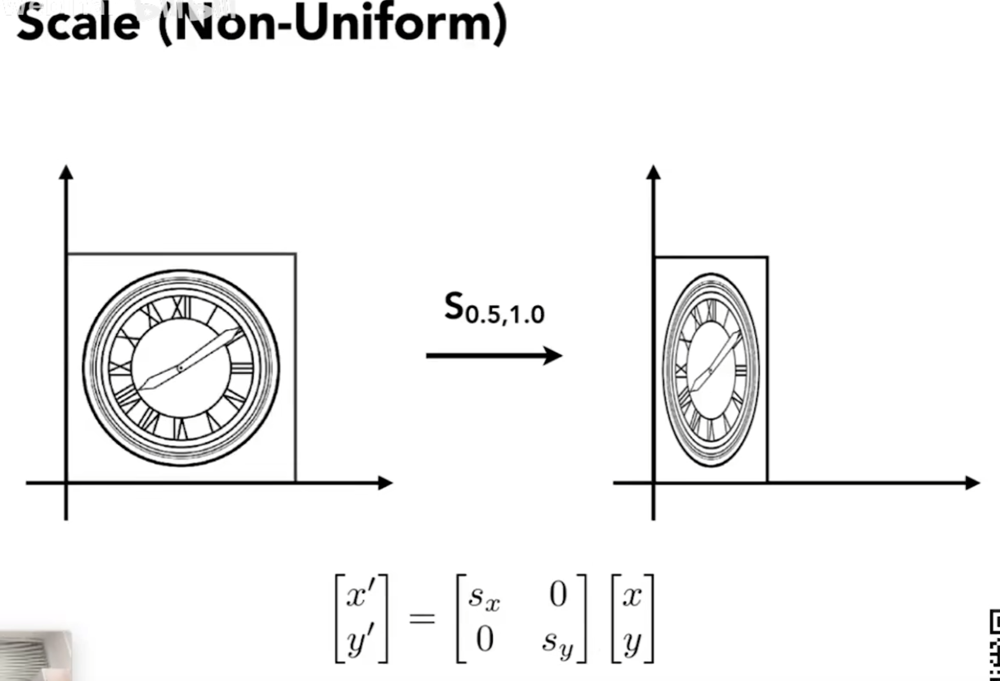
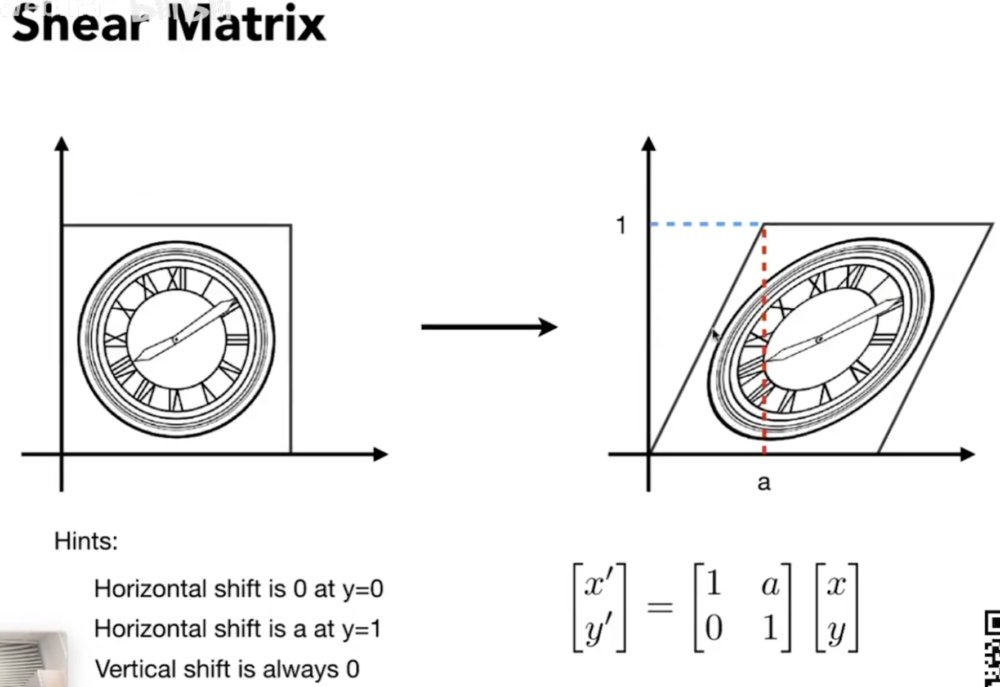
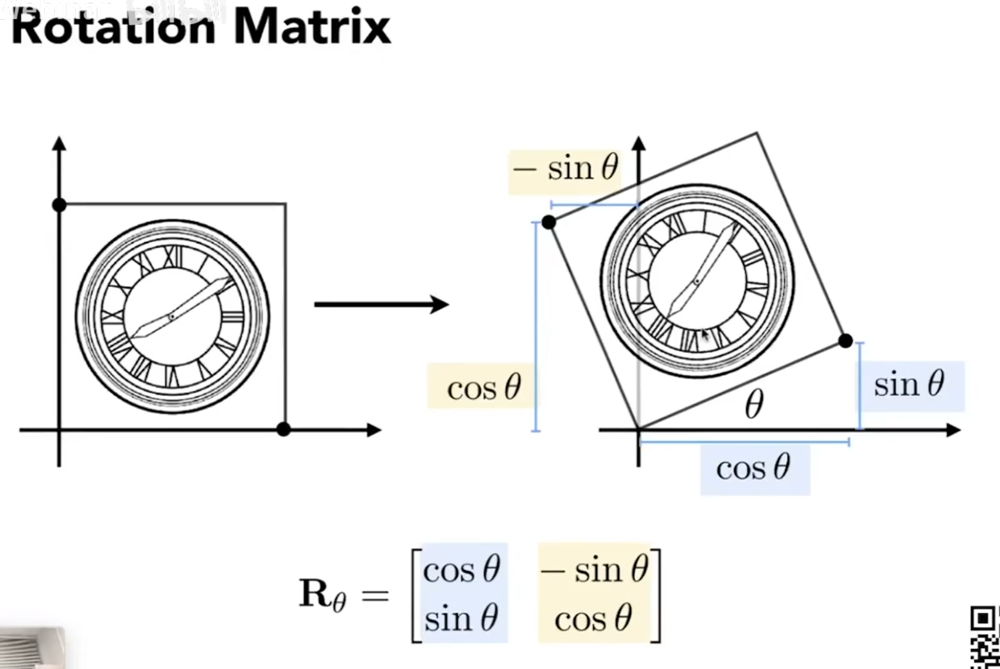
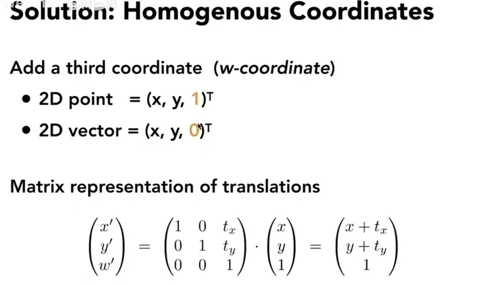
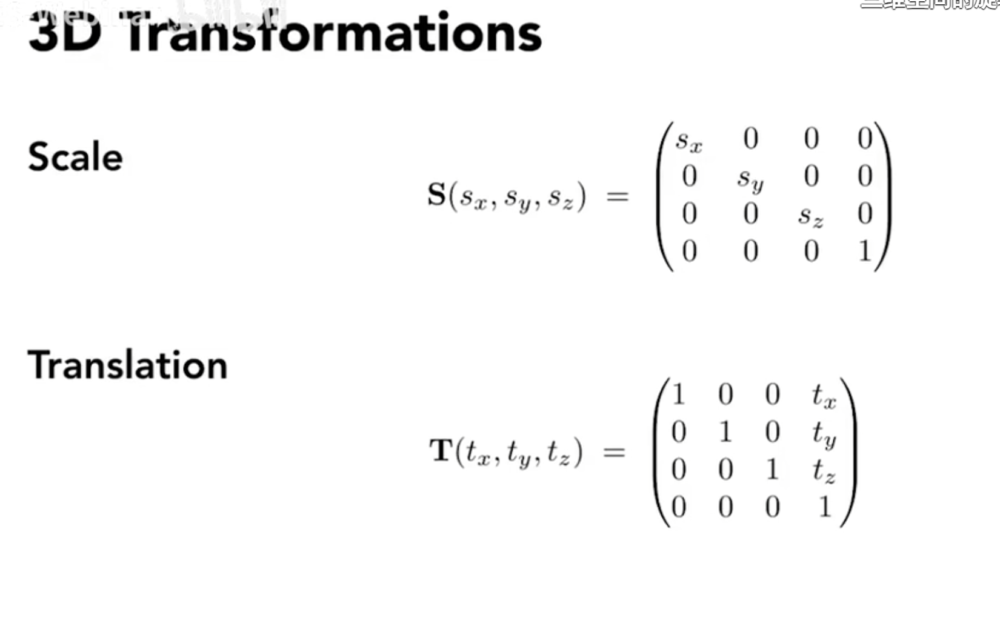
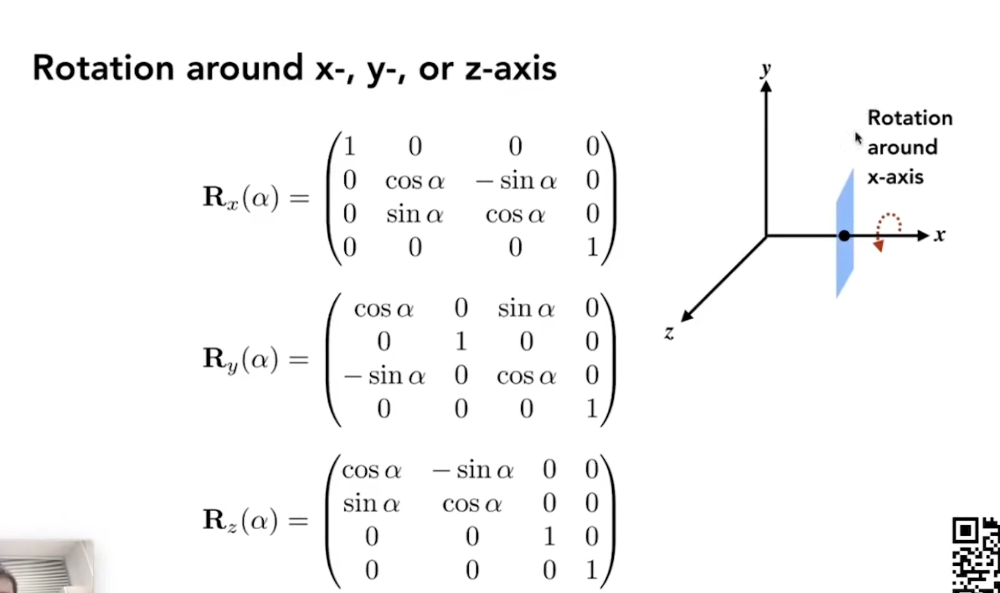

# 矩阵

## 1. 矩阵的定义

## 2. 矩阵的乘法

## 3. 没有交换律

## 4. 矩阵的转置

## 5. 单位矩阵，矩阵的逆

## 6. 向量的乘法可以用矩阵表示

# 矩阵的线性变换

## 1. 定义，能用下面公式表示的都是线性变换

## 2. 缩放

## 3. 非均匀的缩放

## 4. 反射，对称操作

## 5. 切边

## 6. 旋转

## 7. 平移无法使用线性变换公式，所以引入了齐次坐标

## 8. 仿射变换

## 9. 变换的合成和分解

## 10. 3d变换

