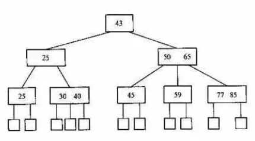
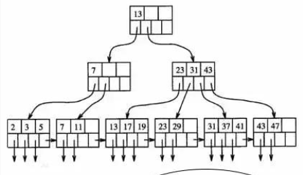

#数据结构

##hash算法复杂度是O(1)，B+树的算法复杂度是O(log(n))，为什么MySql用B+树做索引
- 二叉排序树，当插入的节点是顺序的时候这种极端情况，就会退化成链表，所以有了平衡树
- 红黑树（java里的TreeMap）的五条规则可以保证树的平衡，这样做是为了降低树的高度，保证查找的效率
- B树是一种多路搜索树，M路树的B树最多能拥有M个孩子，可以进一步降低树的高度

```
每一种数据结构都有它的适用场景和不适用场景

B树在文件系统中使用的最广泛，因为文件系统的内容一般比较大，不能一次的加载到内存，而高度比较低的B树可以大大的减少检索磁盘的次数。
但是某些数据量小的排序，用红黑树是更好的选择。
```

- B+树是对B树的一种改进，使它更适合数据库，它的数据全部都在叶子节点，叶子节点还加了指针形成链表，下图是一个4路的B+树

```
因为数据库很多select，大部分都是查找多个数据，所以B+树就更适合数据库，而hash更适合查找一个数据的数据库，如Redis
```
