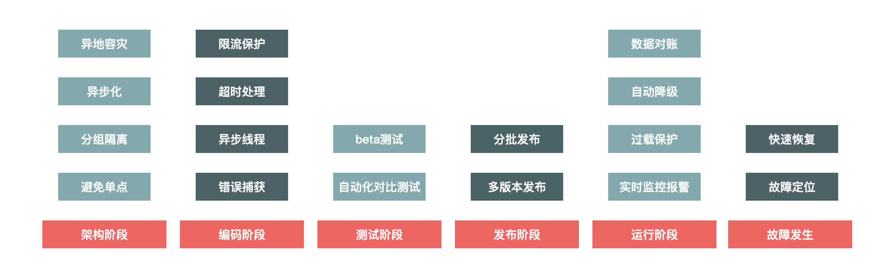
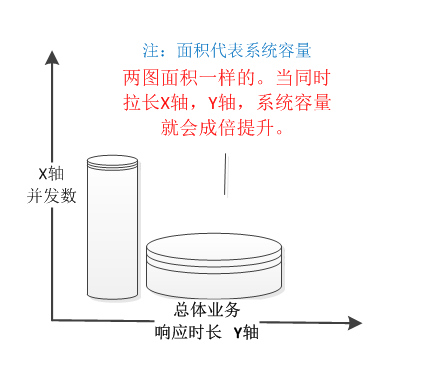
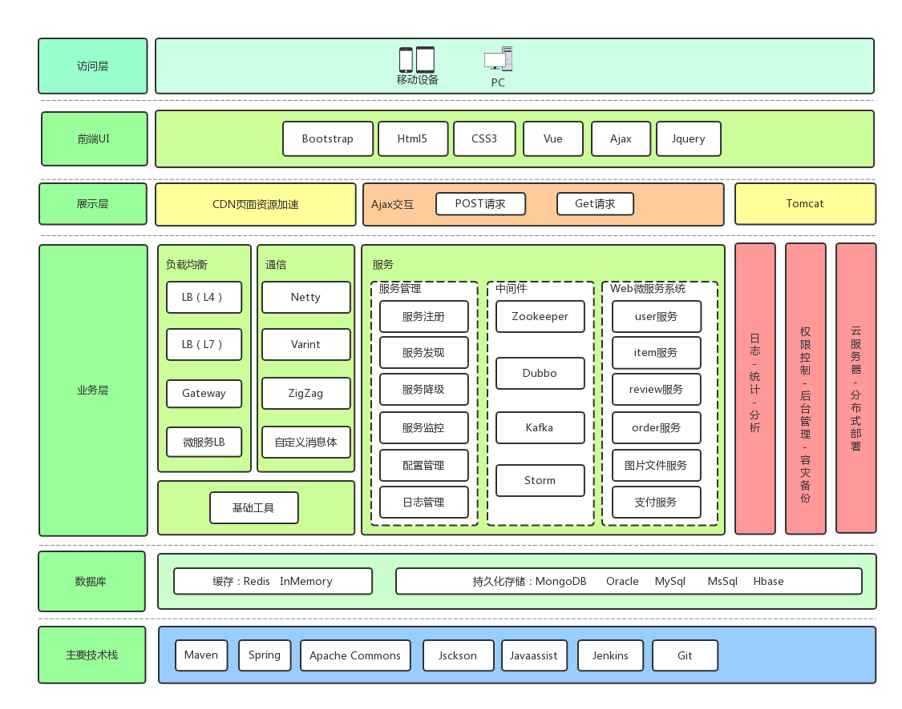

# 一、架构简介
- architect  [ar·chi·tect || 'ɑːkɪtekt]  n.建筑师; 缔造者, 创造者; 设计师  
- 一群优秀的人做一件他们热爱的事，一定能取得成功。不管过程多么曲折，不管外人看来多么不可思议。
- 领导的真谛：寻找一个值得共同奋斗的目标，营造一个让大家都能最大限度发挥自我价值的工作氛围。
- 是事情成就了人，而不是人成就了事。
```
架构师要和项目组全体裁员共同描绘一个蓝图，这个蓝图是整个团队能够认同的，是团队的共同奋斗目标。
蓝图应该表述清楚：产品要做什么，不做什么，要达到什么业务目标，都需要描述清楚；
蓝图应该是形象的：产品能为用户创造什么价值，能实现什么样的市场目标，产品最终会长什么样，都需要形象地想象出来；
蓝图应该是简单的：不管内部还是外部沟通，都能一句话说明白，我们在做什么。
```

## 1.专业术语
### 1) 项目管理与监理有关 
1.Project Manager 项目经理   
2.Project Stakeholders 项目干系人   
3.general engineer 总监理工程师  
4.vice-general engineer  副监理工程师   
5.supervising engineer 监理工程师   
6.supervisory staff 监理人员 


### 2) 计算机软件、网络、数据库、系统等相关 
1.Senior System Architect  高级系统架构师   
2.Software Architect  软件架构师 
3.Network Architect 网络架构师   
4.System analyst 系统分析师  


1.senior software engineer 高级软件工程师    
2.software QA engineer(software quality assurance engineer) 软件测试工程师   
3.test engineer 测试工程师  
4.software engineer 软件工程师   
5.network engineer 网络工程师   
6.database engineer  数据库工程师 
7.information security engineer 信息安全工程师   
 
1.system administrator（SA）系统管理员   
2.network administrator 网络管理员   
3.database administrator（DBA）数据库管理员  

1.designer 设计师   
2.developer 开发人员（开发者） 
3.programmer 程序员 
4.data processing specialist 信息处理员 


# 二、架构的设计

- 架构阶段
```
架构阶段主要考虑系统的可扩展性和容错性，要避免系统出现单点问题。例如多机房单元化部署，
即使某个城市的某个机房出现整体故障，仍然不会影响整体网站的运转。
```

- 编码阶段
```
编码最重要的是保证代码的健壮性，例如涉及远程调用问题时，要设置合理的超时退出机制，防止被其他系统拖垮，
也要对调用的返回结果集有预期，防止返回的结果超出程序处理范围，最常见的做法就是对错误异常进行捕获，对无法预料的错误要有默认处理结果。
```

- 测试阶段
```
测试主要是保证测试用例的覆盖度，保证最坏情况发生时，我们也有相应的处理流程。
```

- 发布阶段
````
发布时也有一些地方需要注意，因为发布时最容易出现错误，因此要有紧急的回滚机制。
````

- 运行阶段
```
运行时是系统的常态，系统大部分时间都会处于运行态，运行态最重要的是对系统的监控要准确及时，
发现问题能够准确报警并且报警数据要准确详细，以便于排查问题。
```

- 故障发生
```
故障发生时首先最重要的就是及时止损，例如由于程序问题导致商品价格错误，
那就要及时下架商品或者关闭购买链接，防止造成重大资产损失。然后就是要能够及时恢复服务，并定位原因解决问题。
```

# 三、面向对象


# 四、QA
####有别于社交网络、搜索和游戏等网站，电商网站的用户流量有哪些特点？  
杨超：个人觉得电商网站流量特点，突发性流量暴增，根本无法精确的预估的量。  
可能刚开始几万的量，突然几分钟就上到几十、几百、上千万、十倍百倍千倍的往上增。  
相比社交、搜索、游戏网站，差异最大点，就在直接牵涉精确的金额的问题。所以对于精准和延时，缓存有一些差异化的。  

社交网络：一般延时可做大点，及时性通讯可以端对端。  
搜索：一般多级缓存，大多计算好往前推，延时也可做大点，另外搜索本就模糊的匹配，精准性方面要求没那么严格。  
游戏网站：大多客户端大型游戏，客户端数据缓存几秒之后再进行传输，或者一些直接本地存数据，后端根服务器交互。  

###高流量、高并发情况下，如何保证整个系统的可靠性和稳定性???  
入口层：过滤掉大部分软件刷的情况，衍生了风控系统，秒杀系统。  
应用层: 读写分离、缓存、队列、令牌、系统拆分、隔离、系统升级（可水平扩容方向）。  
可靠性和稳定性：会做一堆的容灾方案，从机房、网络、应用、存储、渠道、业务等多维度容灾。做一堆的降级策略，从流量、应用、渠道、业务 等对多维度做。  
其他：  
时间换空间：降低单次请求时间，这样在单位时间内系统并发就会提升。  
空间换时间：拉长整体处理业务时间，换取后台系统容量空间  



###在线商城的架构图

