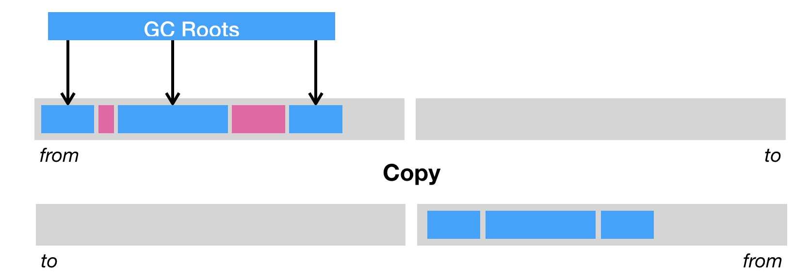

##垃圾回收GC通用概念
####判断一个对象是否可达的算法，引用计数法与可达性分析
- 引用计数法（reference counting）
```
它的做法是为每个对象添加一个引用计数器，用来统计指向该对象的引用个数。一旦某个对象的引用计数器为 0，则说明该对象已经死亡，便可以被回收了。
可能会导致ABA循环引用的问题，所以一般不采用。
```

- 可达性分析————目前 Java 虚拟机的主流垃圾回收器采取的是可达性分析算法
```
这个算法的实质在于将一系列 GC Roots 作为初始的存活对象合集（live set），然后从该合集出发，探索所有能够被该集合引用到的对象，
并将其加入到该集合中，这个过程我们也称之为标记（mark）。最终，未被探索到的对象便是死亡的，是可以回收的。

那么什么是 GC Roots 呢？我们可以暂时理解为由堆外指向堆内的引用，一般而言，GC Roots 包括（但不限于）如下几种：
1. Java 方法栈桢中的局部变量；
2. 已加载类的静态变量；
3. JNI handles；
4. 已启动且未停止的 Java 线程。
可达性分析可以解决引用计数法所不能解决的循环引用问题。
举例来说，即便对象 a 和 b 相互引用，只要从 GC Roots 出发无法到达 a 或者 b，那么可达性分析便不会将它们加入存活对象合集之中。
```


####
1. 堆大小可用 -Xmx1024m 控制
2. 方法区（本地方法）可用 -XX:MaxMetaspaceSize=1024m 控制     
    
####Stop-the-world 以及安全点
```
在 Java 虚拟机里，传统的垃圾回收算法采用的是一种简单粗暴的方式，那便是 Stop-the-world，停止其他非垃圾回收线程的工作，直到完成垃圾回收。
这也就造成了垃圾回收所谓的暂停时间（GC pause）。

Java 虚拟机中的 Stop-the-world 是通过安全点（safepoint）机制来实现的。
当 Java 虚拟机收到 Stop-the-world 请求，它便会等待所有的线程都到达安全点，才允许请求 Stop-the-world 的线程进行独占的工作。

安全点的初始目的并不是让其他线程停下，而是找到一个稳定的执行状态。
在这个执行状态下，Java 虚拟机的堆栈不会发生变化。这么一来，垃圾回收器便能够“安全”地执行可达性分析。

举个例子，当 Java 程序通过 JNI 执行本地代码时，如果这段代码不访问 Java 对象、调用 Java 方法或者返回至原 Java 方法，
那么 Java 虚拟机的堆栈不会发生改变，也就代表着这段本地代码可以作为同一个安全点。

除了执行 JNI 本地代码外，Java 线程还有其他几种状态：解释执行字节码、执行即时编译器生成的机器码和线程阻塞。
阻塞的线程由于处于 Java 虚拟机线程调度器的掌控之下，因此属于安全点。
```

####垃圾回收的三种方式
- 第一种是清除（sweep），即把死亡对象所占据的内存标记为空闲内存，并记录在一个空闲列表（free list）之中。
```
当需要新建对象时，内存管理模块便会从该空闲列表中寻找空闲内存，并划分给新建的对象。
清除这种回收方式的原理及其简单，但是有两个缺点。一是会造成内存碎片。由于 Java 虚拟机的堆中对象必须是连续分布的，因此可能出现总空闲内存足够，但是无法分配的极端情况。
```


- 第二种是压缩（compact），即把存活的对象聚集到内存区域的起始位置，从而留下一段连续的内存空间。这种做法能够解决内存碎片化的问题，但代价是压缩算法的性能开销。


- 第三种则是复制（copy），即把内存区域分为两等分，分别用两个指针 from 和 to 来维护，并且只是用 from 指针指向的内存区域来分配内存。
```
当发生垃圾回收时，便把存活的对象复制到 to 指针指向的内存区域中，并且交换 from 指针和 to 指针的内容。
复制这种回收方式同样能够解决内存碎片化的问题，但是它的缺点也极其明显，即堆空间的使用效率极其低下。
```


####Java 虚拟机的堆划分
```
Java 虚拟机将堆划分为新生代和老年代。Java 虚拟机可以给不同代使用不同的回收算法。
其中，新生代又被划分为 Eden 区，以及两个大小相同的 Survivor 区。

默认情况下，Java 虚拟机采取的是一种动态分配的策略（对应 Java 虚拟机参数 -XX:+UsePSAdaptiveSurvivorSizePolicy）。
根据生成对象的速率，以及 Survivor 区的使用情况动态调整 Eden 区和 Survivor 区的比例。
你也可以通过参数 -XX:SurvivorRatio 来固定这个比例。但是需要注意的是，其中一个 Survivor 区会一直为空，因此比例越低浪费的堆空间将越高。

通常来说，当我们调用 new 指令时，它会在 Eden 区中划出一块作为存储对象的内存。由于堆空间是线程共享的，因此直接在这里边划空间是需要进行同步的。
否则，将有可能出现两个对象共用一段内存的事故。如果你还记得前两篇我用“停车位”打的比方的话，这里就相当于两个司机（线程）同时将车停入同一个停车位，因而发生剐蹭事故。
Java 虚拟机的解决方法是为每个司机预先申请多个停车位，并且只允许该司机停在自己的停车位上。那么当司机的停车位用完了该怎么办呢（假设这个司机代客泊车）？

答案是：再申请多个停车位便可以了。这项技术被称之为 TLAB（Thread Local Allocation Buffer，对应虚拟机参数 -XX:+UseTLAB，默认开启）。
具体来说，每个线程可以向 Java 虚拟机申请一段连续的内存，比如 2048 字节，作为线程私有的 TLAB。
这个操作需要加锁，线程需要维护两个指针（实际上可能更多，但重要也就两个），一个指向 TLAB 中空余内存的起始位置，一个则指向 TLAB 末尾。
接下来的 new 指令，便可以直接通过指针加法（bump the pointer）来实现，即把指向空余内存位置的指针加上所请求的字节数。
```


####针对新时代的Minor GC
```
当 Eden 区的空间耗尽了怎么办？这个时候 Java 虚拟机便会触发一次 Minor GC，来收集新生代的垃圾。存活下来的对象，则会被送到 Survivor 区。
当发生 Minor GC 时，Eden 区和 from 指向的 Survivor 区中的存活对象会被复制到 to 指向的 Survivor 区中，然后交换 from 和 to 指针，
以保证下一次 Minor GC 时，to 指向的 Survivor 区还是空的。

Java 虚拟机会记录 Survivor 区中的对象一共被来回复制了几次。如果一个对象被复制的次数为 15（对应虚拟机参数 -XX:+MaxTenuringThreshold），
那么该对象将被晋升（promote）至老年代。另外，如果单个 Survivor 区已经被占用了 50%（对应虚拟机参数 -XX:TargetSurvivorRatio），那么较高复制次数的对象也会被晋升至老年代。

当发生 Minor GC 时，应用了标记 - 复制算法。理想情况下，Eden 区中的对象基本都死亡了，那么需要复制的数据将非常少，因此采用这种标记 - 复制算法的效果极好。

Minor GC 的另外一个好处是不用对整个堆进行垃圾回收。但是，它却有一个问题，那就是老年代的对象可能引用新生代的对象。
也就是说，在标记存活对象的时候，我们需要扫描老年代中的对象。如果该对象拥有对新生代对象的引用，那么这个引用也会被作为 GC Roots。

这样一来，岂不是又做了一次全堆扫描呢？
HotSpot 给出的解决方案是一项叫做卡表（Card Table）的技术。该技术将整个堆划分为一个个大小为 512 字节的卡，并且维护一个卡表，用来存储每张卡的一个标识位。
这个标识位代表对应的卡是否可能存有指向新生代对象的引用。如果可能存在，那么我们就认为这张卡是脏的。
在进行 Minor GC 的时候，我们便可以不用扫描整个老年代，而是在卡表中寻找脏卡，并将脏卡中的对象加入到 Minor GC 的 GC Roots 里。
当完成所有脏卡的扫描之后，Java 虚拟机便会将所有脏卡的标识位清零。
由于 Minor GC 伴随着存活对象的复制，而复制需要更新指向该对象的引用。因此，在更新引用的同时，我们又会设置引用所在的卡的标识位。这个时候，我们可以确保脏卡中必定包含指向新生代对象的引用。
```

####Java 虚拟机中的垃圾回收器
```
针对新生代的垃圾回收器共有三个：Serial，Parallel Scavenge 和 Parallel New。这三个采用的都是标记 - 复制算法。
其中，Serial 是一个单线程的，Parallel New 可以看成 Serial 的多线程版本。Parallel Scavenge 和 Parallel New 类似，但更加注重吞吐率。此外，Parallel Scavenge 不能与 CMS 一起使用。

针对老年代的垃圾回收器也有三个：刚刚提到的 Serial Old 和 Parallel Old，以及 CMS。Serial Old 和 Parallel Old 都是标记 - 压缩算法。同样，前者是单线程的，而后者可以看成前者的多线程版本。

CMS 采用的是标记 - 清除算法，并且是并发的。除了少数几个操作需要 Stop-the-world 之外，它可以在应用程序运行过程中进行垃圾回收。
在并发收集失败的情况下，Java 虚拟机会使用其他两个压缩型垃圾回收器进行一次垃圾回收。由于 G1 的出现，CMS 在 Java 9 中已被废弃。

G1（Garbage First）是一个横跨新生代和老年代的垃圾回收器。实际上，它已经打乱了前面所说的堆结构，直接将堆分成极其多个区域。
每个区域都可以充当 Eden 区、Survivor 区或者老年代中的一个。它采用的是标记 - 压缩算法，而且和 CMS 一样都能够在应用程序运行过程中并发地进行垃圾回收。
G1 能够针对每个细分的区域来进行垃圾回收。在选择进行垃圾回收的区域时，它会优先回收死亡对象较多的区域。这也是 G1 名字的由来。

即将到来的 Java 11 引入了 ZGC，宣称暂停时间不超过 10ms。如果你感兴趣的话，可参考 R 大的这篇文章。
https://www.zhihu.com/question/287945354/answer/458761494
```

##G1收集器

####g1收集器简介
G1 GC，全称Garbage-First Garbage Collector，通过-XX:+UseG1GC参数来启用，jdk8中已经设置为默认的垃圾收集器
G1是一种服务器端的垃圾收集器，应用在多处理器和大容量内存环境中，在实现高吞吐量的同时，尽可能的满足垃圾收集暂停时间的要求。
它是专门针对以下应用场景设计的:
- 像CMS收集器一样，能与应用程序线程并发执行。
- 整理空闲空间更快。
- 需要GC停顿时间更好预测。
- 不希望牺牲大量的吞吐性能。
- 不需要更大的Java Heap。

G1收集器的设计目标是取代CMS收集器，它同CMS相比，在以下方面表现的更出色：
- G1是一个有整理内存过程的垃圾收集器，不会产生很多内存碎片。
- G1的Stop The World(STW)更可控，G1在停顿时间上添加了预测机制，用户可以指定期望停顿时间。

####Java9默认的垃圾收集器g1
  
G1算法将堆划分为若干个区域（Region），它仍然属于分代收集器。  
不过，这些区域的一部分包含新生代，新生代的垃圾收集依然采用暂停所有应用线程的方式，将存活对象拷贝到老年代或者Survivor空间。  
老年代也分成很多区域，G1收集器通过将对象从一个区域复制到另外一个区域，完成了清理工作。  
这就意味着，在正常的处理过程中，G1完成了堆的压缩（至少是部分堆的压缩），这样也就不会有cms内存碎片问题的存在了。  
在G1中，还有一种特殊的区域，叫Humongous区域。 如果一个对象占用的空间超过了分区容量50%以上，G1收集器就认为这是一个巨型对象。  
这些巨型对象，默认直接会被分配在年老代，但是如果它是一个短期存在的巨型对象，就会对垃圾收集器造成负面影响。  
为了解决这个问题，G1划分了一个Humongous区，它用来专门存放巨型对象。如果一个H区装不下一个巨型对象，那么G1会寻找连续的H分区来存储。  
为了能找到连续的H区，有时候不得不启动Full GC。

##G1中几个重要概念

####Region
传统的GC收集器将连续的内存空间划分为新生代、老年代和永久代（JDK 8去除了永久代，引入了元空间Metaspace），
这种划分的特点是各代的存储地址（逻辑地址，下同）是连续的。如下图所示：
 

而G1的各代存储地址是不连续的，每一代都使用了n个不连续的大小相同的Region，每个Region占有一块连续的虚拟内存地址。如下图所示：
 

在上图中，我们注意到还有一些Region标明了H，它代表Humongous，这表示这些Region存储的是巨大对象（humongous object，H-obj），
即大小大于等于region一半的对象。H-obj有如下几个特征：
- H-obj直接分配到了old gen，防止了反复拷贝移动。
- H-obj在global concurrent marking阶段的cleanup 和 full GC阶段回收。
- 在分配H-obj之前先检查是否超过 initiating heap occupancy percent和the marking threshold, 如果超过的话，就启动global concurrent marking，为的是提早回收，防止 evacuation failures 和 full GC。
为了减少连续H-objs分配对GC的影响，需要把大对象变为普通的对象，建议增大Region size。

一个Region的大小可以通过参数-XX:G1HeapRegionSize设定，取值范围从1M到32M，且是2的指数。如果不设定，那么G1会根据Heap大小自动决定。

####G1中提供了三种模式垃圾回收模式
- young gc
```
发生在年轻代的GC算法，一般对象（除了巨型对象）都是在eden region中分配内存，当所有eden region被耗尽无法申请内存时，
就会触发一次young gc，这种触发机制和之前的young gc差不多，执行完一次young gc，
活跃对象会被拷贝到survivor region或者晋升到old region中，空闲的region会被放入空闲列表中，等待下次被使用。
```

- mixed gc
```
当越来越多的对象晋升到老年代old region时，为了避免堆内存被耗尽，虚拟机会触发一个混合的垃圾收集器，
即mixed gc，该算法并不是一个old gc，除了回收整个young region，还会回收一部分的old region，
这里需要注意：是一部分老年代，而不是全部老年代，可以选择哪些old region进行收集，从而可以对垃圾回收的耗时时间进行控制。
```
- full gc
```
如果对象内存分配速度过快，mixed gc来不及回收，导致老年代被填满，就会触发一次full gc，G1的full gc算法就是单线程执行的serial old gc，
会导致异常长时间的暂停时间，需要进行不断的调优，尽可能的避免full gc。
```


##GC参数
####G1收集器参数
```
-XX:G1HeapRegionSize=n	            # 设置Region大小，并非最终值
-XX:MaxGCPauseMillis	            # 设置G1收集过程目标时间，默认值200ms，不是硬性条件
-XX:G1NewSizePercent	            # 新生代最小值，默认值5%
-XX:G1MaxNewSizePercent	            # 新生代最大值，默认值60%
-XX:ParallelGCThreads	            # STOP WORLD期间，并行GC线程数
-XX:ConcGCThreads=n	                # 并发标记阶段，并行执行的线程数
-XX:InitiatingHeapOccupancyPercent	# 设置触发标记周期的 Java 堆占用率阈值。默认值是45%。这里的java堆占比指的是non_young_capacity_bytes，包括old+humongous
```
####gc日志参数
```
-XX:+PrintGC            # 输出GC日志
-XX:+PrintGCDetails     # 输出GC的详细日志
-XX:+PrintGCTimeStamps  # 输出GC的时间戳（以基准时间的形式）
-XX:+PrintGCDateStamps  # 输出GC的时间戳（以日期的形式，如 2013-05-04T21:53:59.234+0800）
-XX:+PrintHeapAtGC      # 在进行GC的前后打印出堆的信息
-Xloggc:/var/gc.log     # 日志文件的输出路径
```
