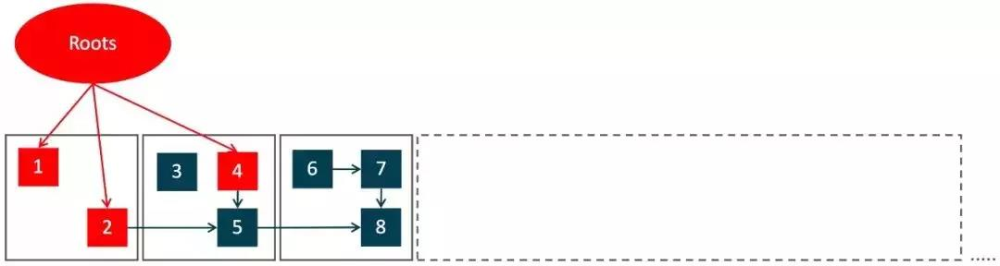
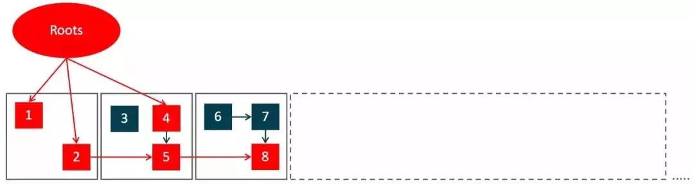

###ZGC的特点
ZGC的核心原则是将load barrier(加载屏障)与colored oops(有色对象指针)结合使用。这使得ZGC能够在Java应用程序线程运行时执行并发操作，例如对象迁移时。

####1.并发
```
ZGC在128G的大堆下，最大停顿时间才 1.68ms (不是平均，不是90%，99%，是Max ! )，远低于最初的目标－那保守的10ms，也远胜前代的G1。
avg: 1.091ms (+/-0.215ms)
max: 1.681ms
G1
avg: 156.806ms (+/-71.126ms)
max: 543.846ms
应用线程与GC线程都是并发执行的，无论堆多大停顿都小于10ms。
```


####2.基于Region
```
在G1中，堆内存通常被分为几千个大小相同region。同样的，在ZGC中堆内存也被分成大量的区域，它们被称为page，不同的是，ZGC中page的大小是不同的。
不过G1一开始就把堆划分成固定大小的Region，而ZGC 可以有2MB，32MB，N× 2MB 三种Size Groups，动态地创建和销毁Region，动态地决定Region的大小。
256k以下的对象分配在Small Page， 4M以下对象在Medium Page，以上在Large Page。所以ZGC能更好的处理大对象的分配。
```

---------------------

####3.使用colored pointer
根据三色标记算法，我们知道对象存在三种状态：
- 白：对象没有被标记到，标记阶段结束后，会被当做垃圾回收掉。
- 灰：对象被标记了，但是它的field还没有被标记或标记完。
- 黑：对象被标记了，且它的所有field也被标记完了。
```
在x64系统上，指针标记的引用是64位的, ZGC重新定义了引用结构。
Colored Pointer从64位的指针中，借了几位出来表示Finalizable、Remapped、Marked1、Marked0。 
所以它不支持32位指针也不支持压缩指针， 且堆的上限是4TB。
```
  

####4.使用load barrier
```
与标记对象的传统算法相比，ZGC在指针上做标记，在访问指针时加入Load Barrier（读屏障），比如当对象正被GC移动，指针上的颜色就会不对，
这个屏障就会先把指针更新为有效地址再返回，也就是，永远只有单个对象读取时有概率被减速，而不存在为了保持应用与GC一致而粗暴整体的Stop The World。
```


####5.标记整理
1).Pause Mark Start －初始停顿标记
**停顿JVM地标记Root对象，1，2，4三个被标为live。**
**GC循环从标记阶段开始，递归标记所有可达对象，标记阶段结束时，ZGC可以知道哪些对象仍然存在哪些是垃圾。**
**ZGC将结果存储在每一页的位图（称为live map）中。**

2).Concurrent Mark －并发标记
**并发地递归标记其他对象，5和8也被标记为live。**

3).Relocate － 移动对象
**对比发现3、6、7是过期对象，也就是中间的两个灰色region需要被压缩清理，所以陆续将4、5、8  对象移动到最右边的新Region。**
**移动过程中，有个forward table纪录这种转向。**
**标记阶段后，ZGC需要迁移relocate集中的所有对象。relocate集是一组页面集合，包含了根据某些标准（例如那些包含最多垃圾对象的页面）确定的需要迁移的页面。**
**对象由GC线程或者应用线程迁移（通过load barrier）。ZGC为每个relocate集中的页面分配了转发表。**
**转发表是一个哈希映射，它存储一个对象已被迁移到的地址（如果该对象已经被迁移）。GC线程遍历relocate集的活动对象，并迁移尚未迁移的所有对象。**
**有时候会发生应用线程和GC线程同时试图迁移同一个对象，在这种情况下，ZGC使用CAS操作来确定胜利者。**

4).Remap － 修正指针
**最后将指针都妥帖地更新指向新地址。这里R大还提到一个亮点： “上一个阶段的Remap，和下一个阶段的Mark是混搭在一起完成的，
这样非常高效，省却了重复遍历对象图的开销活的对象都移走之后，这个region可以立即释放掉，并且用来当作下一个要扫描的region的to region。
所以理论上要收集整个堆，只需要有一个空region就OK了。。”
一旦GC线程完成了relocate集的处理，迁移阶段就完成了。
虽然这时所有对象都已迁移，但是旧地引用址仍然有可能被使用，仍然需要通过转发表重新映射（remapping）。
然后通过load barrier或者等到下一个标记循环修复这些引用。**


####6.NUMA感知
```
现在多CPU插槽的服务器都是Numa架构了，比如两颗CPU插槽(24核)，64G内存的服务器，那其中一颗CPU上的12个核，
访问从属于它的32G本地内存，要比访问另外32G远端内存要快得多。
原理就是申请堆内存时，对每个Numa Node的内存都申请一些，当一条线程分配对象时，根据当前是哪个CPU在运行的，就在靠近这个CPU的内存中分配，
这条线程继续往下走，通常会重新访问这个对象，而且如果线程还没被切换出去，就还是这位CPU在访问，所以就快了。

但可惜CMS，G1不支持Numa，现在ZGC又重新做了简单支持。
```

####7.其它
```
在ZGC 官网上有介绍，前面基准测试中的32核服务器，128G堆的场景下，它的配置是：
20条ParallelGCThreads，在那三个极短的STW阶段并行的干活 －  mark roots， weak root processing（StringTable, JNI Weak Handles,etc）和 relocate roots ；
4条ConcGCThreads，在其他阶段与应用并发地干活 － Mark，Process Reference，Relocate。 仅仅四条，高风亮节地尽量不与应用争抢CPU 。
ConcCGCThreads开始时各自忙着自己平均分配下来的Region，如果有线程先忙完了，会尝试“偷”其他线程还没做的Region来干活，非常勤奋。
```
