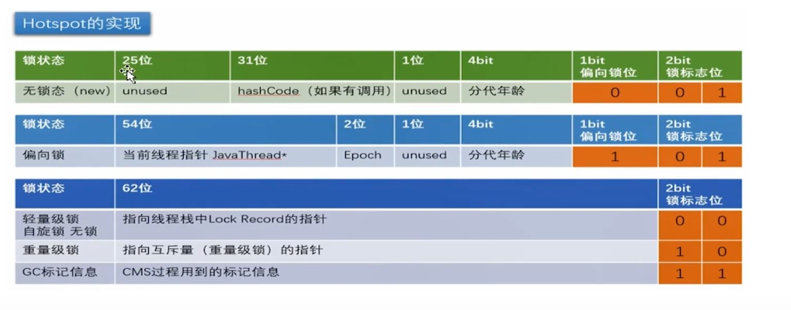

# 一、volatile关键字

## 1.volatile的作用

- 缓存可见性

```
instance = new Singleton();

被编译成汇编代码：
    ...
    Lock ...
有volatile的关键字被编译的汇编代码会出现一个Lock指令，Lock再多核cpu引发两件事：
1. lock指令会引起处理器缓存写回到内存
2. 处理器的缓存写回到内存会导致其cpu总线上的缓存数据无效，所以其它处理器会重新再去拿这个最新的数据
```

- 禁止指令重排序

```
原代码->编译器javac重排序->处理器指令并行的重排序->内存系统重排序->最终执行指令

JMM是一种协议规范，屏蔽物理硬件和操作系统对Java的影响使其跨平台。

JMM会在volatile加入内存屏障来防止指令重排序，比如:
instance = new Singleton();
上面的代码可以分解为如下三行行为代码：
1. memory = allocate(); // 分配对象的内存空间   重  1
2. ctorInstance(memory); // 初始化对象         排   3
3. instance = memory; // 设置内存地址           序 2
如果指令重排序，会导致对象的半初始化，导致别的类提前使用这个不为空的对象，这个时候里面的变量可能没有初始化完成
volatile会禁止内存重排序，这也是为什么双重检测锁必须要加volatile的原因
```

# 二、synchronized关键字

- 普通方法，锁是当前实例的对象；
- 静态同步方法，锁是当前类的class对象；
- 同步方法块，锁是括号里配置的对象


- 对象头

```
第一部分用于存储对象自身的运行时数据，如哈希码（HashCode）、GC 分代年龄、锁状态标志、线程持有的锁、偏向线程 ID、偏向时间戳、对象分代年龄，
这部分信息称为“Mark Word”；Mark Word 被设计成一个非固定的数据结构以便在极小的空间内存储尽量多的信息，它会根据自己的状态复用自己的存储空间。

第二部分是类型指针（Klass Word），即对象指向它的类元数据的指针，虚拟机通过这个指针来确定这个对象是哪个类的实例；

如果对象是一个 Java 数组，那在对象头中还必须有一块用于记录数组长度的数据。
因为虚拟机可以通过普通 Java 对象的元数据信息确定 Java 对象的大小，但是从数组的元数据中无法确定数组的大小。


这部分数据的长度在 32 位和 64 位的虚拟机（未开启压缩指针）中分别为 32bit 和 64bit。

例如，在 32 位的 HotSpot 虚拟机中，如果对象处于未被锁定的状态下，那么 Mark Word 的 32bit 空间中的 25bit 用于存储对象哈希码，
4bit 用于存储对象分代年龄，2bit 用于存储锁标志位，1bit 固定为 0，如下表所示：


在 32 位系统下，存放 Class 指针的空间大小是 4 字节，Mark Word 空间大小也是4字节，因此头部就是 8 字节，如果是数组就需要再加 4 字节表示数组的长度，如下表所示：

在 64 位系统及 64 位 JVM 下，开启指针压缩，那么头部存放 Class 指针的空间大小还是4字节，而 Mark Word 区域会变大，变成 8 字节，也就是头部最少为 12 字节，如下表所示：
```



```
JVM会在Synchronized的进入和退出插入monitor enter和monitor exit。这两条汇编指令的插入可以保证代码块的同步

Synchronized用的锁存在Java对象头：
4Byte/64bit：Mark Word,|对象的hashcode，25bit|分带年龄，4bit|偏向锁，1bit|锁标志，2bit
4BYte/64bit：Class Metada Address，|存储对象的引用地址
4Byte/64bit：Array Length，|如果当前对象是数组，则表示数组的长度

无锁状态----------->偏向锁状态----------->轻量级锁-------------->重量级锁
           加锁/解锁不需要额外的开销   CAS获取锁，如果失败则变成重量级锁，锁不降级
HotSpot作者经过研究发现，大多数情况下，锁不仅不存在多线程竞争，而总是由同一条线程多次获得，所以有了偏向锁

synchronized特点：保证内存可见性、操作原子性
synchronized重量锁影响性能的原因：
1、加锁解锁操作需要额外操作；
2、互斥同步对性能最大的影响是阻塞的实现，因为阻塞涉及到的挂起线程和恢复线程的操作都需要转入内核态中完成
synchronized锁：对象头中的Mark Word根据锁标志位的不同而被复用

偏向锁：在只有一个线程执行同步块时提高性能。Mark Word存储锁偏向的线程ID，
以后该线程在进入和退出同步块时不需要进行CAS操作来加锁和解锁，只需简单比较ThreadID。
特点：只有等到线程竞争出现才释放偏向锁，持有偏向锁的线程不会主动释放偏向锁。
之后的线程竞争偏向锁，会先检查持有偏向锁的线程是否存活，如果不存货，则对象变为无锁状态，重新偏向；
如果仍存活，则偏向锁升级为轻量级锁，此时轻量级锁由原持有偏向锁的线程持有，继续执行其同步代码，
而正在竞争的线程会进入自旋等待获得该轻量级锁

轻量级锁：CAS获取锁，若获取失败，若当前只有一个等待线程，则通过自旋等待，可能持有轻量级锁的线程很快就会释放锁。
但是当自旋超过一定的次数，或者一个线程在持有锁，一个在自旋，又有第三个来访时，轻量级锁膨胀为重量级锁

重量级锁：指向互斥量（mutex），底层通过操作系统的mutex lock实现。
等待锁的线程会被阻塞，由于Linux下Java线程与操作系统内核态线程一一映射，
所以涉及到用户态和内核态的切换、操作系统内核态中的线程的阻塞和恢复。

偏向所锁，轻量级锁都是乐观锁，重量级锁是悲观锁。
```

# 三、并发数据结构基本原理

1. volatile的读/写 + CAS
2. 由（1）实现了：AQS队列（队列同步器），原子变量类
3. 由（2）实现了：Lock，并发数据结构，Executor

```
AQS队列同步器 = AbstractQueueSynchronizer = Sync = FairSync + NoFairSync = ReentrantLock

模板方法，volatile+CAS：
    getState()
    setState(newState)
    compareAndSetState(expect, update)

可重写的方法：
    tryAcquire(arg)
    tryRelease(arg)，这两个是独占获取/释放，state=1
    
    tryAcquireShared(arg)
    tryReleaseSHared(arg)，共享获取/释放，state>=1

acquire(arg)，获取同步器的状态，成功则反悔；失败则进入同步队列中等待

同步器依赖内部的同步队列（FIFO双向队列）来完成同步状态的管理，会把每个线程封装成Node。
Node = waitStatus + （Node prev，next） + Thread（当前）

被加入队列的线程通过LockSupport的park()和unpark()阻塞和唤醒，依赖于操作系统的实现。
LockSupport比wait()和notify()更好，前者可以唤醒指定的线程，后者不行
```

- ReentrantLock（排他锁）

```
公平锁：每次都从队列中的第一个节点获取锁
非公平：默认的实现，极少的线程切换，保证了更大的吞吐量
```

- ReentrantReadWriteLock（共享锁+排他锁）

```
ReentrantReadWriteLock包含两种锁，一个是读操作相关的共享锁，一个是写操作相关的排他锁。
多个共享锁之间不互斥，多个排他锁之间互斥，共享锁与排他锁互斥。
在读多余写的情况下，读写锁能够比排他锁由更好的并发性和吞吐量
```

- CurrentHashMap（分段所）

- ConcurrentLinkedQueue（非阻塞）

```
实现线程安全的队列由两种方式：1.阻塞算法，用锁实现；2.非阻塞算法，用CAS实现
```

- Java中的阻塞队列由一下

```
ArrayBlockingQueue
LinkedBlockingQueue
PriorityBlockingQueue
DelayQueue：使用PriorityBlockingQueue实现的无界阻塞队列你，ScheduledThreadPoolExector

LinkedTransferQueue：实现了TransferQueue接口，它是一个继承了BlockingQueue的接口
transfer(E e)：若当前有正在等待获取的消费者线程，立刻移交之；否则，会插入e到队列尾部，进入阻塞状态
```

# 四、线程相关

## 1.CountDownLatch和CyclicBarrier

- 两者都可以作为同步屏障，等待多个线程，CyclicBarrier可以使用reset()重置，前者只能使用一次

## 2.Fork/Join原理

- 工作窃取算法

```
netty自己实现了一套效率更高的ForkJoinPool
google的guava也有一套基于模板方法，注册监听的回调
scala和kotlin都自己实现了一套ForkJoinPool，官方说比Java原生效率更高
```

## 3.线程池的数量

- CPU密集型：线程数尽可能小，cpu数量 + 1；在游戏中因为计算量比较大，基本上都是单线程
- I/O密集型：线程数尽可能大，2倍的CPU
- 混合型：CPU密集型 + I/O密集型
