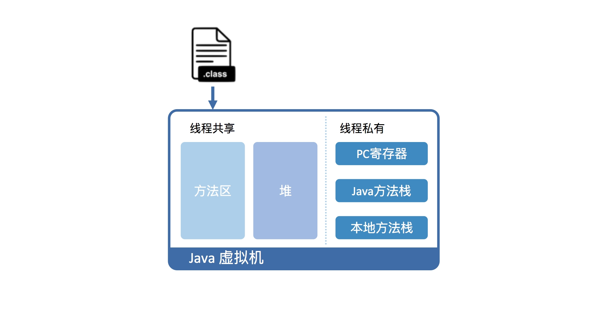

## 一.JVM概述

#### 发展历史

* 1996年1月 JDK1.0发布
* 2006年12月 JRE6.0发布
* 2009年4月 Oracle收购Sun
* 2011年7月 JavaSE7发布
* 2014年3月 JavaSE8发布
* 2018年8月 Java11发布

## 二.JVM基础

#### JVM如何运行Java字节码？

- 软件角度

1. 首先需要将Java代码编译成class文件
2. 将class文件加载到Java虚拟机中
3. 栈

```
在运行过程中，每当调用进入一个 Java 方法，Java 虚拟机会在当前线程的 Java 方法栈中生成一个栈帧（interpreted frame），用以存放局部变量以及字节码的操作数。
这个栈帧的大小是提前计算好的，而且 Java 虚拟机不要求栈帧在内存空间里连续分布。
当退出当前执行的方法时，不管是正常返回还是异常返回，Java 虚拟机均会弹出当前线程的当前栈帧，并将之舍弃。
```

4. 加载后的Java类会被存放于方法区（Method Area）中。实际运行时，虚拟机会执行方法区内的代码。

```
在方法区中，存储了每个类的信息（包括类的名称、方法信息、字段信息）、静态变量、常量以及编译器编译后的代码
```




- 硬件角度

```
从硬件视角来看，Java 字节码无法直接执行。因此，Java 虚拟机需要将字节码翻译成机器码。
在 HotSpot 里面，上述翻译过程有两种形式：
    第一种是解释执行，即逐条将字节码翻译成机器码并执行；
    第二种是即时编译（Just-In-Time compilation，JIT），即将一个方法中包含的所有字节码编译成机器码后再执行。
前者的优势在于无需等待编译，而后者的优势在于实际运行速度更快。
HotSpot 默认采用混合模式，综合了解释执行和即时编译两者的优点。它会先解释执行字节码，而后将其中反复执行的热点代码，以方法为单位进行即时编译。
热点代码有两种算法，基于采样的热点探测和基于计数器的热点探测。Java采用的都是基于计数器的热点探测。
基于计数器的热点探测又有两个计数器，方法调用计数器，回边计数器，他们在C1和C2又有不同的阈值。
```


#### 栈帧是怎么定义的？

- 栈帧有两个主要的组成部分，分别是局部变量区，以及字节码的操作数栈

```
这里的局部变量是广义的，除了普遍意义下的局部变量之外，它还包含实例方法的“this 指针”以及方法所接收的参数。局部变量区等价于一个数组，并且可以用正整数来索引。
long、double用两个数组单元来存储，boolean、byte、char、short，int用四个字节存储。（因为变长数组不好控制，以空间换时间的做法）
因此，在 32 位的 HotSpot 中，这些类型在栈上将占用 4 个字节；而在 64 位的 HotSpot 中，他们将占 8 个字节。
对于 byte、char 以及 short 这三种类型的字段或者数组单元，它们在堆上占用的空间分别为一字节、两字节，以及两字节，也就是说，跟这些类型的值域相吻合。
```

#### JVM运行效率如何？

```
即时编译建立在程序符合二八定律的假设上，也就是百分之二十的代码占据了百分之八十的计算资源。
理论上讲，即时编译后的 Java 程序的执行效率，是可能超过 C++ 程序的。这是因为与静态编译相比，即时编译拥有程序的运行时信息，并且能够根据这个信息做出相应的优化。
举个例子，我们知道虚方法是用来实现面向对象语言多态性的。对于一个虚方法调用，尽管它有很多个目标方法，但在实际运行过程中它可能只调用其中的一个。
这个信息便可以被即时编译器所利用，来规避虚方法调用的开销，从而达到比静态编译的 C++ 程序更高的性能。
编译之后的指令需要保存在内存中，这种方式吃内存，按照二八原则这种混合模式最恰当。
```

#### 即时编译的编译器

- C1：又叫Client编译器，面向的是对启动性能有要求的客户端GUI程序。对于执行时间较短的，或者对启动性能有要求的程序，我们采用编译效率较快的 C1，对应参数 -client。
- C2：又叫Server编译器，面向的是对峰值性能有要求的服务器端程序，采用的优化手段相对复杂，因此编译时间较长，但同时生成代码的执行效率较高，对应参数 -server。
- Graal：Java 10 正式引入的实验性即时编译器。Graal 和 C2 最为明显的一个区别是：Graal 是用 Java 写的，而 C2 是用 C++ 写的。相对来说，Graal 更加模块化，也更容易开发与维护。

```
HotSpot 装载了多个不同的即时编译器，以便在编译时间和生成代码的执行效率之间做取舍。
从 Java 7 开始，HotSpot 默认采用分层编译的方式：热点方法首先会被 C1 编译，而后热点方法中的热点会进一步被 C2 编译。

为了不干扰应用的正常运行，HotSpot 的即时编译是放在额外的编译线程中进行的。HotSpot 会根据 CPU 的数量设置编译线程的数目，并且按 1:2 的比例配置给 C1 及 C2 编译器。
在 64 位 Java 虚拟机中，默认情况下编译线程的总数目是根据处理器数量来调整的（对应参数 -XX:+CICompilerCountPerCPU，默认为 true；
当通过参数 -XX:+CICompilerCount=N 强制设定总编译线程数目时，CICompilerCountPerCPU 将被设置为 false）。

在计算资源充足的情况下，字节码的解释执行和即时编译可同时进行。编译完成后的机器码会在下次调用该方法时启用，以替换原本的解释执行。

JVM有两种编译方式，整个方法进行编译，或者对热循环进行编译。
OSR（on stack replacement）是一种能够在非方法入口处进行解释执行和编译后代码之间切换的技术。OSR 编译可以用来解决单次调用方法包含热循环的性能优化问题。
后面那种涉及到一个叫on stack replacement的技术。不论是那种，都要比if else的粒度大。

事实上JVM确实有考虑做AOT (ahead of time compilation) 这种事情。AOT能够在线下将Java字节码编译成机器码，主要是用来解决启动性能不好的问题。但是牺牲了跨平台。
```

- 编译的优化

```
1）逻辑的优化，如if-else优化
2）字段读取优化
3）字段存储优化
4）死代码消除
5）循环无关代码外提
6) 他是借助CPU的SIMD指令，通过单条指令控制多组数据的运算，实现了CPU指令级别的并行。
7）intrinsic的方法，从而可以定义自己独有的一些编译的算法，根据不同的架构使用不同的指令集，如复数技术
```

```
每种CPU里边有很多支持向量处理的计算指令，比如复数乘法，共轭相乘等，但是这些计算指令器不多，
而且不能在一个指令周期完成计算，所以大量使用后会影响指令流水，反而不如能在一个指令周期完成计算的单数据加法器。

```

#### 分层编译模式

- 从 Java 8 开始，Java 虚拟机默认采用分层编译的方式。分层编译将 Java 虚拟机的执行状态分为了五个层次：
    0. 解释执行；
    1. 执行不带 profiling 的 C1 代码；
    2. 执行仅带方法调用次数以及循环回边执行次数 profiling 的 C1 代码；
    3. 执行带所有 profiling 的 C1 代码；
    4. 执行 C2 代码。
       

```
profiling 是指在程序执行过程中，收集能够反映程序执行状态的数据，其中就包含方法的调用次数和循环回边的执行次数。这里所收集的数据我们称之为程序的 profile。
分支 profile 和类型 profile 的收集将给应用程序带来不少的性能开销。据统计，正是因为这部分额外的 profiling，使得 3 层 C1 代码的性能比 2 层 C1 代码的低 30%。
条件跳转指令的分支 profile，即时编译器可以将从未执行过的分支剪掉，以避免编译这些很有可能不会用到的代码。此外，“剪枝”将精简程序的数据流，从而触发更多的优化。

基于分支 profile 的优化以及基于类型 profile 的优化都将对程序今后的执行作出假设。这些假设将精简所要编译的代码的控制流以及数据流。
在假设失败的情况下，Java 虚拟机将采取去优化，退回至解释执行并重新收集相关的 profile。
在生成的机器码中，即时编译器将在假设失败的位置上插入一个陷阱（trap）。该陷阱实际上是一条 call 指令，调用至 Java 虚拟机里专门负责去优化的方法。


通常情况下，方法会首先被解释执行，然后被 3 层的 C1 编译，最后被 4 层的 C2 编译。
即时编译是由profile中方法调用计数器和循环回边计数器触发的。在使用分层编译的情况下，触发编译的阈值是根据当前待编译的方法数目动态调整的。
可以使用参数 -XX:+PrintCompilation 来打印你项目中的即时编译情况。


在编译原理课程中，我们通常将编译器分为前端和后端。
其中，前端会对所输入的程序进行词法分析、语法分析、语义分析，然后生成中间表达形式，也就是 IR（Intermediate Representation ）。
后端会对 IR 进行优化，然后生成目标代码。
R 对优化方式有很大的帮助，例如常量折叠（constant folding）、常量传播（constant propagation）、强度削减（strength reduction）以及死代码删除（dead code elimination）等。
```

#### JVM如何加载类？

- 从 class 文件到内存中的类，按先后顺序需要经过加载、链接以及初始化三大步骤。在程序内生成的类或者远程加载的类没有经过初始化，同样不能使用。

- 加载，是指查找字节流，并且据此创建类的过程。

```
对于数组类来说，它没有对应的字节流，由 Java 虚拟机直接生成的。对于类来说，Java 虚拟机则需要借助类加载器来完成查找字节流的过程。
每当一个类加载器接收到加载请求时，它会先将请求转发给父类加载器。在父类加载器没有找到所请求的类的情况下，该类加载器才会尝试去加载。这叫双亲委派模型。

启动类加载器（boot class loader）。启动类加载器是由 C++ 实现的，没有对应的 Java 对象，因此在 Java 中只能用 null 来指代。
负责加载最为基础、最为重要的类，比如存放在 JRE 的 lib 目录下 jar 包中的类（以及由虚拟机参数 -Xbootclasspath 指定的类）。

扩展类加载器（extension class loader），父类加载器是启动类加载器，由 Java 核心类库提供。
它负责加载相对次要、但又通用的类，比如存放在 JRE 的 lib/ext 目录下 jar 包中的类（以及由系统变量 java.ext.dirs 指定的类）。
Java 9 引入了模块系统，扩展类加载器被改名为平台类加载器（platform class loader），
Java SE 中除了少数几个关键模块，比如说 java.base 是由启动类加载器加载之外，其他的模块均由平台类加载器所加载。

应用类加载器（application class loader），均由 Java 核心类库提供。
它负责加载应用程序路径下的类。（这里的应用程序路径，便是指虚拟机参数 -cp/-classpath、系统变量 java.class.path 或环境变量 CLASSPATH 所指定的路径。）
默认情况下，应用程序中包含的类便是由应用类加载器加载的。

在 Java 虚拟机中，类的唯一性是由类加载器实例以及类的全名一同确定的。即便是同一串字节流，经由不同的类加载器加载，也会得到两个不同的类。
在大型应用中，我们往往借助这一特性，来实现热部署实现，如Tomcat就自定义了一个自己的类加载器。
```

- 链接，是指将创建成的类合并至 Java 虚拟机中，使之能够执行的过程。它可分为验证、准备以及解析三个阶段。

```
验证阶段的目的，在于确保被加载类能够满足 Java 虚拟机的约束条件。

准备阶段的目的，则是为被加载类的静态字段分配内存。Java 代码中对静态字段的具体初始化，则会在稍后的初始化阶段中进行。

解析阶段的目的，正是将这些符号引用解析成为实际引用。
如果符号引用指向一个未被加载的类，或者未被加载类的字段或方法，那么解析将触发这个类的加载（但未必触发这个类的链接以及初始化。）
```

- 初始化，则是为标记为常量值的字段赋值，以及执行 < clinit > 方法的过程。类的初始化仅会被执行一次，这个特性被用来实现单例的延迟初始化。

```
如果直接赋值的静态字段被 final 所修饰，并且它的类型是基本类型或字符串时，那么该字段便会被 Java 编译器标记成常量值（ConstantValue），
其初始化直接由 Java 虚拟机完成。除此之外的直接赋值操作，以及所有静态代码块中的代码，则会被 Java 编译器置于同一方法中，并把它命名为 < clinit >。
类加载的最后一步是初始化，便是为标记为常量值的字段赋值，以及执行 < clinit > 方法的过程。
Java 虚拟机会通过加锁来确保类的 < clinit > 方法仅被执行一次，所以类初始化是线程安全的。
```

#### JVM如何调用方法？

```
Java 虚拟机识别方法的关键在于类名、方法名以及方法描述符（method descriptor）。（方法描述符由方法的参数类型以及返回类型所构成。）
由于字节码所附带的方法描述符包含了返回类型，因此 Java 虚拟机能够准确地识别目标方法。
在同一个类中，如果同时出现多个名字相同且描述符也相同的方法，那么 Java 虚拟机会在类的验证阶段报错。

重载也被称为静态绑定（static binding），或者编译时多态（compile-time polymorphism）；而重写则被称为动态绑定（dynamic binding）。
前者在JVM中的指令是invokestatic，后者是invokedynamic

在编译过程中，我们并不知道目标方法的具体内存地址。
因此，Java 编译器会暂时用符号引用来表示该目标方法。这一符号引用包括目标方法所在的类或接口的名字，以及目标方法的方法名和方法描述符。

经过上述的解析步骤之后，符号引用会被解析成实际引用。对于可以静态绑定的方法调用而言，实际引用是一个指向方法的指针。
对于需要动态绑定的方法调用而言，实际引用则是一个方法表的索引，它是 Java 虚拟机实现动态绑定的关键所在，紧紧用在解释执行的过程中。
这是因为即时编译还拥有另外两种性能更好的优化手段：内联缓存（inlining cache）和方法内联（method inlining）。

内联缓存是一种加快动态绑定的优化技术。它能够缓存虚方法调用中调用者的动态类型，以及该类型所对应的目标方法。
在之后的执行过程中，如果碰到已缓存的类型，内联缓存便会直接调用该类型所对应的目标方法。如果没有碰到已缓存的类型，内联缓存则会退化至使用基于方法表的动态绑定。

以 getter/setter 为例，如果没有方法内联，在调用 getter/setter 时，程序需要保存当前方法的执行位置，
创建并压入用于 getter/setter 的栈帧、访问字段、弹出栈帧，最后再恢复当前方法的执行。而当内联了对 getter/setter 的方法调用后，上述操作仅剩字段访问。

内联函数就是在程序编译时，编译器将程序中出现的内联函数的调用表达式用内联函数的函数体来直接进行替换。
如果JVM监测到一些小方法被频繁的执行，它会把方法的调用替换成方法体本身。
Java不支持直接声明为内联函数的，如果想让他内联，你只能够向编译器提出请求: 关键字final修饰 用来指明那个函数是希望被JVM内联的，例：
    public final void doSomething() {  
            // to do something  
    } 
    
```

#### 方法内联

```
此外，内联越多也将导致生成的机器码越长。在 Java 虚拟机里，编译生成的机器码会被部署到 Code Cache 之中。
这个 Code Cache 是有大小限制的（由 Java 虚拟机参数 -XX:ReservedCodeCacheSize 控制）。

这就意味着，生成的机器码越长，越容易填满 Code Cache，从而出现 Code Cache 已满，即时编译已被关闭的警告信息（CodeCache is full. Compiler has been disabled）。

首先，由 -XX:CompileCommand 中的 inline 指令指定的方法，以及由 @ForceInline 注解的方法（仅限于 JDK 内部方法），会被强制内联。
而由 -XX:CompileCommand 中的 dontinline 指令或 exclude 指令（表示不编译）指定的方法，以及由 @DontInline 注解的方法（仅限于 JDK 内部方法），则始终不会被内联。
其次，如果调用字节码对应的符号引用未被解析、目标方法所在的类未被初始化，或者目标方法是 native 方法，都将导致方法调用无法内联。

再次，C2 不支持内联超过 9 层的调用（可以通过虚拟机参数 -XX:MaxInlineLevel 调整），以及 1 层的直接递归调用（可以通过虚拟机参数 -XX:MaxRecursiveInlineLevel 调整）。
如果方法 a 调用了方法 b，而方法 b 调用了方法 c，那么我们称 b 为 a 的 1 层调用，而 c 为 a 的 2 层调用。

可以利用虚拟机参数 -XX:+PrintInlining 来打印编译过程中的内联情况。
```

#### 逃逸分析

```
如果一个对象的指针被多个方法或者线程引用时，那么我们就称这个对象的指针发生了逃逸。

逃逸分析，是一种可以有效减少Java程序中同步负载和内存堆分配压力的跨函数全局数据流分析算法。通过逃逸分析，Java Hotspot编译器能够分析出一个新的对象的引用的使用范围从而决定是否要将这个对象分配到堆上。

JDK6里的 Swing内存和性能消耗的瓶颈就是由于 GC 来遍历引用树并回收内存的，如果对象的数目比较多，将给 GC 带来较大的压力，也间接得影响了性能。
减少临时对象在堆内分配的数量，无疑是最有效的优化方法。java 中应用里普遍存在一种场景，一般是在方法体内，声明了一个局部变量，
并且该变量在方法执行生命周期内未发生逃逸，按照 JVM内存分配机制，首先会在堆内存上创建类的实例（对象），然后将此对象的引用压入调用栈，
继续执行，这是 JVM优化前的方式。当然，我们可以采用逃逸分析对 JVM 进行优化。
即针对栈的重新分配方式，首先我们需要分析并且找到未逃逸的变量，将该变量类的实例化内存直接在栈里分配，无需进入堆，分配完成之后，
继续调用栈内执行，最后线程执行结束，栈空间被回收，局部变量对象也被回收，通过这种方式的优化，与优化前的方案主要区别在于对象的存储介质，
优化前是在堆中，而优化后的是在栈中，从而减少了堆中临时对象的分配（较耗时），从而优化性能。

逃逸分析的优化方式锁消除、栈上分配以及标量替换等。
```

#### Java语言的动态性

- Jvm中调用方法的指令
    1. Invokevirtual：根据虚方法表调用虚方法。
    2. invokespecial,：调用实例构造方法（方法），私有方法，父类继承方法。
    3. invokeinteface：调用接口方法。
    4. invokestatic：调用静态方法
    5. invokedynamic：为了实现动态类型语言（duck typing）支持而做的一种改进

```
java7中提供了invokedynamic指令，更多的是为动态语言提供一种运行机制，java7本身并没有直接提供相应的方法生成invokedynamic字节码。
Java8中每一处的lambda表达式的调用都会生成一个invokedynamci指令，速度和普通的方法调用没有什么区别。
```

#### JVM异常概述

```
在 Java 语言规范中，所有异常都是 Throwable 类或者其子类的实例。Throwable 有两大直接子类：
    第一个是 Error，涵盖程序不应捕获的异常。当程序触发 Error 时，它的执行状态已经无法恢复，需要中止线程甚至是中止虚拟机。
    第二子类则是 Exception，涵盖程序可能需要捕获并且处理的异常。
    
异常实例的构造十分昂贵。这是由于在构造异常实例时，Java 虚拟机便需要生成该异常的栈轨迹（stack trace）。
该操作会逐一访问当前线程的 Java 栈帧，并且记录下各种调试信息，包括栈帧所指向方法的名字，方法所在的类名、文件名，以及在代码中的第几行触发该异常。

既然异常实例的构造十分昂贵，我们是否可以缓存异常实例，在需要用到的时候直接抛出呢？从语法角度上来看，这是允许的。
然而，该异常对应的栈轨迹并非 throw 语句的位置，而是新建异常的位置。
```

#### JVM如何捕获异常？

- 在编译生成的字节码中，每个方法都附带一个异常表。
- 异常表中的每一个条目代表一个异常处理器，并且由 from 指针、to 指针、target 指针以及所捕获的异常类型构成。
- 这些指针的值是字节码索引（bytecode index，bci），用以定位字节码。

```
public static void main(String[] args) {
  try {
    mayThrowException();
  } catch (Exception e) {
    e.printStackTrace();
  }
}
// 对应的 Java 字节码
// from 指针和 to 指针标示了该异常处理器所监控的范围，例如 try 代码块所覆盖的范围。
// target 指针则指向异常处理器的起始位置，例如 catch 代码块的起始位置。
public static void main(java.lang.String[]);
  Code:
    0: invokestatic mayThrowException:()V
    3: goto 11
    6: astore_1
    7: aload_1
    8: invokevirtual java.lang.Exception.printStackTrace
   11: return
  Exception table:
    from  to target type
      0   3   6  Class java/lang/Exception  // 异常表条目


```

#### 反射调用如何实现的？

```
如果你查阅 Method.invoke 的源代码，那么你会发现，它实际上委派给 MethodAccessor 来处理。
MethodAccessor 是一个接口，它有两个已有的具体实现：一个通过本地方法来实现反射调用，另一个则使用了委派模式。

本地实现：
动态实现和本地实现相比，其运行效率要快上 20 倍。这是因为动态实现无需经过 Java 到 C++ 再到 Java 的切换，
但由于生成字节码十分耗时，仅调用一次的话，反而是本地实现要快上 3 到 4 倍。

委派实现：
Java 的反射调用机制还设立了另一种动态生成字节码的实现（下称动态实现），直接使用 invoke 指令来调用目标方法。

考虑到许多反射调用仅会执行一次，Java 虚拟机设置了一个阈值 15（可以通过 -Dsun.reflect.inflationThreshold= 来调整）。
当某个反射调用的调用次数在 15 之下时，采用本地实现；
当达到 15 时，便开始动态生成字节码，并将委派实现的委派对象切换至动态实现，这个过程我们称之为 Inflation。
执行15次会编译动态生成字节码，当该方法预热到一定程度会被即时编译成方法内联，这个时候可以达到和普通方法一样的速度，达到反射的峰值。

反射调用的 Inflation 机制是可以通过参数（-Dsun.reflect.noInflation=true）来关闭的。
这样一来，在反射调用一开始便会直接生成动态实现，而不会使用委派实现或者本地实现。
```

#### 对象内存布局

- 对象头

```
每个对象都有一个对象头，对象头包括两部分，标记信息和类型指针。
标记信息包括哈希值，锁信息，GC信息。类型指针指向这个对象的class。
两个信息分别占用8个字节，所以每个对象的额外内存为16个字节。很消耗内存。
```

- 对象对齐

```
Java 虚拟机堆中对象的起始地址需要对齐至 8 的倍数。如果一个对象用不到 8N 个字节，那么空白的那部分空间就浪费掉了。这些浪费掉的空间我们称之为对象间的填充（padding）。
为减少对象的内存使用量，64 位 Java 虚拟机引入了压缩指针的概念（-XX:+UseCompressedOops，默认开启），将堆中原本 64 位的 Java 对象指针压缩成 32 位的。

还可以通过配置刚刚提到的内存对齐选项（-XX:ObjectAlignmentInBytes）来进一步提升寻址范围。
但是，这同时也可能增加对象间填充，导致压缩指针没有达到原本节省空间的效果。
```

- 内存对齐

```
内存对齐的另一个好处是，使得CPU缓存行可以更好的实施。保证每个变量都只出现在一条缓存行中，不会出现跨行缓存。
JVM会默认的进行内存对齐，避免字段的存储同时污染两个缓存行。提高程序的执行效率。

字段重排序其实就是更好的执行内存对齐标准，会调整字段在内存中的分布，达到方便寻址和节省空间的目的。
```

- 虚共享

```
当两个线程分别访问一个对象中的不同volatile字段，理论上是不涉及变量共享和同步要求的。但是如果两个volatile字段处于同一个CPU缓存行中，
对其中一个volatile字段的写操作，会导致整个缓存行的写回和读取操作，进而影响到了另一个volatile变量，也就是实际上的共享问题。

@Contented注解
该注解就是用来解决虚共享问题的，被该注解标识的变量，会独占一个CPU缓存行。但也因此浪费了大量的内存空间。
```

#### volatile的作用

- as-if-serial

```
造成这一情况的原因有三个，分别为即时编译器的重排序，处理器的乱序执行，以及内存系统的重排序。
重排序需要保证程序能够遵守 as-if-serial 属性。就是在单线程情况下，要给程序一个顺序执行的假象。即经过重排序的单线程执行结果要与顺序执行的结果保持一致。
这叫顺序一致性，通过这个性质可以尽量减少使用寄存器中，从而减少需要借助栈空间的情况。
```

- happens-before

```
为了让应用程序能够免于数据竞争的干扰，Java 5 引入了明确定义的 Java 内存模型。其中最为重要的一个概念便是 happens-before 关系。
happens-before 关系是用来描述两个操作的内存可见性的。如果操作 X happens-before 操作 Y，那么 X 的结果对于 Y 可见。
happens-before 关系还具备传递性。如果操作 X happens-before 操作 Y，而操作 Y happens-before 操作 Z，那么操作 X happens-before 操作 Z。

Thread1      Thread2
  |            |
 b=1           |
  |          r1=b
  |           a=2
r2=a           | 

拥有 happens-before 关系的两对赋值操作之间没有数据依赖，因此即时编译器、处理器都可能对其进行重排序。
举例来说，只要将 b 的赋值操作排在 r2 的赋值操作之前，那么便可以按照赋值 b，赋值 r1，赋值 a，赋值 r2 的顺序得到（1，2）的结果。

那么如何解决这个问题呢？答案是，将 a 或者 b 设置为 volatile 字段。
volatile 有两个作用，内存可见性（缓存一致性协议，不同cpu有不同的实现），禁止指令重排序（as-if-serial和happens-before）。
```

- 内存可见性

```
Java 内存模型是通过内存屏障（memory barrier）来禁止重排序的。
X86_64 架构上，只有 volatile 字段写操作之后的写读内存屏障需要用具体指令来替代。（HotSpot 所选取的具体指令是 lock add DWORD PTR [rsp],0x0）
该具体指令的效果，可以简单理解为强制刷新处理器的写缓存。写缓存是处理器用来加速内存存储效率的一项技术。

在碰到内存写操作时，处理器并不会等待该指令结束，而是直接开始下一指令，并且依赖于写缓存将更改的数据同步至主内存（main memory）之中。
强制刷新写缓存，将使得当前线程写入 volatile 字段的值（以及写缓存中已有的其他内存修改），同步至主内存之中。
由于内存写操作同时会无效化其他处理器所持有的、指向同一内存地址的缓存行，因此可以认为其他处理器能够立即见到该 volatile 字段的最新值。

volatile 字段可以看成一种轻量级的、不保证原子性的同步，其性能往往优于（至少不亚于）锁操作。然而，频繁地访问 volatile 字段也会因为不断地强制刷新缓存而严重影响程序的性能。
volatile 字段的另一个特性是即时编译器无法将其分配到寄存器里。换句话说，volatile 字段的每次访问均需要直接从内存中读写。
```

#### JMM 内存语义

```
JMM可以确保读线程B至少能看到写线程A在构造函数中对final引用对象的成员域的写入。
当发布一个已初始化的对象时，我们希望所有已初始化的实例字段对其他线程可见。
如果不加final的变量，其他线程可能见到一个仅部分初始化的新建对象，从而造成程序错误。
```

#### JVM泛型擦除

```
基本类型和其包装类型之间的自动转换，也就是自动装箱、自动拆箱，是通过加入 [Wrapper].valueOf（如 Integer.valueOf）以及 [Wrapper].[primitive]Value（如 Integer.intValue）方法调用来实现的。

Java 程序中的泛型信息会被擦除。具体来说，Java 编译器将选取该泛型所能指代的所有类中层次最高的那个，作为替换泛型的具体类。

由于 Java 语义与 Java 字节码中关于重写的定义并不一致，因此 Java 编译器会生成桥接方法作为适配器。

字符串 switch 的编译：字符串 switch 编译而成的字节码看起来非常复杂，但实际上就是一个哈希桶。由于每个 case 所截获的字符串都是常量值，
因此，Java 编译器会将原来的字符串 switch 转换为 int 值 switch，比较所输入的字符串的哈希值。
由于字符串哈希值很容易发生碰撞，因此，我们还需要用 String.equals 逐个比较相同哈希值的字符串。

// foreach 循环的语法糖
public void foo(int[] array) {
  for (int item : array) {
  }
}
// 等同于
public void bar(int[] array) {
  int[] myArray = array;
  int length = myArray.length;
  for (int i = 0; i < length; i++) {
    int item = myArray[i];
  }
}

public void foo(ArrayList<Integer> list) {
  for (Integer item : list) {
  }
}
// 等同于
public void bar(ArrayList<Integer> list) {
  Iterator<Integer> iterator = list.iterator();
  while (iterator.hasNext()) {
    Integer item = iterator.next();
  }
}
```

#### 什么时候触发Minor GC?什么时候触发Full GC?

1.触发Minor GC(Young GC)
虚拟机在进行Minor GC之前会判断老年代最大的可用连续空间是否大于新生代的所有对象总空间。  
所有的Minor GC和Full GC都会触发全世界的暂停（stop-the-world），停止应用程序的线程，前者非常短暂，后者时间长，约慢10倍。

    1).如果大于的话，直接执行minorGC
    2).如果小于，判断是否开启HandlerPromotionFailure，没有开启直接FullGC
    3).如果开启了HanlerPromotionFailure, JVM会判断老年代的最大连续内存空间是否大于历次晋升的大小，如果小于直接执行FullGC

2.触发FullGC

    1).老年代空间不足
    如果创建一个大对象，Eden区域当中放不下这个大对象，会直接保存在老年代当中，如果老年代空间也不足，就会触发Full GC。为了避免这种情况，最好就是不要创建太大的对象。
    2).永久带空间不足
    如果有永久带空间的话，系统当中需要加载的类，调用的方法很多，同时持久代当中没有足够的空间，就出触发一次Full GC
    3).YGC出现promotion failure
    promotion failure发生在Young GC, 如果Survivor区当中存活对象的年龄达到了设定值，会就将Survivor区当中的对象拷贝到老年代，如果老年代的空间不足，就会发生promotion failure， 接下去就会发生Full GC.
    4).统计YGC发生时晋升到老年代的平均总大小大于老年代的空闲空间
    在发生YGC是会判断，是否安全，这里的安全指的是，当前老年代空间可以容纳YGC晋升的对象的平均大小，如果不安全，就不会执行YGC,转而执行Full GC。
    5).显示调用System.gc

到目前为止JVM还没有明确的定义Full GC和Minor GC。许多Full GC是由Minor GC触发的，所以很多情况下将这两种GC分离是不太可能的。  
这使得我们不用去关心到底是叫Full GC还是Minor GC，大家应该关注当前的GC是否停止了所有应用程序的线程，还是能够并发的处理而不用停掉应用程序的线程。

#### Java中垃圾回收算法有哪些？

1.标记-清除算法 分为标记、清除两个阶段，标记所有需要回收的对象，在标记完成之后统一回收所有被标记的对象。  
缺点：标记和清除两个阶段的效率都不高；产生大量的内存碎片；

2.2、复制算法[新生代]
为了解决效率问题，一种被成为“复制”的收集算法出现了。  
将可用内存分为两个大小相等的两块，每次只使用其中的一块。  
当这一块内存使用完了，就将还存活的对象复制到另一块上面，然后再把使用过的内存空间一次清理掉。这样使得每次都是对整个半区进行内存回收。  
解决了内存碎片过多的问题，但是代价是可使用内存缩小为原来的一半，未免有点太高了。而且当存活对象较多的时候，会进行较多的复制操作。  
【现在的商业虚拟机都采用这种收集算法来回收新生代[老年代不使用这种算法，因为需要分配担保]， IBM研究表明新生代中的对象98%是“朝生夕死”的，  
所以并不需要按照1:1的比例来划分内存空间，而是将内存分为一块较大的Eden和两块较小的Survivor空间，每次使用Eden和其中一块Survivor。  
当回收时，将Eden和Survivor中还存活的对象一次性复制到另一块Survivor空间上，最后清理掉Eden和刚才用过的Survivor空间。  
HotSpot虚拟机默认Eden和Survivor的大小比例是8：1，也就是每次新生代中可用内存空间为整个新生代容量的90%，只有10%被浪费掉。  
当Survivor空间不够的时候，需要依赖其他内存（这里指老年代）进行分配担保，这里所谓的担保就是当另一块Survivor空间不足以存放上一次新生代收集下来的存活对象时，这些对象将直接通过分配担保机制进入老年代】

2.3、标记-整理算法[老年代]
标记过程仍然与“标记-清除”算法一样，但后续步骤不是直接对可回收对象进行清除，而是让所有存活的对象都向一端移动，然后直接清理掉边界以外的内存。

2.4、分代收集算法 一般Java堆分为新生代和老年代。  
新生代：在新生代中，每次垃圾收集都会发现大批对象死去，只有少量存活，因此使用复制算法。  
老年代：对象的存活率高、没有额外空间对它进行分配担保，就必须使用“标记-清除”或者“标记-整理”算法进行回收。  
【GC进行时必须停顿所有Java执行线程】  
以上只是垃圾收集的算法思想，在JVM中真正落地实现垃圾回收动作的还是GC收集器，而且通常虚拟机中往往不止有一种GC收集器。


jdk1.8 默认垃圾收集器Parallel Scavenge（新生代）+Parallel Old（老年代），jdk1.9 默认垃圾收集器G1。

ParallelScavenge收集器的目标则是达到一个可控制的吞吐量（Throughput）。所谓吞吐量就是CPU用于运行用户代码的时间与CPU总消耗时间的比值，即吞吐量 = 运行用户代码时间 /（运行用户代码时间 +
垃圾收集时间）。  
-XX:MaxGCPauseMillis：控制最大垃圾收集停顿时间的参数，收集器将尽力保证内存回收花费的时间不超过设定值。  
不过大家不要异想天开地认为如果把这个参数的值设置得稍小一点就能使得系统的垃圾收集速度变得更快，GC停顿时间缩短是以牺牲吞吐量和新生代空间来换取的：系统把新生代调小一些，  
收集300MB新生代肯定比收集500MB快吧，这也直接导致垃圾收集发生得更频繁一些，原来10秒收集一次、每次停顿100毫秒，现在变成5秒收集一次、每次停顿70毫秒。停顿时间的确在下降，但吞吐量也降下来了。   
-XX:GCTimeRatio：直接设置吞吐量大小，参数的值应当是一个大于0小于100的整数，也就是垃圾收集时间占总时间的比率，相当于是吞吐量的倒数。  
如果把此参数设置为19，那允许的最大GC时间就占总时间的5%（即1 /（1+19）），默认值为99，就是允许最大1%（即1 /（1+99））的垃圾收集时间。  
-XX:+UseAdaptiveSizePolicy是一个开关参数，当这个参数打开之后，就不需要手工指定新生代的大小（-Xmn）、Eden与Survivor区的比例（-XX:SurvivorRatio）、  
晋升老年代对象年龄（-XX:PretenureSizeThreshold）等细节参数了，虚拟机会根据当前系统的运行情况收集性能监控信息，动态调整这些参数以提供最合适的停顿时间或最大的吞吐量。  
这种调节方式称为GC自适应的调节策略（GC Ergonomics）。

#### 新生代对象是如何分配的？？

Minor GC：发生在新生代的垃圾收集动作，因为Java对象大多都具备朝生夕灭的特性，所以Minor GC非常频繁，一般回收速度也比较快。  
Major/Full GC：发生在老年代的GC，出现了Major GC，经常会伴随着至少一次的Monitor GC（但非绝对的，在Parallel Scavenge收集器的收集策略里就有直接进行Major GC的策略选择过程）。  
Major GC 的速度一般要比Minor GC慢10倍以上。

1.大对象直接进入老年代  
大多数情况下，对象在新生代Eden区中分配。当Eden区没有足够的空间进行分配时，虚拟机将发起一次Minor GC。  
需要大量连续内存空间的Java对象，最典型的大对象就是那种很长的字符串以及数组，比如3.1中的allocation1等，大对象对虚拟机来说是一个坏消息，
经常出现大对象容易导致内存还有空间时就提前触发了垃圾收集以获取足够的连续空间来“安置”它们。  
虚拟机提供了一个-XX:PretenureSizeThresholdc参数，令大于这个设置值的对象直接在老年代上分配。这样做的目的是避免在Eden区及两个Survivor区之间发生大量的内存复制。

2.长期存活的对象将进入老年代  
既然虚拟机采用分代收集的思想来管理内存，那么内存回收时就必须能识别哪些对象应放在新生代，哪些对象应放在老年代中。  
为了做到这点，虚拟机为每一个对象定义了一个对象年龄计数器。如果对象在Eden出生并经过第一次Monitor GC后仍然存活，  
并且能被Survivor容纳的话，将被移动到Survivor空间中，并且对象的年龄设为1。对象在Survivor区中每“熬过”一次Monitor GC，年龄就增加一岁，  
当它的年龄增加到一定程度（默认15岁），就将会晋升到老年代中。对象晋升老年代的年龄阈值，可以通过参数-XX:MaxTenuringThreshold设置。

3.动态对象年龄判定  
为了更好的适应不同程序的内存状况，虚拟机并不是永远要求对象的年龄必须达到了MaxTenuringThreshold才能晋升到老年代，  
如果在Survivor空间中相同年龄所有对象大小总和大于Survivor空间的一半，年龄大于或者等于改年龄的对象就可以直接进入老年代，无需等到MaxTenuringThreshold中要求的年龄。

4.空间分配担保  
在发生Minor GC之前，虚拟机会先检查老年代最大可用的连续空间是否大于新生代所有对象总空间。如果这个条件成立，那么Minor GC可以确保是安全的。  
如果不成立，则虚拟机会查看HandlerPromotionFailure设置是否允许担保失败。如果允许，那么会继续检查老年代最大可用的连续空间是否大于历次晋升到老年代对象的平均大小。  
如果大于，将尝试着进行一次Minor GC，尽管这次GC是有风险的。如果小于，或者HandlerPromotionFailure设置不允许冒险，那这时也要改为进行一次Full GC了。  
上述所说的冒险到底是冒的什么险呢？ 前面提到过，新生代使用复制收集算法，但是为了内存利用率。只使用其中一个Survivor空间来作为轮换备份，  
因此当出现大量对象在Minor GC后仍然存活的情况（最极端的情况是内存回收之后，新生代中所有的对象都存活），就需要老年代进行分配担保，把Survivor无法容纳的对象直接进入老年代。  
老年代要进行这样的担保，前提是老年代本身还有容纳这些对象的剩余空间，一共有多少对象存活下来在实际完成内存回收之前是无法明确知道的，  
所以只好取之前每一次回收晋升到老年代对象容量的平均大小值作为经验值，与老年代的剩余空间进行比较，决定是否进行Full GC来让老年代腾出更多空间。  
取平均值进行比较其实仍然是一种动态概率的手段，也就是说，如果某次Minor GC存活后的对象突增，远远高于平均值的话，依然会导致担保失败。  
如果出现HandlerPromotionFailure失败，那就只好在失败后重新发起一次FULL GC。虽然担保失败时绕的圈子是最大的，但大部分情况下都还是将HandlerPromotionFailure开关打开，避免Full
GC过于频繁。

#### 方法区有垃圾回收吗？

很多人认为方法区（或者HotSpot虚拟机中的永久代）是没有垃圾收集的，Java虚拟机规范中确实说过不要求虚拟机在方法区实现垃圾收集，而且在方法区中进行垃圾收集的性价比一般是比较低的。  
在堆中，尤其是在新生代中，常规应用进行一次垃圾收集一般可以回收70%~95%的空间，而永久代的垃圾收集的效率远低于此。  
永久代的垃圾收集主要回收两部分的内容：废弃常量和无用的类。  
1.废弃常量的回收和Java堆中的对象非常类似，比如如果没有任何String对象引用常量池中的“abc”，也没有任何其他地方引用这个字面量，如果发生内存回收，而且必要的话，这个“abc”常量就会被系统清理出常量池。  
2.“无用的类”需同时满足如下的三个条件：

    a、该类的所有实例都已经被回收，也就是Java堆中不存在该类的实例；
    b、加载该类的ClassLoader已经被回收；
    c、该类对应的java.lang.Class对象没有在任何地方被引用，无法在任何地方通过反射访问该类的方法；

虚拟机可以对满足上述三个条件的无用类进行回收，这里仅仅是说“可以”，而不是和对象一样，不使用了就必然会被回收。
