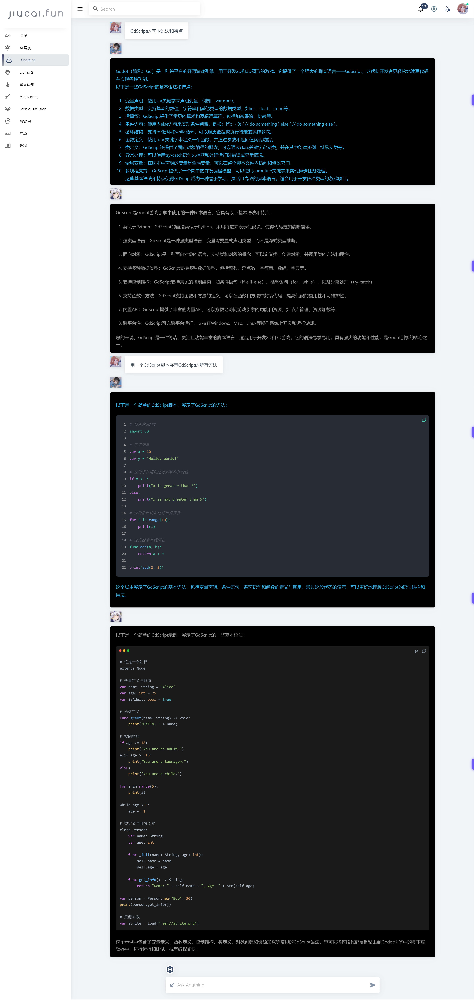

## GdScript的基本语法和特点



-----------
> 问：GdScript的基本语法和特点

```text
Godot（简称：Gd）是一种跨平台的开源游戏引擎，用于开发2D和3D图形的游戏。它提供了一个强大的脚本语言——GdScript，以帮助开发者更轻松地编写代码并实现各种功能。
以下是一些GdScript的基本语法和特点：
1. 变量声明：使用var关键字来声明变量，例如：var x = 0；
2. 数据类型：支持基本的数值、字符串和其他类型的数据类型，如int、float、string等。
3. 运算符：GdScript提供了常见的算术和逻辑运算符，包括加减乘除、比较等。
4. 条件语句：使用if-else语句来实现条件判断，例如：if(x > 0) { // do something } else { // do something else }。
5. 循环结构：支持for循环和while循环，可以遍历数组或执行特定的操作多次。
6. 函数定义：使用func关键字来定义一个函数，并通过参数和返回值实现功能。
7. 类定义：GdScript还提供了面向对象编程的概念，可以通过class关键字定义类，并在其中创建实例、继承父类等。
8. 异常处理：可以使用try-catch语句来捕获和处理运行时错误或异常情况。
9. 全局变量：在脚本中声明的变量是全局变量，可以在整个脚本文件内访问和修改它们。
10. 多线程支持：GdScript提供了一个简单的并发编程模型，可以使用coroutine关键字来实现异步任务处理。
这些基本语法和特点使得GdScript成为一种易于学习、灵活且高效的脚本语言，适合用于开发各种类型的游戏项目。
```

```text
GdScript是Godot游戏引擎中使用的一种脚本语言，它具有以下基本语法和特点：

1. 类似于Python：GdScript的语法类似于Python，采用缩进来表示代码块，使得代码更加清晰易读。

2. 强类型语言：GdScript是一种强类型语言，变量需要显式声明类型，而不是隐式类型推断。

3. 面向对象：GdScript是一种面向对象的语言，支持类和对象的概念，可以定义类、创建对象，并调用类的方法和属性。

4. 支持多种数据类型：GdScript支持多种数据类型，包括整数、浮点数、字符串、数组、字典等。

5. 支持控制结构：GdScript支持常见的控制结构，如条件语句（if-elif-else）、循环语句（for、while）、以及异常处理（try-catch）。

6. 支持函数和方法：GdScript支持函数和方法的定义，可以在函数和方法中封装代码，提高代码的复用性和可维护性。

7. 内置API：GdScript提供了丰富的内置API，可以方便地访问游戏引擎的功能和资源，如节点管理、资源加载等。

8. 跨平台性：GdScript可以跨平台运行，支持在Windows、Mac、Linux等操作系统上开发和运行游戏。

总的来说，GdScript是一种简洁、灵活且功能丰富的脚本语言，适合用于开发2D和3D游戏。它的语法易学易用，具有强大的功能和性能，是Godot引擎的核心之一。
```

-----------
> 问：用一个GdScript脚本展示GdScript的所有语法

> 以下是一个简单的GdScript脚本，展示了GdScript的语法：
> ```
> # 导入内置API
> import GD
> 
> # 定义变量
> var x = 10
> var y = "Hello, world!"
> 
> # 使用条件语句进行判断和控制流
> if x > 5:
>     print("x is greater than 5")
> else:
>     print("x is not greater than 5")
> 
> # 使用循环语句进行重复操作
> for i in range(10):
>     print(i)
> 
> # 定义函数并调用它
> func add(a, b):
>     return a + b
> 
> print(add(2, 3))
> ```
> 这个脚本展示了GdScript的基本语法，包括变量声明、条件语句、循环语句和函数的定义与调用。通过这段代码的演示，可以更好地理解GdScript的语法结构和用法。


> 以下是一个简单的GdScript示例，展示了GdScript的一些基本语法：
> 
> ```gd
> # 这是一个注释
> extends Node
> 
> # 变量定义与赋值
> var name: String = "Alice"
> var age: int = 25
> var isAdult: bool = true
> 
> # 函数定义
> func greet(name: String) -> void:
>     print("Hello, " + name)
> 
> # 控制结构
> if age >= 18:
>     print("You are an adult.")
> elif age >= 13:
>     print("You are a teenager.")
> else:
>     print("You are a child.")
>     
> for i in range(5):
>     print(i)
>     
> while age > 0:
>     age -= 1
> 
> # 类定义与对象创建
> class Person:
>     var name: String
>     var age: int
>     
>     func _init(name: String, age: int):
>         self.name = name
>         self.age = age
>         
>     func get_info() -> String:
>         return "Name: " + self.name + ", Age: " + str(self.age)
>         
> var person = Person.new("Bob", 30)
> print(person.get_info())
> 
> # 资源加载
> var sprite = load("res://sprite.png")
> ```
> 
> 这个示例中包含了变量定义、函数定义、控制结构、类定义、对象创建和资源加载等常见的GdScript语法。您可以将这段代码复制粘贴到Godot引擎中的脚本编辑器中，进行运行和测试。祝您编程愉快！