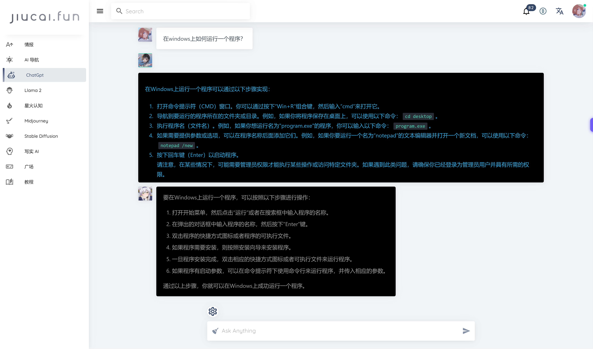

## 如何使用文本编辑器编写GdScript

### 如何运行一个程序



-----------
> 问：在windows上如何运行一个程序？

```text
在Windows上运行一个程序可以通过以下步骤实现：
1. 打开命令提示符（CMD）窗口。你可以通过按下“Win+R”组合键，然后输入“cmd”来打开它。
2. 导航到要运行的程序所在的文件夹或目录。例如，如果你将程序保存在桌面上，可以使用以下命令：`cd desktop`。
3. 执行程序名（文件名）。例如，如果你想运行名为"program.exe"的程序，你可以输入以下命令：`program.exe`。
4. 如果需要提供参数或选项，可以在程序名称后面添加它们。例如，如果你要运行一个名为“notepad”的文本编辑器并打开一个新文档，可以使用以下命令：`notepad /new`。
5. 按下回车键（Enter）以启动程序。
请注意，在某些情况下，可能需要管理员权限才能执行某些操作或访问特定文件夹。如果遇到此类问题，请确保你已经登录为管理员用户并具有所需的权限。
```

```text
要在Windows上运行一个程序，可以按照以下步骤进行操作：

1. 打开开始菜单，然后点击“运行”或者在搜索框中输入程序的名称。
2. 在弹出的对话框中输入程序的名称，然后按下“Enter”键。
3. 双击程序的快捷方式图标或者程序的可执行文件。
4. 如果程序需要安装，则按照安装向导来安装程序。
5. 一旦程序安装完成，双击相应的快捷方式图标或者可执行文件来运行程序。
6. 如果程序有启动参数，可以在命令提示符下使用命令行来运行程序，并传入相应的参数。

通过以上步骤，你就可以在Windows上成功运行一个程序。
```


### 通过文本编辑器运行GdScript

- https://github.com/williamd1k0/gdscript-cli

- https://github.com/gdscript-online/gdscript-online.github.io

- https://docs.godotengine.org/en/stable/tutorials/editor/command_line_tutorial.html

```text
godot.exe --headless --script myscript.gd
```

### idea运行GdScript

- 在idea中配置shell script
- 配置环境变量