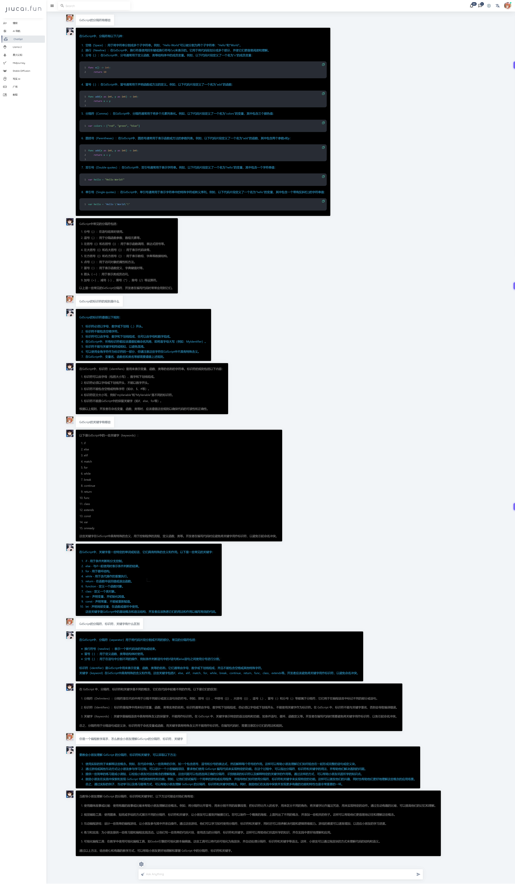

## 分隔符标识符和关键字

- https://juejin.cn/post/7257873483689394231




-----------
> 问：GdScript的分隔符有哪些


在GdScript中，分隔符有以下几种：
1. 空格（Space）：用于将字符串分割成多个子字符串。例如，"Hello World"可以被分割为两个子字符串："Hello"和"World"。
2. 换行（Newline）：在GdScript中，换行符是使用回车键或换行符号(\n)来表示的。它用于将代码段划分成多个部分，并使它们更容易阅读和理解。
3. 分号（;）：在GdScript中，分号通常用于定义函数、类等结构体中的成员变量。例如，以下代码片段定义了一个名为"x"的成员变量：
```
func x() -> int:
    return 10
```
4. 冒号（:）：在GdScript中，冒号通常用于声明函数或方法的定义。例如，以下代码片段定义了一个名为"add"的函数：
```
func add(x as int, y as int) -> int:
    return x + y
```
5. 分隔符（Comma）：在GdScript中，分隔符通常用于将多个元素列表化。例如，以下代码片段定义了一个名为"colors"的变量，其中包含三个颜色值：
```
var colors = ["red", "green", "blue"]
```
6. 圆括号（Parentheses）：在GdScript中，圆括号通常用于表示函数或方法的参数列表。例如，以下代码片段定义了一个名为"add"的函数，其中包含两个参数x和y：
```
func add(x as int, y as int) -> int:
    return x + y
```
7. 双引号（Double quotes）：在GdScript中，双引号通常用于表示字符串。例如，以下代码片段定义了一个名为"hello"的变量，其中包含一个字符串值：
```
var hello = "Hello World!"
```
8. 单引号（Single quotes）：在GdScript中，单引号通常用于表示字符串中的特殊字符或转义序列。例如，以下代码片段定义了一个名为"hello"的变量，其中包含一个带有反斜杠(\)的字符串值：
```
var hello = 'Hello \'World\'!'
```


```text
GdScript中常见的分隔符包括：

1. 分号（;）：在语句结束时使用。
2. 逗号（,）：用于分隔函数参数、数组元素等。
3. 左括号（(）和右括号（)）：用于表示函数调用、表达式括号等。
4. 左大括号（{）和右大括号（}）：用于表示代码块等。
5. 左方括号（[）和右方括号（]）：用于表示数组、字典等数据结构。
6. 点号（.）：用于访问对象的属性和方法。
7. 冒号（:）：用于表示函数定义、字典键值对等。
8. 箭头（->）：用于表示类成员访问。
9. 加号（+）、减号（-）、乘号（*）、除号（/）等运算符。

以上是一些常见的GdScript分隔符，开发者在编写代码时常常会用到它们。
```


-----------
> 问：GdScript的标识符的规则是什么


```text
以下是GdScript中的一些关键字（keywords）：

1. if
2. else
3. elif
4. match
5. for
6. while
7. break
8. continue
9. return
10. func
11. class
12. extends
13. const
14. var
15. onready

这些关键字在GdScript中具有特殊的含义，用于控制程序的流程、定义函数、类等。开发者在编写代码时应避免将关键字用作标识符，以避免引起命名冲突。
```


```text
在GdScript中，关键字是一些特定的单词或短语，它们具有特殊的含义和作用。以下是一些常见的关键字：
1. if - 用于条件判断和分支控制。
2. else - 与if一起使用时表示条件判断的结果。
3. for - 用于循环结构。
4. while - 用于迭代操作的重复执行。
5. return - 在函数中返回值或退出函数。
6. function - 定义一个函数对象。
7. class - 定义一个类对象。
8. var - 声明变量，并初始化其值。
9. const - 声明常量，不能被重新赋值。
10. let - 声明局部变量，在函数或循环中使用。
这些关键字是GdScript中的基础概念和语法结构，开发者应该熟悉它们的用法和作用以编写有效的代码。
```


-----------
> 问：GdScript的分隔符，标识符，关键字有什么区别


在GdScript中，分隔符（separator）用于将代码片段分割成不同的部分。常见的分隔符包括：
- 换行符号（newline）：表示一个新代码块的开始或结束。
- 冒号（:）：用于定义函数、类等结构体时使用。
- 分号（;）：用于在语句中分割不同的操作，例如条件判断语句中的if语句和else语句之间使用分号进行分割。

标识符（identifier）是GdScript中用来表示变量、函数、类等的名称。它们通常由字母、数字或下划线组成，并且不能包含空格或其他特殊字符。
关键字（keyword）在GdScript中具有特殊的含义和作用。这些关键字包括if、else、elif、match、for、while、break、continue、return、func、class、extends等。开发者应该避免将关键字用作标识符，以避免命名冲突。


```text
在 GdScript 中，分隔符、标识符和关键字是不同的概念，它们在代码中起着不同的作用。以下是它们的区别：

1. 分隔符（Delimiters）：分隔符是在代码中用于分隔不同部分或定义语句块的符号。例如，括号（()）、中括号（[]）、大括号（{}）、逗号（,）、冒号（:）和分号（;）等都属于分隔符，它们用于在编程语言中标记不同的部分或语句。

2. 标识符（Identifiers）：标识符是程序中用来标识变量、函数、类等实体的名称。标识符通常由字母、数字和下划线组成，但必须以字母或下划线开头，不能使用关键字作为标识符。在 GdScript 中，标识符不能与关键字重名，否则会导致编译错误。

3. 关键字（Keywords）：关键字是编程语言中具有特殊含义的保留字，不能用作标识符。在 GdScript 中，关键字表示特定的语法结构和功能，如条件语句、循环、函数定义等。开发者在编写代码时需要避免将关键字用作标识符，以免引起命名冲突。

总之，分隔符用于分隔语句或定义块，标识符用于命名变量或函数，而关键字具有特殊含义并不能用作标识符。在编写代码时，需要注意区分它们的用法和规则。
```


-----------
> 问：你是一个编程教学高手，怎么教会小朋友理解GdScript的分隔符，标识符，关键字


要教会小朋友理解 GdScript 的分隔符、标识符和关键字，可以采取以下方法：
1. 使用实际的例子来解释这些概念。例如，在代码中插入一些简单的示例，如一个包含括号、逗号和分号的表达式，然后解释每个符号的作用。这样可以帮助小朋友理解它们如何组合在一起形成完整的语句或定义块。
2. 通过游戏或其他互动方式让小朋友参与学习过程。可以设计一个小型编程项目，要求他们使用 GdScript 编写代码来实现特定的功能。在这个过程中，可以指出分隔符、标识符和关键字的用法，并帮助他们解决遇到的问题。
3. 提供一些简单的练习题或小测验，以检验小朋友对这些概念的理解程度。这些问题可以包括选择正确的分隔符、识别错误的标识符以及解释特定的关键字的作用等。通过这样的方式，可以帮助小朋友巩固所学的知识点。
4. 鼓励小朋友在实践中探索和发现 GdScript 中的其他特性和功能。例如，让他们尝试编写一个简单的游戏或应用程序，并指导他们如何使用分隔符、标识符和关键字来实现特定的功能。这样可以激发他们的兴趣，同时也帮助他们更好地理解这些概念的应用场景。
   总之，通过实际的例子、互动学习以及练习题等方式，可以帮助小朋友理解 GdScript 的分隔符、标识符和关键字的概念。同时，鼓励他们在实践中探索并发现更多有趣的功能和特性也是非常重要的一环。


```text
当教导小朋友理解 GdScript 的分隔符、标识符和关键字时，以下方法可能会对他们有帮助：

1. 使用趣味故事或比喻：使用有趣的故事或比喻来帮助小朋友理解这些概念。例如，将分隔符比作冒号，用来分割不同的故事段落；把标识符比作人的名字，用来区分不同的角色；将关键字比作魔法咒语，用来实现特定的动作。通过生动有趣的比喻，可以提高他们的记忆和理解。

2. 视觉辅助工具：使用图表、贴纸或手绘的方式展示不同的分隔符、标识符和关键字，让小朋友可以看到并触摸它们。您可以制作一个精美的海报，上面列出了不同的概念，并添加一些相关的例子。这样可以帮助他们更容易地记住和理解这些概念。

3. 互动编程游戏：设计一些简单的编程游戏，让小朋友参与其中并亲自操作。通过这些游戏，他们可以学习如何使用分隔符、标识符和关键字，同时还可以培养解决问题和逻辑思维能力。游戏的难度可以逐渐增加，以适应小朋友的学习进度。

4. 练习和实践：为小朋友提供一些练习题和编程实践活动。让他们写一些简单的代码片段，使用适当的分隔符、标识符和关键字。这样可以帮助他们巩固所学的知识，并在实践中更好地理解和应用。

5. 可视化编程工具：在教学中使用可视化编程工具，如Godot引擎的可视化脚本编辑器。这些工具可以将代码可视化为拖放块，并自动处理分隔符、标识符和关键字等语法。这样，小朋友可以通过拖放块的方式来理解代码的结构和语义。

通过以上方法，结合耐心和有趣的教学方式，可以帮助小朋友更好地理解和掌握 GdScript 中的分隔符、标识符和关键字。
```