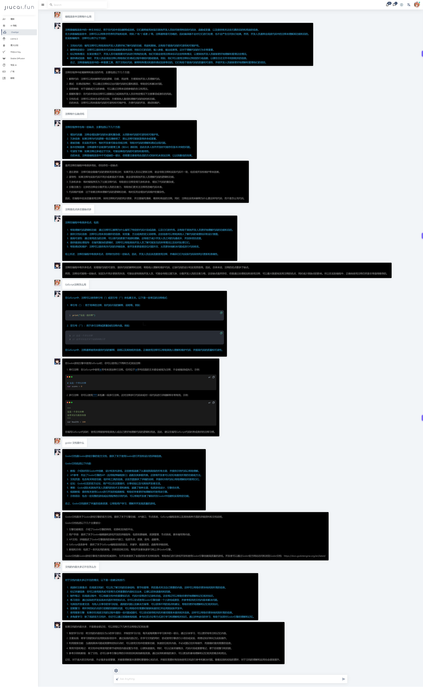

## 注释和文档

### 注释

### 文档

- godot官方文档
- godot engine引擎内部文档
- 文档是用来查的，不需要死记硬背




-----------
> 问：编程语言中注释有什么用


```text
注释是编程语言中的一种文本标记，用于在代码中添加解释或说明。它们通常被用来指示其他开发人员如何使用特定的代码块、函数或变量，以及提供有关这些元素的目的和用途的信息。
在大多数编程语言中，注释可以以特殊字符序列开始和结束，例如 /* 和 */ 或者 // 等。注释通常是可忽略的，因此编译器不会对它们进行处理，也不会产生任何执行结果。然而，开发人员通常会阅读代码中的注释来理解其功能和目的。
在实际编程中，注释可以用于以下目的：
1. 文档化代码：编写注释可以帮助其他开发人员更好地了解代码的功能、用途和限制。这有助于提高代码的可读性和可维护性。
2. 解释特定部分：注释可以提供有关代码块或函数的具体说明，例如它们的目的、输入参数、输出结果等。这对于理解代码的行为非常重要。
3. 标记特殊情况：在某些情况下，开发人员可能需要对代码进行特殊的处理。他们可能会使用注释来标识这些特殊情况，以便其他开发人员能够更好地理解和管理这些情况。
4. 提供调试信息：有时，开发人员会添加注释以帮助他们在调试过程中跟踪问题或错误。例如，他们可以使用注释标记特定的行或函数，以便在日志文件中找到相关的信息。
总之，注释是编程语言中的一种重要工具，用于文档化代码、解释特殊情况和提供调试信息等目的。它们有助于提高代码的质量和可读性，并使开发人员能够更好地理解和管理他们的项目。
```


```text
注释在程序中起着解释和备注的作用，主要包括以下几个方面：
1. 解释代码：注释可以用来解释代码的逻辑、功能、用途等，方便其他开发人员理解代码。
2. 调试：在调试程序时，可以通过注释标记出问题代码的位置和原因，帮助定位和解决问题。
3. 说明参数：对于函数或方法的参数，可以通过注释来说明参数的含义和用法。
4. 提醒和警示：在代码中添加注释可以提醒自己或其他开发人员在特定情况下注意事项或潜在的风险。
5. 文档生成：注释可以用来生成代码文档，方便其他人查阅和理解代码的结构和功能。
总的来说，注释可以用来提高代码的可读性和可维护性，方便代码的开发、调试和维护。
```


-----------
> 问：注释有什么缺点吗


```text
注释在程序中也有一些缺点，主要包括以下几个方面：
1. 增加代码量：注释会增加源代码的长度和复杂度，从而影响代码的可读性和可维护性。
2. 冗余信息：如果注释与代码逻辑一致且清晰明了，那么注释可能就显得多余或重复。
3. 易被忽略：在实际开发中，有时开发者可能会忽视注释，导致对代码的理解和调试出现问题。
4. 版本控制困难：注释通常不会被源代码管理工具（如Git）跟踪到，因此在多人协作开发时可能存在版本冲突的问题。
5. 可读性下降：如果注释过多或过于冗长，可能会降低代码的可读性和易用性。
总的来说，注释是编程语言中不可或缺的一部分，但需要注意使用合适的方式和时机来添加注释，以达到最佳的效果。
```


```text
虽然注释在编程中有很多用处，但也存在一些缺点：
1. 遗忘更新：注释可能会随着代码的更新而变得过时，如果开发人员忘记更新注释，就会导致注释和实际代码不一致，给后续开发和维护带来困难。
2. 误导性：如果注释与实际代码不同步或者描述不准确，就会误导其他开发人员理解代码的逻辑和功能。
3. 冗余和多余：有时候程序员为了过度注释代码，导致部分注释变得冗余和多余，增加了代码的复杂度。
4. 分散注意力：过多的注释会分散开发人员的注意力，导致他们更关注注释而忽略代码本身。
5. 代码维护困难：过于依赖注释来理解代码的逻辑和功能，有时反而会增加代码维护的复杂性。

因此，在编程中应该适量使用注释，保持注释和代码的同步更新，并注重编写清晰、精准和有益的注释。同时，注释应该用来解释为什么要这样写代码，而不是怎么写代码。
```


-----------
> 问：注释是优点多还是缺点多


```text
注释在编程中有很多优点，包括：
1. 帮助理解代码逻辑和功能：通过注释可以解释为什么编写了特定的代码片段或函数，以及它们的作用。这有助于其他开发人员更好地理解代码的功能和目的。
2. 提供文档化信息：注释可以用来添加额外的信息，如变量、方法或类的定义说明等。这些信息可以帮助其他人了解代码的背景知识和设计意图。
3. 提高可读性：通过使用适当的注释，可以使代码更易于阅读和理解。这有助于减少开发人员之间的沟通成本，并加快项目进度。
4. 提供错误处理指导：在编写复杂的逻辑时，注释可以帮助其他开发人员了解可能发生的异常情况以及如何处理它们。
5. 帮助调试和维护：注释可以提供有关代码的详细信息，使开发者更容易定位问题所在，从而更快地解决问题或进行代码修改。

综上所述，注释在编程中有很多优点，但同时也存在一些缺点。因此，开发人员应该适度使用注释，并确保它们与实际代码保持同步更新和准确性。
```

注释在编程中有许多优点，如增强代码的可读性、提供代码的解释和说明、帮助他人理解和维护代码、记录代码的设计和实现思路等。因此，总体来说，注释的优点要多于缺点。

然而，注释也可能有一些缺点，如因为不同步更新而失效、可能会误导其他开发人员、可能会导致过度冗余、分散开发人员的注意力等。这些缺点虽然存在，但是通过合理规划和使用注释，可以最大限度地发挥注释的优点，同时减少其缺点的影响。所以在实际编程中，正确地使用注释仍然是非常值得推荐的。


-----------
> 问：GdScript注释怎么用


> 在GdScript中，注释可以使用单引号（'）或双引号（""）来包裹文本。以下是一些常见的注释格式：
> 1. 单引号（'）：用于简单的注释，如代码片段的解释、说明等。例如：
> ```
> print("这是一段注释")
> ```
> 2. 双引号（""）：用于多行注释或更复杂的注释内容。例如：
> ```
> // 这是一个多行注释
> // 这里可以包含多个段落和换行符
> ```
> 在GdScript中，注释通常被用来提供代码的解释、说明以及其他相关信息。正确使用注释可以帮助其他人理解和维护代码，并提高代码的质量和可读性。


在Godot游戏引擎中使用GdScript时，你可以使用以下两种方式添加注释：

1. 单行注释：在GdScript中使用`#`符号来添加单行注释。任何位于`#`符号后面的文本都会被视为注释，不会被编译或执行。示例：

```gd
# 这是一个单行注释
var score = 0
```

2. 多行注释：你可以使用`"""`来包裹一段多行注释。这对注释多行代码块或对一段代码进行详细解释非常有用。示例：

```gd
"""
这是一个多行注释
这里可以写很多内容
"""
var health = 100
```

在编写GdScript代码时，使用注释能够帮助其他人或自己更好地理解代码的逻辑和用途。因此，建议在编写GdScript代码时养成良好的注释习惯。


-----------
> 问：godot 文档是什么


```text
Godot文档是Godot游戏引擎的官方文档，提供了关于使用Godot进行开发和设计的详细信息。

Godot文档包括以下内容：
1. 教程：介绍如何在Godot中创建、设计和发布游戏。这些教程涵盖了从基础到高级的所有主题，并提供示例代码以帮助理解。
2. API参考：列出了Godot引擎的API（应用程序编程接口）函数及其参数列表。这使得开发者可以轻松地查找所需的功能或方法。
3. 文档页面：包含有关特定功能、组件和工具的信息。这些页面提供了详细的说明，并提供示例代码以帮助理解如何使用它们。
4. 论坛：Godot社区的官方论坛，用户可以在这里提问、分享经验以及与其他开发者交流。
5. 博客：Godot团队和其他开发人员撰写的技术文章和教程，涵盖了各种主题，包括游戏设计、引擎优化等。
6. 视频教程：提供有关使用Godot进行开发的视频教程，帮助初学者更好地理解如何使用该引擎。
7. 示例项目：包含一些完整的游戏或应用程序的示例代码，可以帮助开发者了解如何在Godot中创建和实现特定功能。

总之，Godot文档提供了丰富的信息资源，以帮助用户学习、理解并开发高质量的游戏。
```


```text
Godot文档是关于Godot游戏引擎的官方文档，提供了关于引擎功能、API接口、节点系统、GdScript编程语言以及其他各种方面的详细资料和文档说明。

Godot文档包括以下几个主要部分：
1. 引擎功能概览：介绍了Godot引擎的特性、优势和支持的平台。
2. 用户手册：提供了关于Godot编辑器和游戏开发的详细指导，包括场景编辑、资源管理、节点系统、脚本编写等内容。
3. API文档：详细描述了Godot引擎提供的各种API接口，包括节点、资源、信号、函数等。
4. GdScript语言参考：提供了关于GdScript编程语言的语法、关键字、数据类型、函数等详细说明。
5. 教程和示例：包括了一系列实用的教程、示例项目和文档，帮助开发者快速学习和上手Godot引擎。

Godot文档是Godot游戏引擎官方提供的权威资料，为开发者提供了全面的技术支持和指导，帮助他们进行游戏开发和使用Godot引擎创建高质量的游戏。开发者可以通过Godot官方网站访问和浏览Godot文档：https://docs.godotengine.org/en/latest/
```


-----------
> 问：文档的内容太多记不住怎么办


```text
对于文档内容太多记不住的情况，以下是一些建议和技巧：
1. 阅读时注意重点：在阅读文档时，可以先了解文档的目录结构、章节标题等，然后重点关注自己需要的内容。这样可以帮助你更快地找到所需的信息。
2. 标记关键信息：你可以使用高亮或书签等方式将重要的内容标注出来，以便以后快速查找和回顾。
3. 制作笔记：在阅读过程中，可以根据文档中的重要知识点、代码片段等进行记录和总结。这些笔记可以帮助你更好地理解和记忆相关知识。
4. 练习项目：通过实际的开发实践来巩固所学的知识点。你可以尝试使用Godot引擎创建一个小游戏或原型，并参考相关的文档内容来解决问题。
5. 与其他开发者交流：与他人分享你的学习经验、遇到的问题以及解决方案等，可以获得不同的观点和建议，帮助你更好地理解和记忆相关知识。
6. 定期复习：将所学的知识点进行定期的回顾和巩固，可以帮助你在需要时能够快速回忆并应用到实际开发中。
7. 使用搜索引擎：如果你在阅读文档的过程中遇到一些问题或疑问，可以尝试使用相关的关键词搜索来查找相关信息。这样可以帮助你更快地找到所需的信息。
8. 多角度学习：除了阅读官方文档外，你还可以通过观看教程视频、参与社区讨论等方式进行学习和理解相关知识。通过多种途径的学习，有助于加深对Godot引擎的理解和记忆。
```


```text
如果文档的内容太多，不容易全部记住，可以采取以下几种方法帮助记忆和处理：
1. 制定学习计划：将文档的内容划分为小的学习部分，并制定学习计划，每天或每周集中学习其中的一部分。通过分块学习，可以更好地专注和记忆内容。
2. 注重实践：将学习到的知识应用到实际项目中，通过实践巩固记忆。在学习文档的同时，尝试使用引擎进行小项目或实验，将理论知识转化为实际操作。
3. 利用搜索功能：当遇到具体问题或需要特定知识点时，可以使用文档中的搜索功能，快速定位相关内容。不必试图记住所有细节，而是随时查找需要的信息。
4. 常用书签和笔记：将文档中经常使用的章节或特定内容设置为书签，以便快速查找。同时，可以记录关键概念、代码片段或重要笔记，便于后续复习和回顾。
5. 参考示例和教程：除了文档，还可以参考引擎自带的示例项目和其他教程资源。通过实例和教程的演示，可以更加形象地理解和记忆相关的概念和用法。

记住，对于庞大的文档内容，不必强求全部掌握，关键是理解基本原理和掌握核心知识点，并能在需要时有效地使用文档进行参考和解决问题。随着实践和经验的累积，对于文档的理解和运用也会逐渐提升。
```