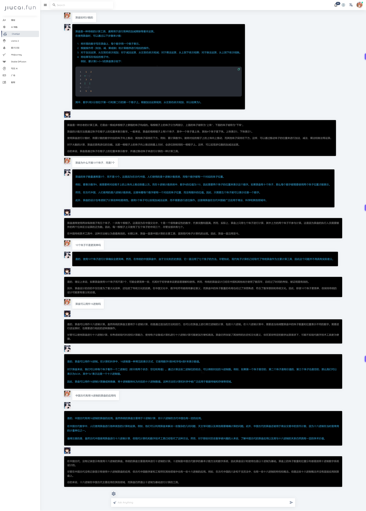

## 算盘和计数方式

- https://baike.baidu.com/item/%E7%AE%97%E7%9B%98/363020?fr=ge_ala
- 【三分钟科技史系列026：算盘——古代的“超级计算机”】 https://www.bilibili.com/video/BV1Xm4y1u7hb/?share_source=copy_web&vd_source=5dbf211eec08e51a4c6d136972063c73
- 【中国传统计算工具-算盘】 https://www.bilibili.com/video/BV1e94y197jC/?share_source=copy_web&vd_source=5dbf211eec08e51a4c6d136972063c73
- 【【计算机科学速成课】[40集全/精校] - Crash Course Computer Science】 https://www.bilibili.com/video/BV1EW411u7th/?share_source=copy_web&vd_source=5dbf211eec08e51a4c6d136972063c73





-----------
> 问：算盘如何计数的


算盘是一种传统的计算工具，通常用于进行简单的加减乘除等基本运算。
在使用算盘时，可以通过以下步骤来计数：
1. 将所需的数字写在算盘上，每个数字用一个格子表示。
2. 根据操作符（如加、减、乘或除）和计算顺序进行相应的操作。
3. 对于加法运算，从左到右依次相加；对于减法运算，从左到右依次相减；对于乘法运算，从上到下依次相乘；对于除法运算，从上到下依次相除。
4. 将结果写在相应的格子中。
   例如，要计算2+3=5的算盘表示如下：
```
  1   2
 +---|
  3   4
 |   |
 ---|-
  5   6
```
其中，数字2和3分别位于第一行和第二行的第一个格子上。根据加法运算规则，从左到右依次相加，所以结果为5。


```text
算盘是一种古老的计算工具，它是由一根或多根棍子上穿插的珠子构成的。每根棍子上的珠子分为两部分，上面的珠子被称为"上珠"，下面的珠子被称为"下珠"。

算盘的计数方法是通过珠子在棍子上的位置来表示数字。一般来说，算盘的每根棍子上有5个珠子，其中一个珠子是上珠，其他4个珠子是下珠。上珠表示5，下珠表示1。

使用算盘进行计数时，将要计数的数字对应的珠子向上推动，其他珠子保持在下方。例如，要计算数字6，就将对应的棍子上的上珠向上推动，而其他珠子保持在下方。这样，可以通过推动珠子的位置来进行加法、减法、乘法和除法等运算。

对于大数的计算，算盘还具有进位的功能。当某一根棍子上的珠子向上推动到最上方时，会进位到相邻的一根棍子上。这样，可以实现多位数的加减法运算。

总的来说，算盘是通过珠子在棍子上的位置来表示数字，并通过推动珠子来进行计算的一种计算工具。
```


-----------
> 问：算盘为什么不搞10个珠子，而是7个


```text
算盘的珠子数量通常是5个，而不是10个。这是因为在古代中国，人们使用的是十进制计数系统，而每个数字都有一个对应的珠子位置。

例如，要表示数字6，就需要将对应棍子上的上珠向上推动到最上方。而在十进制计数系统中，数字6的位值为110，因此需要两个珠子的位置来表示这个数字。
如果算盘有十个珠子，那么每个数字都需要使用两个珠子位置才能表示。

然而，在古代中国，人们使用的是六进制计数系统。这意味着每个数字都有一个对应的珠子位置，而没有额外的位值。因此，只需要五个珠子就可以表示任意一个数字。

此外，算盘的设计也考虑到了计算效率和易用性。使用5个珠子可以实现加减法运算，而不需要进行进位操作。这使得算盘在古代中国被广泛应用于商业、科学和其他领域中。
```


```text
算盘通常使用两块每条棍子有五个珠子，一共有十根棍子。这是因为在中国文化中，十是一个很有象征性的数字，代表完整和圆满。
然而，实际上，算盘上只用七个珠子进行计算，其中上方的两个珠子不参与计算。这是因为算盘的执行人员需要额外的两个位来区分运算的正负数。
因此，每一根棍子上只使用了五个珠子的中间三个，尽管全部共有七个。

在中国传统算术工具中，这种方法被认为是最高效的。长期以来，算盘一直是中国计算的主要工具，直到现代电子计算机的出现。因此，算盘一直沿用至今。
```


-----------
> 问：10个珠子不是更简单吗


```text
算盘的珠子数量通常是5个，而不是10个。这是因为在古代中国，人们使用的是十进制计数系统，而每个数字都有一个对应的珠子位置。

例如，要表示数字6，就需要将对应棍子上的上珠向上推动到最上方。而在十进制计数系统中，数字6的位值为110，因此需要两个珠子的位置来表示这个数字。
如果算盘有十个珠子，那么每个数字都需要使用两个珠子位置才能表示。

然而，在古代中国，人们使用的是六进制计数系统。这意味着每个数字都有一个对应的珠子位置，而没有额外的位值。因此，只需要五个珠子就可以表示任意一个数字。

此外，算盘的设计也考虑到了计算效率和易用性。使用5个珠子可以实现加减法运算，而不需要进行进位操作。这使得算盘在古代中国被广泛应用于商业、科学和其他领域中。
```


```text
算盘通常使用两块每条棍子有五个珠子，一共有十根棍子。这是因为在中国文化中，十是一个很有象征性的数字，代表完整和圆满。
然而，实际上，算盘上只用七个珠子进行计算，其中上方的两个珠子不参与计算。这是因为算盘的执行人员需要额外的两个位来区分运算的正负数。
因此，每一根棍子上只使用了五个珠子的中间三个，尽管全部共有七个。

在中国传统算术工具中，这种方法被认为是最高效的。长期以来，算盘一直是中国计算的主要工具，直到现代电子计算机的出现。因此，算盘一直沿用至今。
```


-----------
> 问：算盘可以用作16进制吗


```text
是的，算盘可以用作十六进制计算。虽然传统的算盘主要用于十进制计算，但是通过适当的方法和技巧，也可以在算盘上进行其它进制的计算，包括十六进制。
在十六进制计算中，需要适当地调整算盘中的珠子数量和位置表示不同的数字。需要进行逆运算时，也需要进行相应的逆转换操作。

尽管可以使用算盘进行十六进制计算，但考虑到现代科技和计算能力，使用电子设备或计算机进行十六进制计算可能更加方便和高效。
算盘仍然保留了其独特的历史和文化意义，但在某些特定的数学运算需求下，可能不如现代数字技术工具更为便捷。
```


```text
是的，算盘可以用作16进制。在计算机科学中，16进制是一种常见的表示方式，它使用数字0到9和字母A到F来表示数值。

对于算盘来说，我们可以将每个珠子看作一个二进制位（即只有两个状态：空位和有值）。通过计算这些二进制位的组合，可以得到对应的16进制数。
例如，如果第一个珠子是空的，第二个珠子是有价值的，第三个珠子也是空的，那么我们可以表示为0x3A，其中“0x”表示这是一个十六进制值。

因此，算盘可以用作16进制计算器或转换器，将十进制数转化为对应的十六进制数值。这种方法在计算机科学中被广泛应用于数据传输和存储等领域。
```


-----------
> 问：中国古代有用16进制的算盘的应用吗


```text
是的，中国古代有用16进制的算盘的应用。虽然传统的算盘主要用于十进制计算，但十六进制在古代中国也有一定的应用。

在中国古代数学中，人们使用算盘进行各种类型的计算和运算。例如，他们可以利用算盘来解决一些复杂的几何问题、天文学问题以及其他需要精确计算的问题。
此外，中国古代的算盘还被用于商业交易中的货币计数，因为十六进制在当时是常用的计量单位之一。

值得注意的是，虽然古代中国使用算盘进行十六进制计算，但现代计算机和数字技术工具已经取代了这种方法。
然而，对于那些对历史数学感兴趣的人来说，了解中国古代的算盘应用以及其与十六进制的关系仍然具有一定的学术价值。
```


```text
在中国古代，没有记录显示有使用十六进制的算盘。传统的算盘主要是用来进行十进制的计算。十进制是中国古代数学的基本计数方法和数字系统，因此算盘设计和使用也是以十进制为基础。算盘上的珠子数量和位置分布都是按照十进制数字系统设计的。

尽管在中国古代没有记录显示有使用十六进制算盘的应用，但古代中国数学家和工程师在其他领域中也有一些十六进制的应用。例如，在古代中国的八卦和干支历法中，也有一些十六进制的特性和概念。但是这些十六进制概念并没有直接应用到算盘上。

总的来说，十六进制在中国古代主要应用在其他领域，而算盘仍然是以十进制为基础进行计算的工具。
```
