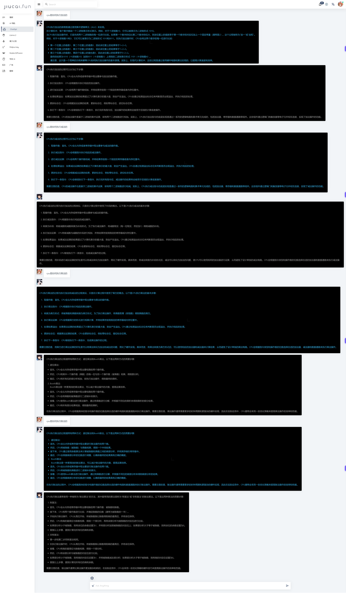

## cpu指令如何执行二进制的加减乘除

- 【【硬核科普】带你认识CPU第02期——CPU是怎么计算加法的（上）】 https://www.bilibili.com/video/BV1aQ4y1v7QP/?share_source=copy_web&vd_source=5dbf211eec08e51a4c6d136972063c73





-----------
> 问：cpu是如何执行加法的


CPU执行加法的原理是通过使用算术逻辑单元（ALU）来实现。
在计算机中，每个数字都由一个二进制表示形式表示。例如，对于十进制数10，它可以被表示为二进制形式 1010。
当CPU执行加法操作时，它首先将两个二进制数的每一位进行比较。如果第一个数字的位比第二个数字的位大，则该位置上的值就等于第一个数字的对应位加上一个固定常量（通常是2）。这个过程被称为“加一”或“加权”。
例如，对于十进制数10和3，它们可以被表示为二进制形式 1010和0011。在执行加法操作时，CPU会将这两个数字的每一位进行比较：
- 第一个位置上的值是1，第二个位置上的值是0，因此该位置上的结果等于1+2=3。
- 第二个位置上的值是1，第三个位置上的值是0，因此该位置上的结果等于1+2=3。
- 第三个位置上的值是0，第四个位置上的值也是0，因此该位置上的结果等于0+2=2。
  最终的结果为1010（十进制数10）加到0011（十进制数3）上得到的二进制表示形式 1101（十进制数4）。
  请注意，这只是一个简单的示例来解释CPU如何执行加法操作的基本原理。实际上，在现代计算机中，这些过程是通过使用硬件电路和算法实现的，以提高计算速度和效率。


```text
CPU执行加法的过程可以分为以下步骤：

1. 取操作数：首先，CPU会从内存或者寄存器中取出要参与加法的操作数。

2. 执行加法指令：CPU会根据指令执行相应的加法操作。

3. 进行加法运算：CPU会将两个操作数相加，并将结果存放到一个指定的寄存器或者内存位置中。

4. 处理结果溢出：如果加法运算的结果超过了计算机表示的最大值，则会产生溢出。CPU会通过检测溢出标志位来判断是否出现溢出，并执行相应的处理。

5. 更新标志位：CPU会根据加法运算的结果，更新标志位，例如零标志位、进位标志位等。

6. 执行下一条指令：CPU会继续执行下一条指令，执行完所有指令后，加法操作的结果将会被用于后续的计算或者操作。

需要注意的是，CPU的加法操作是基于二进制的算术运算，即将两个二进制数进行相加。实际上，CPU执行加法指令的底层实现是通过一系列的逻辑电路和算术单元完成的，包括加法器、寄存器和数据通路等组件。这些组件通过逻辑门和触发器等电子元件相互连接，实现了加法操作的功能。
```


-----------
> 问：cpu是如何执行减法的


```text
CPU执行减法的过程可以分为以下步骤：

1. 取操作数：首先，CPU会从内存或者寄存器中取出要参与减法的操作数。

2. 执行减法指令：CPU会根据指令执行相应的减法操作。

3. 进行减法运算：CPU会将两个操作数相减，并将结果存放到一个指定的寄存器或者内存位置中。

4. 处理结果溢出：如果减法运算的结果超过了计算机表示的最大值，则会产生溢出。CPU会通过检测溢出标志位来判断是否出现溢出，并执行相应的处理。

5. 更新标志位：CPU会根据减法运算的结果，更新标志位，例如零标志位、进位标志位等。

6. 执行下一条指令：CPU会继续执行下一条指令，执行完所有指令后，减法操作的结果将会被用于后续的计算或者操作。

需要注意的是，CPU的减法操作也是基于二进制的算术运算，即将两个二进制数进行相减。实际上，CPU执行减法指令的底层实现是通过一系列的逻辑电路和算术单元完成的，包括加法器、寄存器和数据通路等组件。这些组件通过逻辑门和触发器等电子元件相互连接，实现了减法操作的功能。
```


```text
CPU执行减法的过程与执行加法的过程类似，只是在计算过程中使用了补码的概念。以下是CPU执行减法的基本步骤：

1. 取操作数：首先，CPU会从内存或寄存器中取出要参与减法的操作数。

2. 执行减法指令：CPU根据指令执行相应的减法操作。

3. 转换为补码：将被减数和减数转换为补码形式。为了执行减法操作，将减数取反（每一位取反，然后加1）得到减数的补码。

4. 执行加法运算：CPU将被减数与减数的补码进行相加，并将结果存放到指定的寄存器或内存位置中。

5. 处理结果溢出：如果减法运算的结果超过了计算机表示的最大值，则会产生溢出。CPU通过检测溢出标志位来判断是否出现溢出，并执行相应的处理。

6. 更新标志位：根据减法运算的结果，CPU会更新标志位，例如零标志位、借位标志位等。

7. 执行下一条指令：CPU继续执行下一条指令，完成减法操作的过程。

需要注意的是，用补码进行减法运算的好处是可以将减法转化为加法操作，简化了硬件实现。具体而言，将减法转换为补码形式后，减法可以转化为加法的问题，使CPU可以使用相同的加法器进行运算，从而避免了设计单独的减法电路。CPU会根据指令类型和操作数的位数选择合适的加法器和数据通路来执行减法操作。
```


-----------
> 问：cpu是如何执行乘法的


```text
CPU执行乘法的过程与执行加法和减法的过程类似，只是在计算过程中使用了乘方的概念。以下是CPU执行乘法的基本步骤：

1. 取操作数：首先，CPU会从内存或寄存器中取出要参与乘法的操作数。

2. 执行乘法指令：CPU根据指令执行相应的乘法操作。

3. 转换为乘方形式：将被乘数和乘数转换为乘方形式。为了执行乘法操作，将乘数取幂（即指数）得到乘数的乘方。

4. 执行乘法运算：CPU会根据乘方的形式进行相乘计算，并将结果存放到指定的寄存器或内存位置中。

5. 处理结果溢出：如果乘法运算的结果超过了计算机表示的最大值，则会产生溢出。CPU通过检测溢出标志位来判断是否出现溢出，并执行相应的处理。

6. 更新标志位：根据乘法运算的结果，CPU会更新标志位，例如零标志位、借位标志位等。

7. 执行下一条指令：CPU继续执行下一条指令，完成乘法操作的过程。

需要注意的是，用乘方进行乘法运算的好处是可以将乘法转化为加法和减法的问题，简化了硬件实现。具体而言，将乘法转换为乘方形式后，可以使用相应的加法器和减法器来计算结果，从而避免了设计单独的乘法电路。CPU会根据指令类型和操作数的位数选择合适的加法器、减法器和数据通路来执行乘法操作。
```


CPU执行乘法的过程通常有两种方式：逐位乘法和Booth乘法。以下是这两种方式的简要步骤：

1. 逐位乘法：
- 首先，CPU会从内存或寄存器中取出要相乘的两个操作数。
- 然后，CPU将其中一个操作数（乘数）的每一位与另一个操作数（被乘数）相乘，得到部分积。
- 随后，CPU将所有位的部分积相加，即执行加法操作，得到最终的乘积。

2. Booth乘法：
   Booth乘法是一种更高效的乘法算法，可以减少乘法操作的次数，提高运算效率。
- 首先，CPU会从内存或寄存器中取出要相乘的两个操作数。
- 然后，CPU会将乘数和被乘数进行二进制补码表示。
- 接着，CPU使用Booth算法进行乘法操作，通过将乘数进行分解，并根据不同位的乘积来得到乘积的部分结果。
- 最后，CPU将所有部分结果相加，得到最终的乘积。

在执行乘法的过程中，CPU会根据具体的指令和操作数的位数选择合适的硬件电路和数据通路来执行乘法操作。需要注意的是，乘法操作通常需要更多的时钟周期和更复杂的硬件实现，因此在实际应用中，CPU通常会采用一些优化策略来提高乘法操作的效率和性能。


-----------
> 问：cpu是如何执行除法的


> CPU执行除法的过程通常有两种方式：逐位除法和Booth除法。以下是这两种方式的简要步骤：
> 
> 1. 逐位除法：
> - 首先，CPU会从内存或寄存器中取出要进行除法操作的两个数。
> - 然后，CPU将被除数（被除数）与乘数相乘，得到一个中间结果。
> - 接下来，CPU通过使用余数算法来计算被除数和乘数之间的商部分积，并将其存储在寄存器中。
> - 最后，CPU会根据商部分积的位数进行调整，以确保最终的结果具有正确的精度。
> 
> 2. Booth除法：
>    Booth除法是一种更高效的除法算法，可以减少除法操作的次数，提高运算效率。
> - 首先，CPU会从内存或寄存器中取出要进行除法操作的两个数。
> - 然后，CPU将被除数和乘数进行二进制补码表示。
> - 接着，CPU使用Booth算法进行除法操作，通过将乘数进行分解，并根据不同位的商部分积来得到商部分积的结果。
> - 最后，CPU会根据商部分积的位数进行调整，以确保最终的结果具有正确的精度。
> 
> 在执行除法的过程中，CPU会根据具体的指令和操作数的位数选择合适的硬件电路和数据通路来执行除法操作。需要注意的是，除法操作通常需要更多的时钟周期和更复杂的硬件实现，因此在实际应用中，CPU通常会采用一些优化策略来提高除法操作的效率和性能。


> CPU执行除法通常使用一种被称为"除法算法"的方法，其中最常用的算法是称为"恢复法"或"非恢复法"的除法算法。以下是这两种算法的简要步骤：
> 
> 1. 恢复法：
> - 首先，CPU会从内存或寄存器中取出要相除的两个操作数：被除数和除数。
> - 接下来，CPU将两个操作数进行比较，并确定除数的位数（通常为被除数的一半）。
> - 开始执行除法操作，CPU从高位开始，将被除数除以除数得到商的最高位，并将该位保存。
> - 然后，CPU将商的最高位与除数相乘，得到一个部分积，再将该部分积与被除数的对应位进行比较。
> - 如果部分积小于被除数，则将该位的余数设置为1，并将部分积加到被除数的对应位上；如果部分积大于等于被除数，则将该位的余数设置为0。
> - 重复以上步骤，直到计算完所有位的商和余数。
> 
> 2. 非恢复法：
> - 第一步和第二步同恢复法相同。
> - 在执行除法操作时，CPU从高位开始，将被除数除以除数得到商的最高位，并将该位保存。
> - 接着，CPU将商的最高位与除数相乘，得到一个部分积。
> - 然后，CPU将该部分积与被除数的对应位进行比较。
> - 如果部分积小于被除数，则将商的对应位设置为1，并将被除数减去部分积；如果部分积大于等于被除数，则将商的对应位设置为0。
> - 重复以上步骤，直到计算完所有位的商和余数。
> 
> 需要注意的是，除法操作通常比乘法操作更加复杂和耗时。在实际应用中，CPU会采用一些优化策略和硬件技巧来提高除法操作的效率和性能。