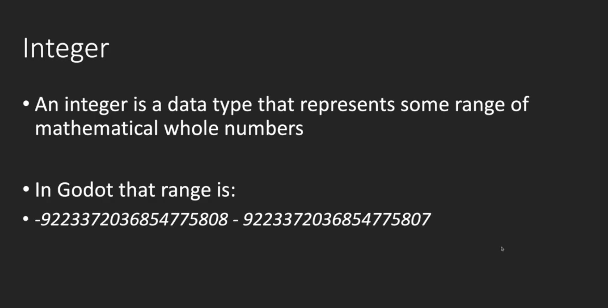
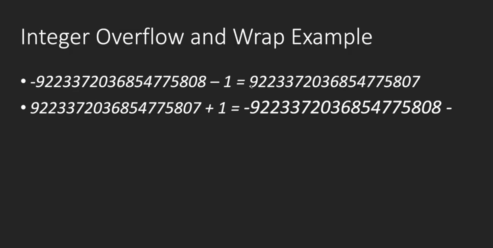
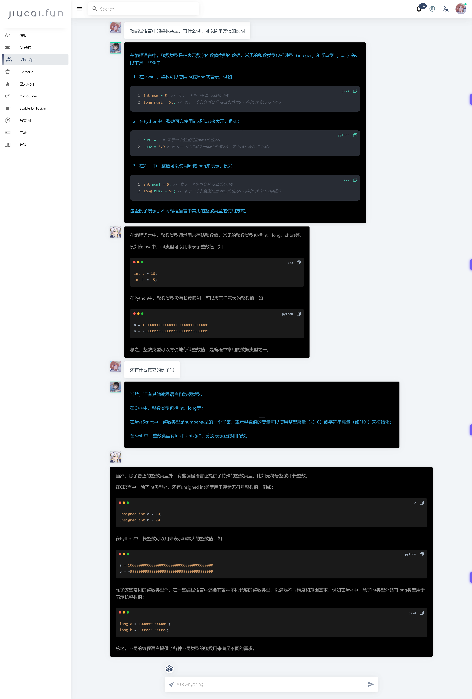

## GdScript类型之整数


### 整数的范围







-----------
> 问：教编程语言中的整数类型，有什么例子可以简单方便的说明


在编程语言中，整数类型是指表示数字的数值类型的数据。常见的整数类型包括整型（integer）和浮点型（float）等。
以下是一些例子：
1. 在Java中，整数可以使用int或long来表示。例如：
```java
int num = 5; // 表示一个整型变量num的值为5
long num2 = 5L; // 表示一个长整型变量num2的值为5（其中L代表long类型）
```
2. 在Python中，整数可以使用int或float来表示。例如：
```python
num1 = 5 # 表示一个整型变量num1的值为5
num2 = 5.0 # 表示一个浮点型变量num2的值为5（其中.0代表浮点类型）
```
3. 在C++中，整数可以使用int或long来表示。例如：
```cpp
int num1 = 5; // 表示一个整型变量num1的值为5
long num2 = 5L; // 表示一个长整型变量num2的值为5（其中L代表long类型）
```
这些例子展示了不同编程语言中常见的整数类型的使用方式。


> 在编程语言中，整数类型通常用来存储整数值，常见的整数类型包括int、long、short等。
> 
> 例如在Java中，int类型可以用来表示整数值，如：
> 
> ```java
> int a = 10;
> int b = -5;
> ```
> 
> 在Python中，整数类型没有长度限制，可以表示任意大的整数值，如：
> 
> ```python
> a = 1000000000000000000000000000000
> b = -999999999999999999999999999999
> ```
> 
> 总之，整数类型可以方便地存储整数值，是编程中常用的数据类型之一。


-----------
> 问：还有什么其它的例子吗


```text
当然，还有其他编程语言和数据类型。

在C++中，整数类型包括int、long等；

在JavaScript中，整数类型是number类型的一个子集，表示整数值的变量可以使用整型常量（如10）或字符串常量（如"10"）来初始化；

在Swift中，整数类型有Int和UInt两种，分别表示正数和负数。
```


当然，除了普通的整数类型外，有些编程语言还提供了特殊的整数类型，比如无符号整数和长整数。

在C语言中，除了int类型外，还有unsigned int类型用于存储无符号整数值，例如：

```c
unsigned int a = 10;
unsigned int b = 20;
```

在Python中，长整数可以用来表示非常大的整数值，如：

```python
a = 1000000000000000000000000000000000000000
b = -999999999999999999999999999999999999999
```

除了这些常见的整数类型外，在一些编程语言中还会有各种不同长度的整数类型，以满足不同精度和范围需求。例如在Java中，除了int类型外还有long类型用于表示长整数值：

```java
long a = 1000000000000L;
long b = -999999999999;
```

总之，不同的编程语言提供了各种不同类型的整数用来满足不同的需求。