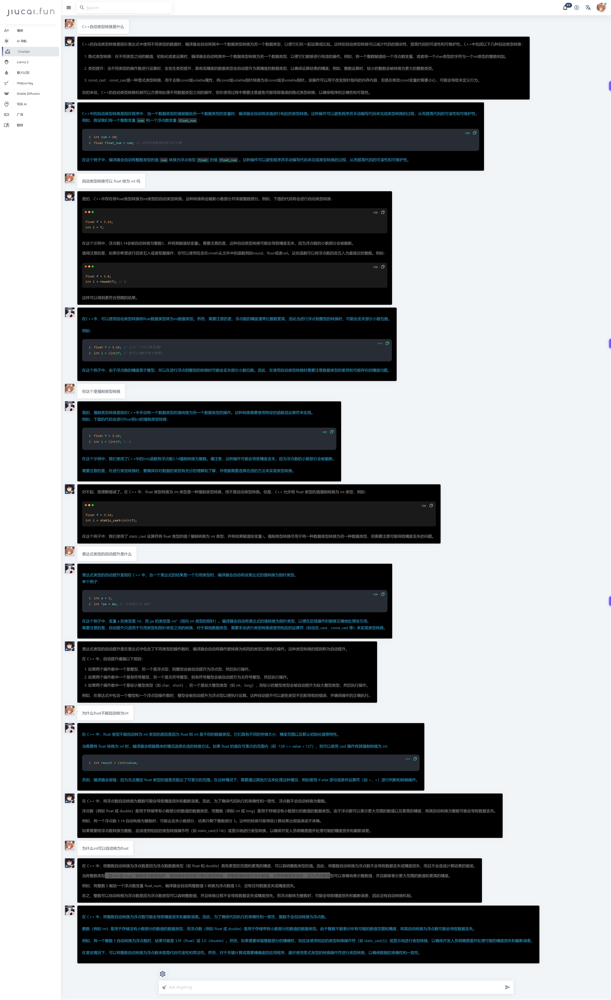

## 自动类型转换





-----------
> 问：C++自动类型转换是什么


```text
C++的自动类型转换是指在表达式中使用不同类型的数据时，编译器会自动将其中一个数据类型转换为另一个数据类型，以便它们在一起运算或比较。这样的自动类型转换可以减少代码的复杂性，提高代码的可读性和可维护性。C++中包括以下几种自动类型转换：

1. 隐式类型转换：在不同类型之间的赋值、初始化或者运算时，编译器会自动将其中一个数据类型转换为另一个数据类型，以便它们能够进行有效的操作。例如，将一个整数赋值给一个浮点数变量，或者将一个char类型的字符与一个int类型的整数相加。

2. 类型提升：当不同类型的操作数进行运算时，会发生类型提升，具有低精度的数据类型会自动提升为高精度的数据类型，以确保运算结果的精度。例如，整数运算时，较小的整数会被转换为更大的整数类型。

3. const_cast：const_cast是一种显式类型转换，用于去除const或volatile属性，将const或volatile指针转换为非const或非volatile指针。该操作可以用于改变指针指向的内存内容，但是在修改const变量时需要小心，可能会导致未定义行为。

总的来说，C++的自动类型转换机制可以方便地处理不同数据类型之间的操作，但在使用过程中需要注意避免可能导致错误的隐式类型转换，以确保程序的正确性和可靠性。
```


C++中的自动类型转换是指在程序中，当一个数据类型的值被赋给另一个数据类型的变量时，编译器会自动将该值进行相应的类型转换。这种操作可以避免程序员手动编写代码来完成类型转换的过程，从而提高代码的可读性和可维护性。
例如，假设我们有一个整数变量`num`和一个浮点数变量`float_num`：
```cpp
int num = 10;
float float_num = num; // 自动将整数值转换为浮点数
```
在这个例子中，编译器会自动将整数类型的值`num`转换为浮点类型`float`的值`float_num`。这种操作可以避免程序员手动编写代码来完成类型转换的过程，从而提高代码的可读性和可维护性。


-----------
> 问：自动类型转换可以 float 转为 int 吗


> 是的，C++中存在将float类型转换为int类型的自动类型转换。这种转换将会截断小数部分并保留整数部分。例如，下面的代码将会进行自动类型转换：
> 
> ```cpp
> float f = 3.14;
> int i = f;
> ```
> 
> 在这个示例中，浮点数3.14会被自动转换为整数3，并将其赋值给变量i。需要注意的是，这种自动类型转换可能会导致精度丢失，因为浮点数的小数部分会被截断。
> 
> 值得注意的是，如果你希望进行四舍五入或者取整操作，你可以使用包含在cmath头文件中的函数例如round、floor或者ceil。这些函数可以将浮点数四舍五入为最接近的整数。例如：
> 
> ```cpp
> float f = 3.8;
> int i = round(f); // 4
> ```
> 
> 这样可以得到更符合预期的结果。


> 在C++中，可以使用自动类型转换将float数据类型转为int数据类型。然而，需要注意的是，浮点数的精度通常比整数更高，因此当进行浮点到整型的转换时，可能会丢失部分小数位数。
> 
> 例如：
> ```c++
> float f = 3.14; // 定义一个浮点数变量f
> int i = (int)f; // 将浮点数f转换为整数i
> ```
> 在这个例子中，由于浮点数的精度高于整型，所以在进行浮点到整型的转换时可能会丢失部分小数位数。因此，在使用自动类型转换时需要注意数据类型的差异和可能存在的精度问题。


-----------
> 问：你这个是强制类型转换


> 是的，强制类型转换是指在C++中手动将一个数据类型的值转换为另一个数据类型的操作。这种转换需要使用特定的函数或运算符来实现。
> 例如，下面的代码会进行float到int的强制类型转换：
> 
> ```cpp
> float f = 3.14;
> int i = (int)f; // 3
> ```
> 
> 在这个示例中，我们使用了C++中的(int)函数将浮点数3.14强制转换为整数。请注意，这种操作可能会导致精度丢失，因为浮点数的小数部分会被截断。
> 
> 需要注意的是，在进行类型转换时，要确保你对数据的类型有充分的理解和了解，并根据需要选择合适的方法来实现类型转换。


> 对不起，我理解错误了。在 C++ 中，float 类型转换为 int 类型是一种强制类型转换，而不是自动类型转换。但是，C++ 允许将 float 类型的值强制转换为 int 类型，例如：
> 
> ```cpp
> float f = 3.14;
> int i = static_cast<int>(f);
> ```
> 
> 在这个例子中，我们使用了 static_cast 运算符将 float 类型的值 f 强制转换为 int 类型，并将结果赋值给变量 i。强制类型转换可用于将一种数据类型转换为另一种数据类型，但需要注意可能导致精度丢失的问题。


-----------
> 问：表达式类型的自动提升是什么


> 表达式类型的自动提升是指在 C++ 中，当一个表达式的结果是一个引用类型时，编译器会自动将该表达式的值转换为指针类型。
> 举个例子：
> ```cpp
> int a = 1;
> int *pa = &a; // 自动提升为 int*
> ```
> 在这个例子中，变量 a 的类型是 int，而 pa 的类型是 int*（指向 int 类型的指针）。编译器会自动将表达式的值转换为指针类型，以便在后续操作时能够正确地处理该引用。
> 需要注意的是，自动提升只适用于引用类型和指针类型之间的转换，对于其他数据类型，需要手动进行类型转换或使用相应的运算符（如动态_cast、const_cast 等）来实现类型转换。


> 表达式类型的自动提升是在表达式中包含了不同类型的操作数时，编译器会自动将操作数转换为相同的类型以便执行操作。这种类型转换的规则称为自动提升。
> 
> 在 C++ 中，自动提升遵循以下规则：
> 
> 1. 如果两个操作数中一个是整型，另一个是浮点型，则整型会被自动提升为浮点型，然后执行操作。
> 2. 如果两个操作数中一个是有符号整型，另一个是无符号整型，则有符号整型会被自动提升为无符号整型，然后执行操作。
> 3. 如果两个操作数中一个是较小整型类型（如 char、short），另一个是较大整型类型（如 int、long），则较小的整型类型会被自动提升为较大整型类型，然后执行操作。
> 
> 例如，在表达式中包含一个整型和一个浮点型操作数时，整型会被自动提升为浮点型以便执行运算。这种自动提升可以避免类型不匹配导致的错误，并确保操作的正确执行。


-----------
> 问：为什么float不能自动转为int


在 C++ 中，float 类型不能自动转为 int 类型的原因是因为 float 和 int 是不同的数据类型。它们具有不同的存储大小、精度范围以及默认初始化值等特性。

当需要将 float 转换为 int 时，编译器会根据具体的情况选择合适的转换方法。如果 float 的值在可表示的范围内（即 -128 <= value < 127），则可以使用 cast 操作将其强制转换为 int：
```c++
int result = (int)value;
```
否则，编译器会报错，因为无法确定 float 类型的值是否超出了可表示的范围。在这种情况下，需要通过其他方法来处理这种情况，例如使用 if-else 语句或条件运算符（如 <、>）进行判断和转换操作。


```text
在 C++ 中，将浮点数自动转换为整数可能会导致精度损失和截断误差。因此，为了确保代码执行的准确性和一致性，浮点数不会自动转换为整数。

浮点数（例如 float 或 double）是用于存储带有小数部分的数值的数据类型，而整数（例如 int 或 long）是用于存储没有小数部分的数值的数据类型。由于浮点数可以表示更大范围的数值以及更高的精度，将其自动转换为整数可能会导致数据丢失。

例如，将一个浮点数 3.14 自动转换为整数时，可能会丢失小数部分，结果只剩下整数部分 3。这样的转换可能导致计算结果出现错误或不准确。

如果需要将浮点数转换为整数，应该使用相应的类型转换操作符（如 static_cast<int>(3.14)）或显示地进行类型转换，以确保开发人员明确意图并处理可能的精度损失和截断误差。
```


-----------
> 问：为什么int可以自动转为float


```text
在 C++ 中，将整数自动转换为浮点数是因为浮点数数据类型（如 float 和 double）具有更宽的范围和更高的精度，可以容纳整数类型的值。因此，将整数自动转换为浮点数不会导致数据丢失或精度损失，而且不会造成计算结果的错误。

当将整数类型（如 int 或 long）赋给浮点数类型时，编译器会自动进行隐式类型转换，将整数值转换为浮点数值。这种转换是安全的，因为浮点数类型可以准确地表示整数值，并且能够表示更大范围的数值和更高的精度。

例如，将整数 5 赋给一个浮点数变量 float_num，编译器会自动将整数值 5 转换为浮点数值 5.0，没有任何数据丢失或精度损失。

总之，整数可以自动转换为浮点数是因为浮点数类型可以容纳整数值，并且转换过程不会导致数据丢失或精度损失。而浮点数转为整数时，可能会导致精度损失和截断误差，因此没有自动转换机制。
```


```text
在 C++ 中，将整数自动转换为浮点数可能会导致精度损失和截断误差。因此，为了确保代码执行的准确性和一致性，整数不会自动转换为浮点数。

整数（例如 int）是用于存储没有小数部分的数值的数据类型，而浮点数（例如 float 或 double）是用于存储带有小数部分的数值的数据类型。由于整数不能表示所有可能的数值范围和精度，将其自动转换为浮点数可能会导致数据丢失。

例如，将一个整数 3 自动转换为浮点数时，结果可能是 3.0f（float）或 3.0（double）。然而，如果需要保留整数部分的精确性，则应该使用相应的类型转换操作符（如 static_cast<float>(3)）或显示地进行类型转换，以确保开发人员明确意图并处理可能的精度损失和截断误差。

在某些情况下，可以将整数自动转换为浮点数来提高代码可读性和简洁性。然而，对于关键计算或需要精确度的应用程序，最好使用显式类型的转换操作符进行类型转换，以确保数据的准确性和一致性。
```


