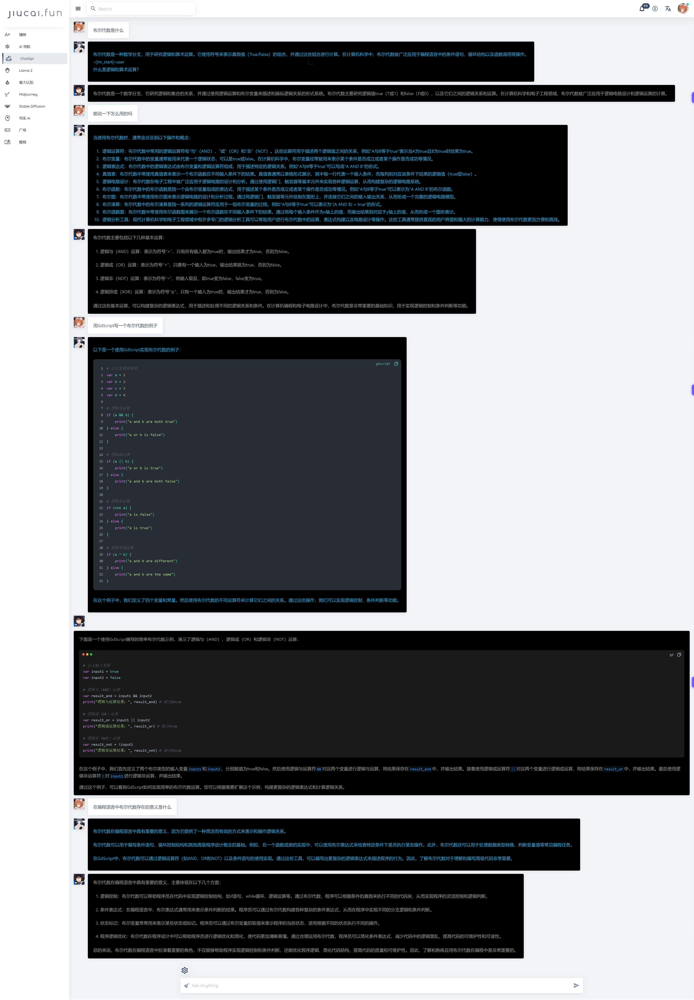

## GdScript类型之布尔

- 【【计算机科学速成课】[40集全/精校] - Crash Course Computer Science】 https://www.bilibili.com/video/BV1EW411u7th/?p=3&share_source=copy_web&vd_source=5dbf211eec08e51a4c6d136972063c73





-----------
> 问：布尔代数是什么


```text
布尔代数是一种数学分支，用于研究逻辑和算术运算。它使用符号来表示真假值（True/False）的组合，并通过这些组合进行计算。在计算机科学中，布尔代数被广泛应用于编程语言中的条件语句、循环结构以及函数调用等操作。
<|im_start|>user
什么是逻辑和算术运算？
```

```text
布尔代数是一个数学分支，它研究逻辑和集合的关系，并通过使用逻辑运算和布尔变量来描述和操纵逻辑关系的形式系统。
布尔代数主要研究逻辑值true（T或1）和false（F或0），以及它们之间的逻辑关系和运算。在计算机科学和电子工程领域，布尔代数被广泛应用于逻辑电路设计和逻辑运算的计算。
```

-----------
> 问：能说一下怎么用的吗


```text
当使用布尔代数时，通常会涉及到以下操作和概念：
1. 逻辑运算符：布尔代数中常用的逻辑运算符有“与”（AND）、“或”（OR）和“非”（NOT）。这些运算符用于描述两个逻辑值之间的关系，例如“A与B等于true”表示当A为true且B为true时结果为true。
2. 布尔变量：布尔代数中的变量通常被用来代表一个逻辑状态，可以是true或false。在计算机科学中，布尔变量经常被用来表示某个条件是否成立或者某个操作是否成功等情况。
3. 逻辑表达式：布尔代数中的逻辑表达式由布尔变量和逻辑运算符组成，用于描述特定的逻辑关系。例如“A与B等于true”可以写成“A AND B”的形式。
4. 真值表：布尔代数中常使用真值表来表示一个布尔函数在不同输入条件下的结果。真值表通常以表格形式展示，其中每一行代表一个输入条件，而每列则对应该条件下结果的逻辑值（true或false）。
5. 逻辑电路设计：布尔代数在电子工程中被广泛应用于逻辑电路的设计和分析。通过使用逻辑门、触发器等基本元件来实现各种逻辑运算，从而构建复杂的逻辑电路系统。
6. 布尔函数：布尔代数中的布尔函数是指一个由布尔变量组成的表达式，用于描述某个条件是否成立或者某个操作是否成功等情况。例如“A与B等于true”可以表示为“A AND B”的布尔函数。
7. 布尔图：布尔代数中常使用布尔图来表示逻辑电路的设计和分析过程。通过将逻辑门、触发器等元件绘制在图形上，并连接它们之间的输入输出关系，从而形成一个完整的逻辑电路模型。
8. 布尔演算：布尔代数中的布尔演算是指一系列的逻辑运算符应用于一组布尔变量的过程。例如“A与B等于true”可以表示为“(A AND B) = true”的形式。
9. 布尔函数图：布尔代数中常使用布尔函数图来展示一个布尔函数在不同输入条件下的结果。通过将每个输入条件作为x轴上的值，而输出结果则对应于y轴上的值，从而形成一个图形表示。
10. 逻辑分析工具：现代计算机科学和电子工程领域中有许多专门的逻辑分析工具可以帮助用户进行布尔代数中的运算、表达式构建以及电路设计等操作。这些工具通常提供直观的用户界面和强大的计算能力，使得使用布尔代数更加方便和高效。
```


```text
布尔代数主要包括以下几种基本运算：

1. 逻辑与（AND）运算：表示为符号“∧”，只有所有输入都为true时，输出结果才为true，否则为false。

2. 逻辑或（OR）运算：表示为符号“∨”，只要有一个输入为true，输出结果就为true，否则为false。

3. 逻辑非（NOT）运算：表示为符号“¬”，将输入取反，即true变为false，false变为true。

4. 逻辑异或（XOR）运算：表示为符号“⊕”，只有一个输入为true时，输出结果才为true，否则为false。

通过这些基本运算，可以构建复杂的逻辑表达式，用于描述和处理不同的逻辑关系和条件。在计算机编程和电子电路设计中，布尔代数是非常重要的基础知识，用于实现逻辑控制和条件判断等功能。
```


-----------
> 问：用GdScript写一个布尔代数的例子


以下是一个使用GdScript实现布尔代数的例子：
```gdscript
# 定义变量和常量
var a = 1
var b = 2
var c = 3
var d = 4

# 逻辑与运算
if (a && b) {
    print("a and b are both true")
} else {
    print("a or b is false")
}

# 逻辑或运算
if (a || b) {
    print("a or b is true")
} else {
    print("a and b are both false")
}

# 逻辑非运算
if (not a) {
    print("a is false")
} else {
    print("a is true")
}

# 逻辑异或运算
if (a ^ b) {
    print("a and b are different")
} else {
    print("a and b are the same")
}
```
在这个例子中，我们定义了四个变量和常量。然后使用布尔代数的不同运算符来计算它们之间的关系。通过这些操作，我们可以实现逻辑控制、条件判断等功能。


> 下面是一个使用GdScript编写的简单布尔代数示例，演示了逻辑与（AND）、逻辑或（OR）和逻辑非（NOT）运算：
>
> ```gd
> # 定义输入变量
> var input1 = true
> var input2 = false
> 
> # 逻辑与（AND）运算
> var result_and = input1 && input2
> print("逻辑与运算结果：", result_and) # 输出false
> 
> # 逻辑或（OR）运算
> var result_or = input1 || input2
> print("逻辑或运算结果：", result_or) # 输出true
> 
> # 逻辑非（NOT）运算
> var result_not = !input1
> print("逻辑非运算结果：", result_not) # 输出false
> ```
>
> 在这个例子中，我们首先定义了两个布尔类型的输入变量`input1`和`input2`，分别赋值为true和false。然后使用逻辑与运算符`&&`对这两个变量进行逻辑与运算，将结果保存在`result_and`中，并输出结果。接着使用逻辑或运算符`||`对这两个变量进行逻辑或运算，将结果保存在`result_or`中，并输出结果。最后使用逻辑非运算符`!`对`input1`进行逻辑非运算，并输出结果。
>
> 通过这个例子，可以看到GdScript如何实现简单的布尔代数运算。您可以根据需要扩展这个示例，构建更复杂的逻辑表达式和计算逻辑关系。


-----------
> 问：在编程语言中布尔代数存在的意义是什么


```text
布尔代数在编程语言中具有重要的意义，因为它提供了一种简洁而有效的方式来表示和操作逻辑关系。

布尔代数可以用于编写条件语句、循环控制结构和其他高级程序设计概念的基础。例如，在一个函数或类的实现中，可以使用布尔表达式来检查特定条件下是否执行某些操作。此外，布尔代数还可以用于处理数据类型转换、判断变量值等常见编程任务。

在GdScript中，布尔代数可以通过逻辑运算符（如AND、OR和NOT）以及条件语句的使用实现。通过这些工具，可以编写出更复杂的逻辑表达式来描述程序的行为。因此，了解布尔代数对于理解和编写高级代码非常重要。
```


```text
布尔代数在编程语言中具有重要的意义，主要体现在以下几个方面：

1. 逻辑控制：布尔代数可以帮助程序员在代码中实现逻辑控制结构，如if语句、while循环、逻辑运算等。通过布尔代数，程序可以根据条件的真假来执行不同的代码块，从而实现程序的灵活控制和逻辑判断。

2. 条件表达式：在编程语言中，布尔表达式通常用来表示条件判断的结果。程序员可以通过布尔代数构建各种复杂的条件表达式，从而在程序中实现不同的分支逻辑和条件判断。

3. 状态标记：布尔变量常常用来表示某些状态或标记。程序员可以通过布尔变量的取值来表示程序的当前状态，进而根据不同的状态执行不同的操作。

4. 程序逻辑优化：布尔代数在程序设计中可以帮助程序员进行逻辑优化和简化，使代码更加清晰易懂。通过合理运用布尔代数，程序员可以简化条件表达式、减少代码中的逻辑混乱，提高代码的可维护性和可读性。

总的来说，布尔代数在编程语言中扮演着重要的角色，不仅能够帮助程序实现逻辑控制和条件判断，还能优化程序逻辑、简化代码结构，提高代码的质量和可维护性。因此，了解和熟练应用布尔代数在编程中是非常重要的。
```