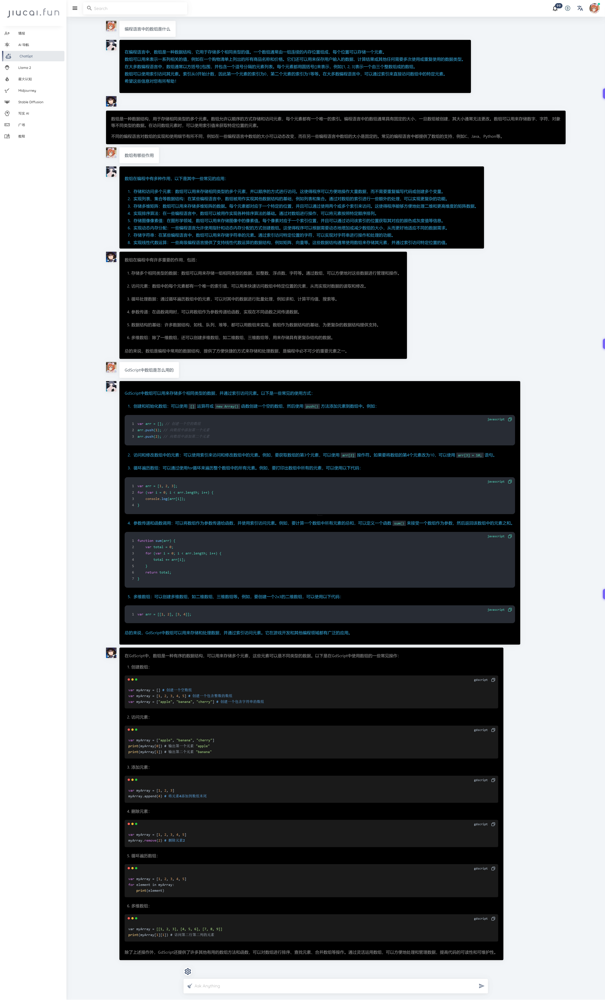

## GdScript类型之数组

- 【#编程通识#第十课，什么是计算机数组？】 https://www.bilibili.com/video/BV1R4411G7Xg/?share_source=copy_web&vd_source=5dbf211eec08e51a4c6d136972063c73




-----------
> 问：编程语言中的数组是什么


```text
在编程语言中，数组是一种数据结构，它用于存储多个相同类型的值。一个数组通常由一组连续的内存位置组成，每个位置可以存储一个元素。
数组可以用来表示一系列相关的值，例如在一个购物清单上列出的所有商品名称和价格。它们还可以用来保存用户输入的数据、计算结果或其他任何需要多次使用或重复使用的数据类型。
在大多数编程语言中，数组通常以方括号[]包围，并包含一个逗号分隔的元素列表。每个元素都用圆括号[]来表示，例如[1, 2, 3]表示一个由三个整数组成的数组。
数组可以使用索引访问其元素。索引从0开始计数，因此第一个元素的索引为0，第二个元素的索引为1等等。在大多数编程语言中，可以通过索引来直接访问数组中的特定元素。
希望这些信息对您有所帮助！
```


```text
数组是一种数据结构，用于存储相同类型的多个元素。数组允许以顺序的方式存储和访问元素，每个元素都有一个唯一的索引。
编程语言中的数组通常具有固定的大小，一旦数组被创建，其大小通常无法更改。数组可以用来存储数字、字符、对象等不同类型的数据。在访问数组元素时，可以使用索引值来获取特定位置的元素。

不同的编程语言对数组的实现和使用细节有所不同，例如在一些编程语言中数组的大小可以动态改变，而在另一些编程语言中数组的大小是固定的。常见的编程语言中都提供了数组的支持，例如C、Java、Python等。
```


-----------
> 问：数组有哪些作用


```text
数组在编程中有多种作用，以下是其中一些常见的应用：
1. 存储和访问多个元素：数组可以用来存储相同类型的多个元素，并以顺序的方式进行访问。这使得程序可以方便地操作大量数据，而不需要重复编写代码或创建多个变量。
2. 实现列表、集合等数据结构：在某些编程语言中，数组被用作实现其他数据结构的基础，例如列表和集合。通过对数组的索引进行一些额外的处理，可以实现更复杂的功能。
3. 存储多维矩阵：数组可以用来存储多维矩阵的数据。每个元素都对应于一个特定的位置，并且可以通过使用两个或多个索引来访问。这使得程序能够方便地处理二维和更高维度的矩阵数据。
4. 实现排序算法：在一些编程语言中，数组可以被用作实现各种排序算法的基础。通过对数组进行操作，可以将元素按照特定顺序排列。
5. 存储图像像素值：在图形学领域，数组可以用来存储图像中的像素值。每个像素对应于一个索引位置，并且可以通过访问该索引的位置获取其对应的颜色或灰度值等信息。
6. 实现动态内存分配：一些编程语言允许使用指针和动态内存分配的方式创建数组。这使得程序可以根据需要动态地增加或减少数组的大小，从而更好地适应不同的数据需求。
7. 存储字符串：在某些编程语言中，数组可以用来存储字符串的元素。通过索引访问特定位置的字符，可以实现对字符串进行操作和处理的功能。
8. 实现线性代数运算：一些高级编程语言提供了支持线性代数运算的数据结构，例如矩阵、向量等。这些数据结构通常使用数组来存储其元素，并通过索引访问特定位置的值。
```

```text
数组在编程中有许多重要的作用，包括：

1. 存储多个相同类型的数据：数组可以用来存储一组相同类型的数据，如整数、浮点数、字符等。通过数组，可以方便地对这些数据进行管理和操作。

2. 访问元素：数组中的每个元素都有一个唯一的索引值，可以用来快速访问数组中特定位置的元素，从而实现对数据的读取和修改。

3. 循环处理数据：通过循环遍历数组中的元素，可以对其中的数据进行批量处理，例如求和、计算平均值、搜索等。

4. 参数传递：在函数调用时，可以将数组作为参数传递给函数，实现在不同函数之间传递数据。

5. 数据结构的基础：许多数据结构，如栈、队列、堆等，都可以用数组来实现。数组作为数据结构的基础，为更复杂的数据结构提供支持。

6. 多维数组：除了一维数组，还可以创建多维数组，如二维数组、三维数组等，用来存储具有更复杂结构的数据。

总的来说，数组是编程中常用的数据结构，提供了方便快捷的方式来存储和处理数据，是编程中必不可少的重要元素之一。
```


-----------
> 问：GdScript中数组是怎么用的


GdScript中数组可以用来存储多个相同类型的数据，并通过索引访问元素。以下是一些常见的使用方式：

1. 创建和初始化数组：可以使用`[]`运算符或`new Array()`函数创建一个空的数组，然后使用`push()`方法添加元素到数组中。例如：
```javascript
var arr = []; // 创建一个空的数组
arr.push(1); // 向数组中添加第一个元素
arr.push(2); // 向数组中添加第二个元素
```

2. 访问和修改数组中的元素：可以使用索引来访问和修改数组中的元素。例如，要获取数组的第3个元素，可以使用`arr[2]`操作符。如果要将数组的第4个元素改为10，可以使用`arr[3] = 10;`语句。

3. 循环遍历数组：可以通过使用for循环来遍历整个数组中的所有元素。例如，要打印出数组中所有的元素，可以使用以下代码：
```javascript
var arr = [1, 2, 3];
for (var i = 0; i < arr.length; i++) {
    console.log(arr[i]);
}
```

4. 参数传递和函数调用：可以将数组作为参数传递给函数，并使用索引访问元素。例如，要计算一个数组中所有元素的总和，可以定义一个函数`sum()`来接受一个数组作为参数，然后返回该数组中的元素之和。
```javascript
function sum(arr) {
    var total = 0;
    for (var i = 0; i < arr.length; i++) {
        total += arr[i];
    }
    return total;
}
```

5. 多维数组：可以创建多维数组，如二维数组、三维数组等。例如，要创建一个2x3的二维数组，可以使用以下代码：
```javascript
var arr = [[1, 2], [3, 4]];
```

总的来说，GdScript中数组可以用来存储和处理数据，并通过索引访问元素。它在游戏开发和其他编程领域都有广泛的应用。


> 在GdScript中，数组是一种有序的数据结构，可以用来存储多个元素，这些元素可以是不同类型的数据。以下是在GdScript中使用数组的一些常见操作：
> 
> 1. 创建数组：
> ```gdscript
> var myArray = [] # 创建一个空数组
> var myArray = [1, 2, 3, 4, 5] # 创建一个包含整数的数组
> var myArray = ["apple", "banana", "cherry"] # 创建一个包含字符串的数组
> ```
> 
> 2. 访问元素：
> ```gdscript
> var myArray = ["apple", "banana", "cherry"]
> print(myArray[0]) # 输出第一个元素 "apple"
> print(myArray[1]) # 输出第二个元素 "banana"
> ```
> 
> 3. 添加元素：
> ```gdscript
> var myArray = [1, 2, 3]
> myArray.append(4) # 将元素4添加到数组末尾
> ```
> 
> 4. 删除元素：
> ```gdscript
> var myArray = [1, 2, 3, 4, 5]
> myArray.remove(2) # 删除元素2
> ```
> 
> 5. 循环遍历数组：
> ```gdscript
> var myArray = [1, 2, 3, 4, 5]
> for element in myArray:
>     print(element)
> ```
> 
> 6. 多维数组：
> ```gdscript
> var myArray = [[1, 2, 3], [4, 5, 6], [7, 8, 9]]
> print(myArray[1][1]) # 访问第二行第二列的元素
> ```
> 
> 除了上述操作外，GdScript还提供了许多其他有用的数组方法和函数，可以对数组进行排序、查找元素、合并数组等操作。通过灵活运用数组，可以方便地处理和管理数据，提高代码的可读性和可维护性。