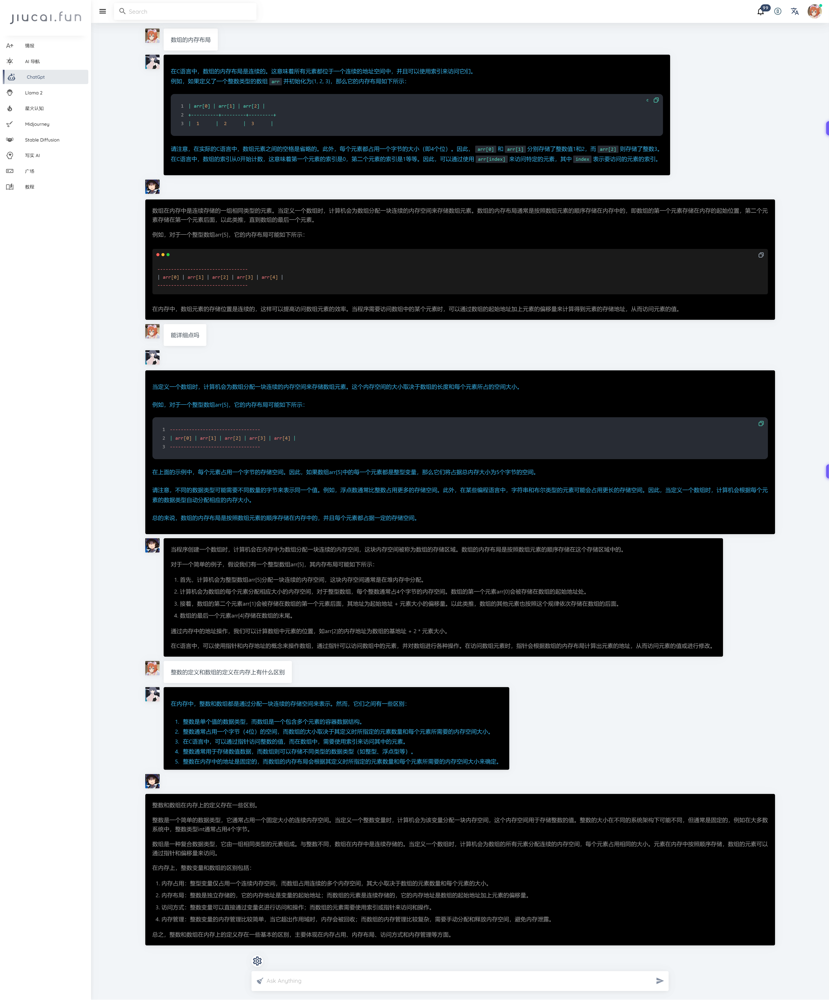

## GdScript类型之字符串


- 【字符串本质】 https://www.bilibili.com/video/BV1oB4y1n7bd/?share_source=copy_web&vd_source=5dbf211eec08e51a4c6d136972063c73





-----------
> 问：字符串是什么


```text
字符串是一种文本数据类型，它由一系列的字母、数字和特殊符号组成。在计算机科学中，字符串通常表示为一个连续的序列，其中每个元素都是一个特定的字符或编码。
```


```text
字符串是由字符组成的序列，是计算机中表示文本的一种数据类型。在许多编程语言中，字符串通常用一对引号（单引号或双引号）来表示，例如"Hello World"或'12345'。
字符串可以包含字母、数字、符号等任意字符，并且可以进行各种操作和处理，如连接、比较、截取等。字符串在编程中被广泛应用，用于处理文字、传递信息等各种场景。
```


-----------
> 问：能说一说字符串有这么应用吗


```text
当然可以。字符串在编程中被广泛应用，以下是一些常见的使用场景：
1. 文本处理和显示：字符串可以用于显示文字、创建文档等任务。例如，在网页开发中，HTML标签中的内容通常以字符串的形式呈现。
2. 数据存储和传输：字符串可以作为数据库的字段类型之一，用于存储和检索文本信息。此外，字符串还可以用作网络通信时的数据格式，如HTTP请求头中的Content-Type等。
3. 文件操作：在编程中处理文件时，通常需要读取、写入或修改文件的内容。字符串可以用于表示文件的字节流，也可以用于创建和编辑文本文件。
4. 数据结构和算法：字符串可以作为数据结构的一部分，如链表中的节点值等。此外，字符串还被广泛应用于各种算法中，例如搜索、排序等。
5. 命令行交互：在一些操作系统的命令行界面中，用户通常通过输入文本来与系统进行交互和操作。字符串可以用于构建命令行指令或参数。
6. 数据可视化：字符串可以作为图形库中的标签、标题等元素，用于展示数据信息。例如，在Matplotlib库中，使用字符串表示x轴和y轴的标签。
7. 文本分析和处理：通过对字符串进行分词、词性标注、情感分析等操作，可以实现各种文本分析任务。这些任务通常需要借助自然语言处理技术来完成。
8. 加密和解密：在密码学中，使用字符串作为密文或明文的载体。例如，在对称加密算法中，通过对明文进行加密后得到一个字符串作为密文。
9. 游戏开发：在游戏中，字符串可以用于显示文字、提示等内容。此外，一些角色扮演类的游戏还允许玩家输入文本命令来控制角色的行为。
10. 其他应用场景：字符串还可以用于构建日志文件、生成随机密码、实现正则表达式匹配等各种任务。
```


```text
当然可以！字符串在编程中有很多应用，以下是一些常见的应用场景：

1. 文本处理：字符串常常用于处理文本数据。可以用来读取、写入、编辑和搜索文本，如文件操作、日志处理和数据分析等。

2. 用户输入和输出：应用程序通常需要与用户进行交互，字符串用于读取用户的输入或向用户显示输出，如命令行界面中的提示信息和用户的响应。

3. 格式化和显示数据：将数据转换为字符串的形式，以便进行展示和输出。这包括数字转字符串，日期时间格式化，货币格式化等。

4. 数据存储和传输：字符串通常用于在应用程序之间传输数据，如网络请求、API调用和数据库操作。在这些场景中，数据需要以字符串的形式进行编码和解码。

5. 加密和哈希算法：对于保护数据的安全性，字符串在加密和哈希算法中起着重要作用。例如密码加密、数字签名、消息摘要等。

6. 文字游戏和解析：字符串常用于文字游戏、解析和处理自然语言，如语义分析、关键词抽取和翻译等。

这些仅仅是字符串的一些应用，实际上，字符串在编程中的应用非常广泛，几乎贯穿了所有领域。
```


-----------
> 问：GdScript中如何表示字符串


```text
在 Godot 引擎的 GDScript 中，你可以使用双引号（"）或单引号（'）来表示字符串。以下是几种表示字符串的方法：

1. 使用双引号：在双引号中输入字符串内容即可表示一个字符串。例如：
```gdscript
var str = "Hello, World!"
```

2. 使用单引号：同样地，在单引号中输入字符串内容也可以表示一个字符串。例如：
```gdscript
var str = 'Hello, World!'
```

3. 多行字符串：如果字符串跨越多行，可以使用三个双引号或三个单引号来表示。例如：
```gdscript
var multiline_str = """
This is a 
multiline 
string
"""
```

> 字符串在 GDScript 中是简单且灵活的，你可以在需要的地方直接使用字符串，并进行字符串的连接、截取、查找等操作。如果需要在字符串中包含特殊字符（如换行符、制表符等），可以使用转义字符来表示。例如 `\n` 表示换行符，`\t` 表示制表符等。
> ```
> 
> 
> 在GdScript中，字符串通常以双引号（""）或单引号('')来表示。例如：
> ```
> var str = "Hello, world!"
> print(str) # 输出: Hello, world!
> ```
> 请注意，在GdScript中，字符串是不可变的类型，一旦创建后就不能修改其内容了。如果你想要对一个字符串进行修改操作，可以使用字符串拼接（+）或字符串替换（[ ]）等方法来实现。


-----------
> 问：字符串底层是如何实现的


字符串底层的实现取决于具体的编程语言和操作系统。在大多数情况下，字符串是通过一个数组或对象来表示的。

在 C++ 中，字符串通常是以 `char` 类型的数组表示的。例如：
```c++
#include <iostream>
using namespace std;
int main() {
    char str[] = "Hello, World!";
    cout << str << endl;
    return 0;
}
```

在 Java 中，字符串通常是以 `String` 类型的对象表示的。例如：
```java
public class Main {
    public static void main(String[] args) {
        String str = "Hello, World!";
        System.out.println(str);
    }
}
```

在 Python 中，字符串通常是以 `str` 类型的对象表示的。例如：
```python
print("Hello, World!")
```

请注意，这些示例只是字符串底层实现的一些常见方式之一。具体的实现方法可能因编程语言和操作系统而异。


```text
在 GDScript 中，字符串的底层实现通常是通过使用 Unicode 字符编码来表示。Unicode 是一种字符编码标准，它为世界上几乎所有的文字字符分配了一个唯一的数字码点。在字符串中，每个字符都会被转换成 Unicode 码点来进行存储和处理。

GDScript 中的字符串可以包含各种字符，包括拉丁字母、汉字、符号等。每个字符都被转换成对应的 Unicode 码点进行存储。在 GDScript 中，字符串是不可变的（immutable）数据类型，这意味着一旦一个字符串被创建后，它的内容就不能被修改，任何的修改都会创建一个新的字符串。

在 GDScript 中，字符串的处理和操作是高效的，可以进行快速的连接、截取、查找等操作。GDScript 也提供了丰富的字符串处理函数和方法，以帮助开发者进行各种字符串操作。

总的来说，字符串在 GDScript 中是通过 Unicode 编码来表示和处理的，是一个灵活和强大的数据类型，适用于各种不同的应用场景。GDScript 提供了丰富的字符串处理功能，使得开发者可以轻松地操作字符串数据。
```


-----------
> 问：字符串的内存是如何布局的


```text
在 GDScript 中，字符串的内存布局是通过使用一个连续的数组来表示。每个字符都会被存储在一个特定的位置上，这个位置可以通过索引（index）进行访问和操作。

GDScript 中的字符串是一个不可变的数据类型，一旦创建后就不能修改其内容。因此，在 GDScript 中，字符串的内存布局是固定的，并且不能更改。

为了方便处理字符串数据，GDScript 提供了一些内置函数和方法来操作字符串。这些函数和方法可以根据需要进行索引访问、连接、截取等操作。例如，可以通过使用 `substr()` 方法在字符串中截取子字符串，或者通过使用 `find()` 方法查找特定的字符串。

总的来说，GDScript 中的字符串内存布局是通过一个连续的数组来表示，并且不能更改。虽然无法修改字符串的内容，但 GDScript 提供了丰富的字符串处理功能，使得开发者可以方便地操作和管理字符串数据。
```


```text
在计算机内存中，字符串通常是以一系列连续的字节来存储的。在 GDScript 中，字符串是不可变的（immutable），这意味着一旦字符串被创建后，它的内容就不会发生改变。这种不可变性使得字符串在内存中布局相对简单和紧凑。

具体来说，一个字符串会被存储在内存中的一段连续的内存空间中，每个字符被转换成对应的 Unicode 码点来表示。字符串的长度通常会被保存在一个额外的内存位置中，以便程序可以快速地访问字符串的长度信息。在 GDScript 中，每个字符通常会占用一个或多个字节的内存空间，具体取决于字符的编码方式（如 UTF-8、UTF-16、UTF-32 等）。

当需要修改字符串的内容时，GDScript 会创建一个新的字符串对象来存储修改后的内容，而原始的字符串对象则会保持不变。这样做可以确保字符串的不可变性，同时也提高了字符串的处理效率。

总的来说，字符串在内存中通常以一段连续的字节序列存储，每个字符被转换成对应的 Unicode 码点来表示。由于字符串的不可变性，对字符串的修改操作会创建新的字符串对象，确保原始字符串对象的内容保持不变。这种设计使得字符串的内存布局相对简单和高效。
```