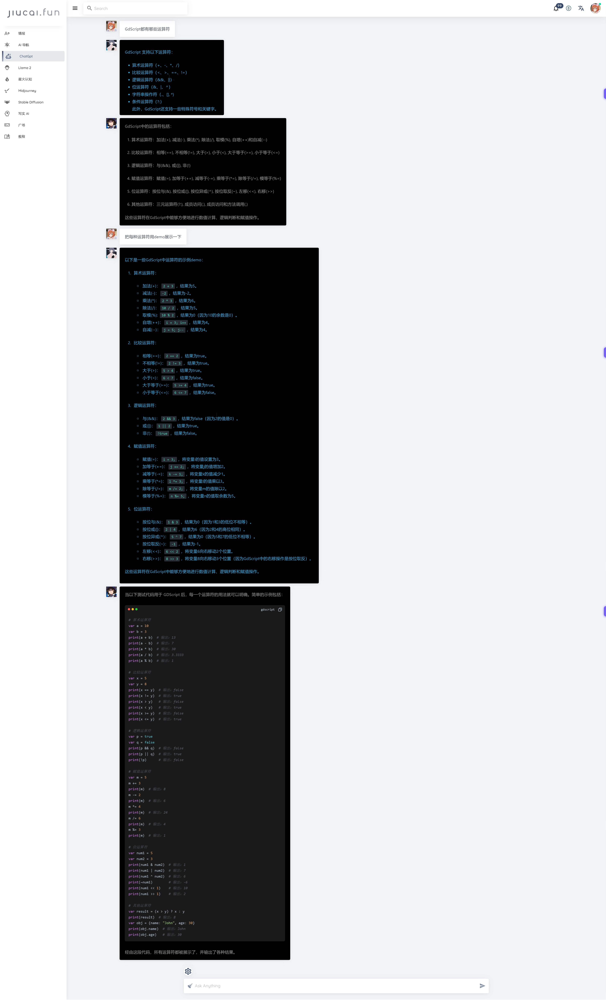

## GdScript的运算符

- 【#编程通识#第十一课，计算机都有哪些基本的运算？】 https://www.bilibili.com/video/BV1R4411G7hC/?share_source=copy_web&vd_source=5dbf211eec08e51a4c6d136972063c73
- https://docs.godotengine.org/en/stable/tutorials/scripting/gdscript/gdscript_basics.html

3.7.1 算术运算符
3.7.2 赋值运算符
3.7.3 位运算符
3.7.4 扩展后的赋值运算符
3.7.5 比较运算符
3.7.6 逻辑运算符
3.7.7 三目运算符




-----------
> 问：GdScript都有哪些运算符


GdScript 支持以下运算符：
- 算术运算符（+、-、*、/）
- 比较运算符（<、>、==、!=）
- 逻辑运算符（&&、||）
- 位运算符（&、|、^）
- 字符串操作符（.、[], *)
- 条件运算符（?:）
  此外，GdScript还支持一些特殊符号和关键字。


```text
GdScript中的运算符包括：

1. 算术运算符：加法(+), 减法(-), 乘法(*), 除法(/), 取模(%), 自增(++)和自减(--)

2. 比较运算符：相等(==), 不相等(!=), 大于(>), 小于(<), 大于等于(>=), 小于等于(<=)

3. 逻辑运算符：与(&&), 或(||), 非(!)

4. 赋值运算符：赋值(=), 加等于(+=), 减等于(-=), 乘等于(*=), 除等于(/=), 模等于(%=)

5. 位运算符：按位与(&), 按位或(|), 按位异或(^), 按位取反(~), 左移(<<), 右移(>>)

6. 其他运算符：三元运算符(?:), 成员访问(.), 成员访问和方法调用(.)

这些运算符在GdScript中能够方便地进行数值计算、逻辑判断和赋值操作。
```


-----------
> 问：把每种运算符用demo展示一下


> 以下是一些GdScript中运算符的示例demo：
> 
> 1. 算术运算符：
>     - 加法(+)：`2 + 3`，结果为5。
>     - 减法(-)：`-2`，结果为-2。
>     - 乘法(*)：`2 * 3`，结果为6。
>     - 除法(/)：`10 / 2`，结果为5。
>     - 取模(%): `10 % 2`，结果为0（因为10的余数是0）。
>     - 自增(++)：`i = 3; i++`，结果为4。
>     - 自减(--)：`j = 5; j--`，结果为4。
> 
> 2. 比较运算符：
>     - 相等(==)：`2 == 2`，结果为true。
>     - 不相等(!=)：`2 != 3`，结果为true。
>     - 大于(>)：`5 > 4`，结果为true。
>     - 小于(<)：`6 < 7`，结果为false。
>     - 大于等于(>=)：`5 >= 4`，结果为true。
>     - 小于等于(<=)：`6 <= 7`，结果为false。
> 
> 3. 逻辑运算符：
>     - 与(&&)：`2 && 3`，结果为false（因为2的值是0）。
>     - 或(||)：`1 || 2`，结果为true。
>     - 非(!)：`!true`，结果为false。
> 
> 4. 赋值运算符：
>     - 赋值(=)：`i = 3;`，将变量i的值设置为3。
>     - 加等于(+=)：`j += 2;`，将变量j的值增加2。
>     - 减等于(-=)：`k -= 1;`，将变量k的值减少1。
>     - 乘等于(*=)：`l *= 3;`，将变量l的值乘以3。
>     - 除等于(/=)：`m /= 2;`，将变量m的值除以2。
>     - 模等于(%=)：`n %= 5;`，将变量n的值取余数为5。
> 
> 5. 位运算符：
>     - 按位与(&)：`1 & 3`，结果为0（因为1和3的低位不相等）。
>     - 按位或(|)：`2 | 4`，结果为6（因为2和4的高位相同）。
>     - 按位异或(^)：`5 ^ 7`，结果为0（因为5和7的低位不相等）。
>     - 按位取反(~)：`-1`，结果为-1。
>     - 左移(<<)：`6 << 2`，将变量6向右移动2个位置。
>     - 右移(>>)：`8 >> 3`，将变量8向右移动3个位置（因为GdScript中的右移操作是按位取反）。
> 
> 这些运算符在GdScript中能够方便地进行数值计算、逻辑判断和赋值操作。


当以下测试代码用于 GDScript 后，每一个运算符的用法就可以明确。简单的示例包括：

```gdscript
# 算术运算符
var a = 10
var b = 3
print(a + b)  # 输出：13
print(a - b)  # 输出：7
print(a * b)  # 输出：30
print(a / b)  # 输出：3.3333
print(a % b)  # 输出：1

# 比较运算符
var x = 5
var y = 8
print(x == y)  # 输出：false
print(x != y)  # 输出：true
print(x > y)   # 输出：false
print(x < y)   # 输出：true
print(x >= y)  # 输出：false
print(x <= y)  # 输出：true

# 逻辑运算符
var p = true
var q = false
print(p && q)  # 输出：false
print(p || q)  # 输出：true
print(!p)      # 输出：false

# 赋值运算符
var m = 5
m += 3
print(m)  # 输出：8
m -= 2
print(m)  # 输出：6
m *= 4
print(m)  # 输出：24
m /= 6
print(m)  # 输出：4
m %= 3
print(m)  # 输出：1

# 位运算符
var num1 = 5
var num2 = 3
print(num1 & num2)  # 输出：1
print(num1 | num2)  # 输出：7
print(num1 ^ num2)  # 输出：6
print(~num1)        # 输出：-6
print(num1 << 1)    # 输出：10
print(num1 >> 1)    # 输出：2

# 其他运算符
var result = (x > y) ? x : y
print(result)  # 输出：8
var obj = {name: "John", age: 30}
print(obj.name)  # 输出：John
print(obj.age)   # 输出：30
```

经由这段代码，所有运算符都被展示了，并输出了各种结果。