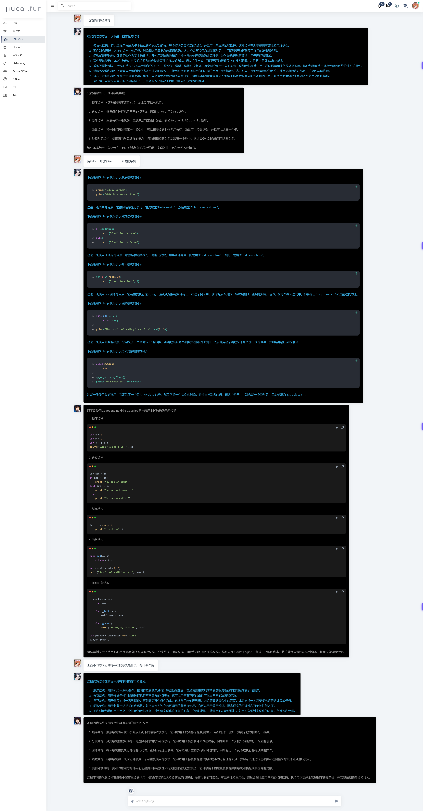

## 代码结构的基本概念


- 顺序结构

- 分支结构
    - if条件语句
    - switch分支语句

- 循环结构
    - for循环
    - while循环

- 函数

- 类和对象




-----------
> 问：代码都有哪些结构


```text
在代码结构方面，以下是一些常见的结构：
1. 模块化结构：将大型程序分解为多个独立的模块或功能块。每个模块负责特定的功能，并且可以单独测试和维护。这种结构有助于提高可读性和可维护性。
2. 面向对象编程（OOP）结构：使用类、对象和继承等概念来组织代码。通过将数据和行为封装在对象中，可以更好地管理复杂程序的逻辑和实现。
3. 函数式编程结构：强调函数作为基本构建块，并使用高阶函数和组合操作符来处理复杂的计算任务。这种结构通常更简洁、易于理解和调试。
4. 事件驱动架构（EDA）结构：将代码组织为响应特定事件的模块或方法。通过这种方式，可以更好地管理程序的行为逻辑，并且更容易添加新的功能。
5. 模型视图控制器（MVC）结构：将应用程序分为三个主要部分：模型、视图和控制器。每个部分负责不同的职责，例如数据存储、用户界面展示和业务逻辑处理等。这种结构有助于提高代码的可维护性和扩展性。
6. 微服务架构结构：将大型应用程序拆分成多个独立的服务，并使用网络通信来实现它们之间的交互。通过这种方式，可以更好地管理复杂的系统，并且更容易进行部署、扩展和故障恢复。
7. 分布式计算结构：在多台计算机上运行程序，以处理大规模数据或复杂任务。这种结构通常需要考虑如何将工作负载均衡分配到不同的节点，并使用通信协议来协调各个节点之间的操作。
请注意，这些只是常见的代码结构之一，具体的选择取决于项目的需求和技术栈的限制。
```


```text
代码通常由以下几种结构组成：

1. 顺序结构：代码按照顺序逐行执行，从上到下依次执行。

2. 分支结构：根据条件选择执行不同的代码块，例如 if、else if 和 else 语句。

3. 循环结构：重复执行一段代码，直到满足特定条件为止，例如 for、while 和 do-while 循环。

4. 函数结构：将一段代码封装在一个函数中，可以在需要的时候调用执行。函数可以接受参数，并且可以返回一个值。

5. 类和对象结构：使用面向对象编程的概念，将数据和相关功能封装在一个类中，通过实例化对象来调用这些功能。

这些基本结构可以组合在一起，形成复杂的程序逻辑，实现各种功能和处理各种情况。
```


-----------
> 问：用GdScript代码表示一下上面说的结构


> 下面是用GdScript代码表示顺序结构的例子：
> ```
> print("Hello, world!")
> print("This is a second line.")
> ```
> 这是一段简单的程序，它按照顺序逐行执行。首先输出“Hello, world!”，然后输出“This is a second line.”。
> 
> 下面是用GdScript代码表示分支结构的例子：
> ```
> if condition:
>     print("Condition is true")
> else:
>     print("Condition is false")
> ```
> 这是一段使用 if 语句的程序，根据条件选择执行不同的代码块。如果条件为真，则输出“Condition is true”；否则，输出“Condition is false”。
> 
> 下面是用GdScript代码表示循环结构的例子：
> ```
> for i in range(10):
>     print("Loop iteration:", i)
> ```
> 这是一段使用 for 循环的程序，它会重复执行这段代码，直到满足特定条件为止。在这个例子中，循环将从 0 开始，每次增加 1，直到达到最大值 9。在每个循环迭代中，都会输出“Loop iteration:”和当前迭代的值。
> 
> 下面是用GdScript代码表示函数结构的例子：
> ```
> func add(x, y):
>     return x + y
> 
> print("The result of adding 2 and 3 is", add(2, 3))
> ```
> 这是一段使用函数的程序，它定义了一个名为“add”的函数，该函数接受两个参数并返回它们的和。然后调用这个函数来计算 2 加上 3 的结果，并将结果输出到控制台。
> 
> 下面是用GdScript代码表示类和对象结构的例子：
> ```
> class MyClass:
>     pass
> 
> my_object = MyClass()
> print("My object is", my_object)
> ```
> 这是一段使用类的程序，它定义了一个名为“MyClass”的类。然后创建一个实例化对象，并输出该对象的值。在这个例子中，对象是一个空对象，因此输出为“My object is <None>”。


以下是使用Godot Engine 中的 GdScript 语言表示上述结构的示例代码：

1. 顺序结构：
```gd
var a = 1
var b = 2
var c = a + b
print("Sum of a and b is: ", c)
```

2. 分支结构：
```gd
var age = 18
if age >= 18:
    print("You are an adult.")
elif age >= 13:
    print("You are a teenager.")
else:
    print("You are a child.")
```

3. 循环结构：
```gd
for i in range(5):
    print("Iteration", i)
```

4. 函数结构：
```gd
func add(a, b):
    return a + b

var result = add(3, 5)
print("Result of addition is: ", result)
```

5. 类和对象结构：
```gd
class Character:
    var name

    func _init(name):
        self.name = name

    func greet():
        print("Hello, my name is", name)

var player = Character.new("Alice")
player.greet()
```

这些示例展示了使用 GdScript 语言如何实现顺序结构、分支结构、循环结构、函数结构和类和对象结构。您可以在 Godot Engine 中创建一个新的脚本，将这些代码复制粘贴到脚本中并运行以查看效果。


-----------
> 问：上面不同的代码结构存在的意义是什么，有什么作用


```text
这些代码结构在编程中具有不同的作用和意义。
1. 顺序结构：用于执行一系列操作，按照特定的顺序进行计算或处理数据。它通常用来实现简单的逻辑流程或者控制程序的执行顺序。
2. 分支结构：用于根据条件判断来选择执行不同部分的代码块。它可以用于在不同的条件下做出不同的决策和行为。
3. 循环结构：用于重复执行一系列操作，直到满足某个条件为止。它通常用来处理列表、数组等数据集合中的元素，或者进行一些需要多次运行的计算或任务。
4. 函数结构：用于封装一组相关的代码块，并将其作为独立的可调用的单元来使用。它可以用于重用代码、提高程序的可读性和可维护性等方面。
5. 类和对象结构：用于定义一个抽象的数据类型，并创建实例化该类型的对象。它可以提供一些通用的功能或属性，并且可以通过实例化的对象进行操作和处理。
```


```text
不同的代码结构在程序中具有不同的意义和作用：

1. 顺序结构：顺序结构表示代码按照从上到下的顺序依次执行。它可以用于按照特定的顺序执行一系列操作，例如计算两个数的和并打印结果。

2. 分支结构：分支结构根据条件的不同选择不同的代码路径执行。它可以用于根据条件来做出决策，例如判断一个人的年龄段并打印相应的信息。

3. 循环结构：循环结构重复执行特定的代码块，直到满足退出条件。它可以用于重复执行相似的操作，例如遍历一个列表或执行特定次数的操作。

4. 函数结构：函数结构将一段代码封装成一个可重复使用的模块。它可以用于将复杂的逻辑拆解成小的可管理的部分，并且可以通过传递参数和返回值来与其他部分进行交互。

5. 类和对象结构：类和对象结构允许我们创建具有特定属性和行为的自定义数据类型。它可以用于创建更复杂的数据结构和模拟现实世界的对象。

这些不同的代码结构在编程中起着重要的作用，使我们能够组织和控制程序的逻辑，提高代码的可读性、可维护性和重用性。通过合理地应用不同的代码结构，我们可以更好地管理程序的复杂性，并实现预期的功能和行为。
```