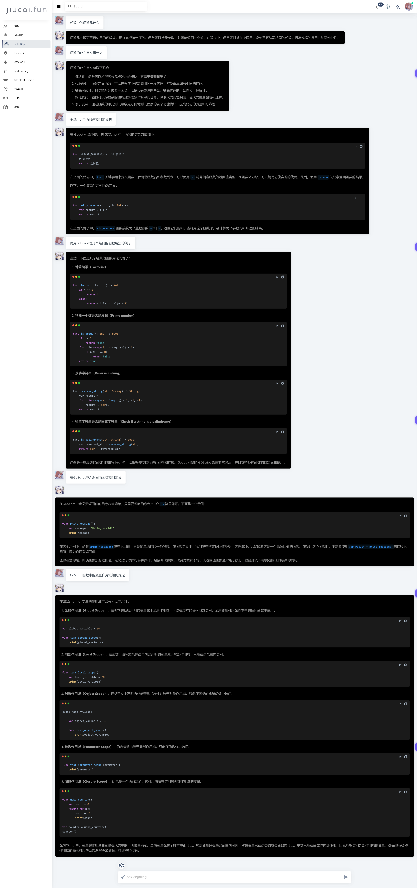

## 函数

- 【#编程通识#第十二课，什么是计算机函数？】 https://www.bilibili.com/video/BV1R4411G7vh/?share_source=copy_web&vd_source=5dbf211eec08e51a4c6d136972063c73

- 【#编程通识#第十三课，变量的作用范围是什么？】 https://www.bilibili.com/video/BV1R4411G7zp/?share_source=copy_web&vd_source=5dbf211eec08e51a4c6d136972063c73





-----------
> 问：代码中的函数是什么

```text
函数是一段可重复使用的代码块，用来完成特定任务。函数可以接受参数，并可能返回一个值。在程序中，函数可以被多次调用，避免重复编写相同的代码，提高代码的复用性和可维护性。
```


-----------
> 问：函数的存在意义是什么


```text
函数的存在意义有以下几点：
1. 模块化：函数可以将程序分解成较小的模块，更易于管理和维护。
2. 代码复用：通过定义函数，可以在程序中多次调用同一段代码，避免重复编写相同的代码。
3. 提高可读性：将功能拆分成若干函数可以使代码更清晰易读，提高代码的可读性和可理解性。
4. 简化代码：函数可以将复杂的功能分解成多个简单的任务，降低代码的复杂度，使代码更易编写和理解。
5. 便于测试：通过函数的单元测试可以更方便地测试程序的各个功能模块，提高代码的质量和可靠性。
```


-----------
> 问：GdScript中函数是如何定义的


在 Godot 引擎中使用的 GDScript 中，函数的定义方式如下：

```gd
func 函数名(参数列表) -> 返回值类型:
    # 函数体
    return 返回值
```

在上面的代码中，`func` 关键字用来定义函数，后面是函数名和参数列表。可以使用 `->` 符号指定函数的返回值类型。在函数体内部，可以编写功能实现的代码。最后，使用 `return` 关键字返回函数的结果。

以下是一个简单的示例函数定义：

```gd
func add_numbers(a: int, b: int) -> int:
    var result = a + b
    return result
```

在上面的例子中，`add_numbers` 函数接收两个整数参数 `a` 和 `b`，返回它们的和。当调用这个函数时，会计算两个参数的和并返回结果。


-----------
> 问：再用GdScript写几个经典的函数用法的例子


当然，下面是几个经典的函数用法的例子：

1. **计算阶乘（Factorial）**
```gd
func factorial(n: int) -> int:
    if n == 0:
        return 1
    else:
        return n * factorial(n - 1)
```

2. **判断一个数是否是质数（Prime number）**
```gd
func is_prime(n: int) -> bool:
    if n < 2:
        return false
    for i in range(2, int(sqrt(n)) + 1):
        if n % i == 0:
            return false
    return true
```

3. **反转字符串（Reverse a string）**
```gd
func reverse_string(str: String) -> String:
    var result = ""
    for i in range(str.length() - 1, -1, -1):
        result += str[i]
    return result
```

4. **检查字符串是否是回文字符串（Check if a string is a palindrome）**
```gd
func is_palindrome(str: String) -> bool:
    var reversed_str = reverse_string(str)
    return str == reversed_str
```

这些是一些经典的函数用法的例子，你可以根据需要自行进行调整和扩展。Godot 引擎的 GDScript 语言非常灵活，并且支持各种函数的自定义和使用。


-----------
> 问：再用GdScript写几个经典的函数用法的例子


当然，下面是几个经典的函数用法的例子：

1. **计算阶乘（Factorial）**
```gd
func factorial(n: int) -> int:
    if n == 0:
        return 1
    else:
        return n * factorial(n - 1)
```

2. **判断一个数是否是质数（Prime number）**
```gd
func is_prime(n: int) -> bool:
    if n < 2:
        return false
    for i in range(2, int(sqrt(n)) + 1):
        if n % i == 0:
            return false
    return true
```

3. **反转字符串（Reverse a string）**
```gd
func reverse_string(str: String) -> String:
    var result = ""
    for i in range(str.length() - 1, -1, -1):
        result += str[i]
    return result
```

4. **检查字符串是否是回文字符串（Check if a string is a palindrome）**
```gd
func is_palindrome(str: String) -> bool:
    var reversed_str = reverse_string(str)
    return str == reversed_str
```

这些是一些经典的函数用法的例子，你可以根据需要自行进行调整和扩展。Godot 引擎的 GDScript 语言非常灵活，并且支持各种函数的自定义和使用。


-----------
> 问：在GdScript中无返回值函数如何定义


在GDScript中定义无返回值的函数非常简单，只需要省略函数定义中的`->`符号即可。下面是一个示例：

```gd
func print_message():
    var message = "Hello, world!"
    print(message)
```

在这个示例中，函数`print_message()`没有返回值，只是简单地打印一条消息。在函数定义中，我们没有指定返回值类型，这样GDScript就知道这是一个无返回值的函数。在调用这个函数时，不需要使用`var result = print_message()`来接收返回值，因为它没有返回值。

值得注意的是，即使函数没有返回值，它仍然可以执行各种操作，包括修改参数、改变对象状态等。无返回值函数通常用于执行一些操作而不需要返回任何结果的情况。


-----------
> 问：GdScript函数中的变量作用域如何界定


在GDScript中，变量的作用域可以分为以下几种：

1. **全局作用域（Global Scope）**：在脚本的顶层声明的变量属于全局作用域，可以在脚本的任何地方访问。全局变量可以在脚本中的任何函数中使用。

```gd
var global_variable = 10

func test_global_scope():
    print(global_variable)
```

2. **局部作用域（Local Scope）**：在函数、循环或条件语句内部声明的变量属于局部作用域，只能在该范围内访问。

```gd
func test_local_scope():
    var local_variable = 20
    print(local_variable)
```

3. **对象作用域（Object Scope）**：在类定义中声明的成员变量（属性）属于对象作用域，只能在该类的成员函数中访问。

```gd
class_name MyClass:

    var object_variable = 30

    func test_object_scope():
        print(object_variable)
```

4. **参数作用域（Parameter Scope）**：函数参数也属于局部作用域，只能在函数体内访问。

```gd
func test_parameter_scope(parameter):
    print(parameter)
```

5. **闭包作用域（Closure Scope）**：闭包是一个函数对象，它可以捕获并访问其外部作用域的变量。

```gd
func make_counter():
    var count = 0
    return func():
        count += 1
        print(count)

var counter = make_counter()
counter()
```

在GDScript中，变量的作用域由变量在代码中的声明位置确定。全局变量在整个脚本中都可见，局部变量只在局部范围内可见，对象变量只在该类的成员函数内可见，参数只能在函数体内部使用，闭包能够访问外部作用域的变量。确保理解各种作用域的概念可以帮助您编写更加清晰、可维护的代码。
