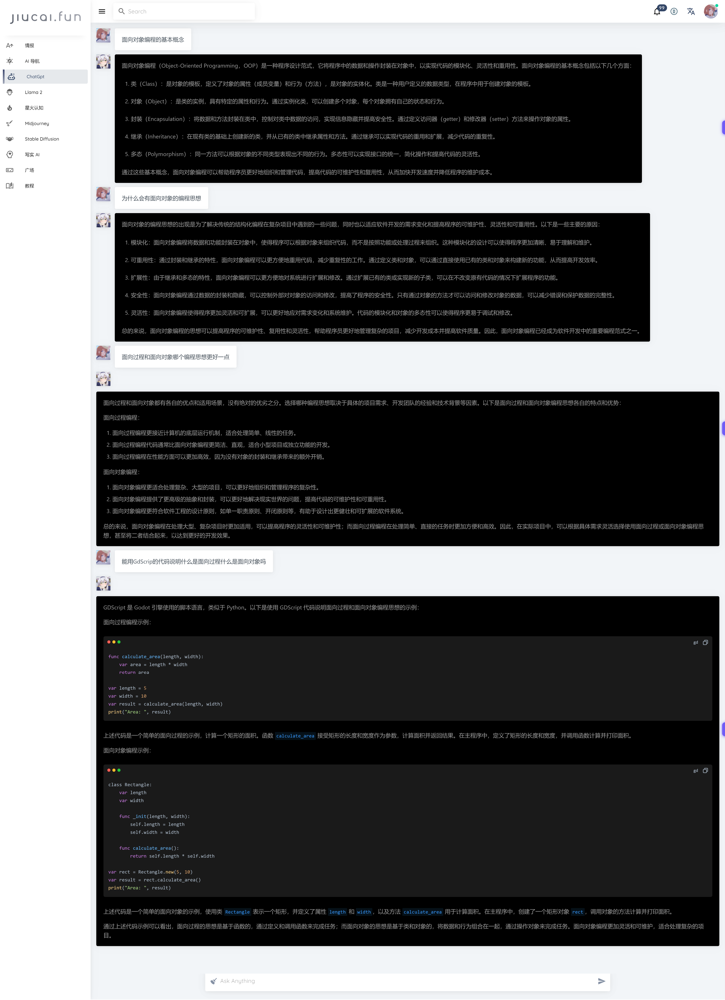

## 面向对象编程的基本概念


【5分钟通俗讲解面向对象编程】 https://www.bilibili.com/video/BV1pq4y1t7nA/?share_source=copy_web&vd_source=5dbf211eec08e51a4c6d136972063c73


【8分钟搞懂面向对象编程 | 面向过程vs面向对象 | OOP | 封装 继承 多态】 https://www.bilibili.com/video/BV1wZ4y1B7A7/?share_source=copy_web&vd_source=5dbf211eec08e51a4c6d136972063c73





-----------
> 问：面向对象编程的基本概念

```text
面向对象编程（Object-Oriented Programming，OOP）是一种程序设计范式，它将程序中的数据和操作封装在对象中，以实现代码的模块化、灵活性和重用性。面向对象编程的基本概念包括以下几个方面：

1. 类（Class）：是对象的模板，定义了对象的属性（成员变量）和行为（方法），是对象的实体化。类是一种用户定义的数据类型，在程序中用于创建对象的模板。

2. 对象（Object）：是类的实例，具有特定的属性和行为。通过实例化类，可以创建多个对象，每个对象拥有自己的状态和行为。

3. 封装（Encapsulation）：将数据和方法封装在类中，控制对类中数据的访问，实现信息隐藏并提高安全性。通过定义访问器（getter）和修改器（setter）方法来操作对象的属性。

4. 继承（Inheritance）：在现有类的基础上创建新的类，并从已有的类中继承属性和方法。通过继承可以实现代码的重用和扩展，减少代码的重复性。

5. 多态（Polymorphism）：同一方法可以根据对象的不同类型表现出不同的行为。多态性可以实现接口的统一，简化操作和提高代码的灵活性。

通过这些基本概念，面向对象编程可以帮助程序员更好地组织和管理代码，提高代码的可维护性和复用性，从而加快开发速度并降低程序的维护成本。
```


-----------
> 问：为什么会有面向对象的编程思想

面向对象的编程思想的出现是为了解决传统的结构化编程在复杂项目中遇到的一些问题，同时也以适应软件开发的需求变化和提高程序的可维护性、灵活性和可重用性。以下是一些主要的原因：

1. 模块化：面向对象编程将数据和功能封装在对象中，使得程序可以根据对象来组织代码，而不是按照功能或处理过程来组织。这种模块化的设计可以使得程序更加清晰、易于理解和维护。

2. 可重用性：通过封装和继承的特性，面向对象编程可以更方便地重用代码，减少重复性的工作。通过定义类和对象，可以通过直接使用已有的类和对象来构建新的功能，从而提高开发效率。

3. 扩展性：由于继承和多态的特性，面向对象编程可以更方便地对系统进行扩展和修改。通过扩展已有的类或实现新的子类，可以在不改变原有代码的情况下扩展程序的功能。

4. 安全性：面向对象编程通过数据的封装和隐藏，可以控制外部对对象的访问和修改，提高了程序的安全性。只有通过对象的方法才可以访问和修改对象的数据，可以减少错误和保护数据的完整性。

5. 灵活性：面向对象编程使得程序更加灵活和可扩展，可以更好地应对需求变化和系统维护。代码的模块化和对象的多态性可以使得程序更易于调试和修改。

总的来说，面向对象编程的思想可以提高程序的可维护性、复用性和灵活性，帮助程序员更好地管理复杂的项目，减少开发成本并提高软件质量。因此，面向对象编程已经成为软件开发中的重要编程范式之一。

-----------
> 问：能用GdScrip的代码说明什么是面向过程什么是面向对象吗

GDScript 是 Godot 引擎使用的脚本语言，类似于 Python。以下是使用 GDScript 代码说明面向过程和面向对象编程思想的示例：

面向过程编程示例：
```gd
func calculate_area(length, width):
    var area = length * width
    return area

var length = 5
var width = 10
var result = calculate_area(length, width)
print("Area: ", result)
```

上述代码是一个简单的面向过程的示例，计算一个矩形的面积。函数 `calculate_area` 接受矩形的长度和宽度作为参数，计算面积并返回结果。在主程序中，定义了矩形的长度和宽度，并调用函数计算并打印面积。

面向对象编程示例：
```gd
class Rectangle:
    var length
    var width

    func _init(length, width):
        self.length = length
        self.width = width

    func calculate_area():
        return self.length * self.width

var rect = Rectangle.new(5, 10)
var result = rect.calculate_area()
print("Area: ", result)
```

上述代码是一个简单的面向对象的示例，使用类 `Rectangle` 表示一个矩形，并定义了属性 `length` 和 `width`，以及方法 `calculate_area` 用于计算面积。在主程序中，创建了一个矩形对象 `rect`，调用对象的方法计算并打印面积。

通过上述代码示例可以看出，面向过程的思想是基于函数的，通过定义和调用函数来完成任务；而面向对象的思想是基于类和对象的，将数据和行为组合在一起，通过操作对象来完成任务。面向对象编程更加灵活和可维护，适合处理复杂的项目。

