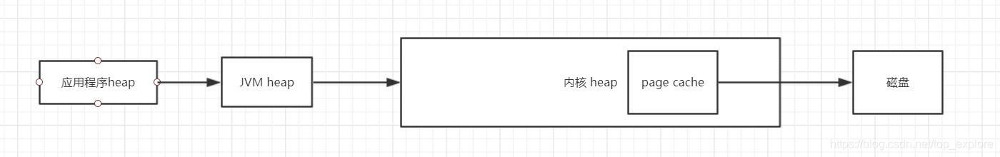

## 磁盘信息

- df 查看filesystem discription，将容量结果以易读的容量格式显示出来
    - df -h

- 列出所有磁盘的信息，使我们能够快速了解磁盘的布局、分区的大小和挂载情况等
    - lsblk
    - blkid

- 列出所有的partition
    - fdisk -l


### 硬件温度

- 主板各个传感器温度查看

```
apt install lm-sensors
sensors
```

- 硬盘温度

```
apt install smartmontools
smartctl -a /dev/sda
```

## 临时挂载磁盘

- 临时挂载

```
mount /dev/sdb1 /data  #将前者挂在到后者
mount -l        #观察目前已挂载的文件系统
umount /data   #卸除挂载点

挂载点选择：
1. 单一文件系统不应该被重复挂载在不同的挂载点(目录)中；
2. 单一目录不应该重复挂载多个文件系统；
3. 要作为挂载点的目录，理论上应该都是空目录才是。
Ext2文件系统主要有：boot sector, superblock, inode bitmap, block bitmap, inode table,
data block
```

## 永久挂载磁盘

- 格式化磁盘
    - mkfs.ext4 /dev/sdb1

- 创建要将磁盘挂载到的目录，如 /assets

- 编辑 /etc/fstab 文件，以便在系统启动时自动挂载磁盘，磁盘使用uuid的方式有更好的兼容性
    - vim /etc/fstab

```
盘符           挂载位置   文件类型   默认参数  能否被dump备份 是否检验扇区   
UUID=blkid       /data       xfs     defaults,        0       1 
```

- 挂载磁盘到目录
  - mount -a


## 磁盘分区

- 对磁盘进行分区，重新分区的话要用d命令把原先的分区删除，d删除分区，n新增分区，w保存，不要加上数字，是针对整个磁盘的操作
    - fdisk /dev/sdb

- 让核心更新partition table
    - partprobe

- 因为是给mongodb用的，所以我用 xfs 格式，要安装xfsprogs（当然也可以用 ext4 的）
    - apt install xfsprogs

- make filesystem 格式化分区，创建一个filesystem
    - mkfs.xfs /dev/sdb1

- 检查和修正文件系统错误的指令
    - fsck /dev/sdb1


## 磁盘合并扩容
- 扩展Linux根目录 /，使用home多余的空间

```
备份/home，tar，zip都可以
umount /home                                # 卸载home
lvremove /dev/mapper/centos-home            # 删除home目录所在的lv
df -h                                       # 此刻就没有home目录了
lvextend -L +10G /dev/mapper/centos-root    # 追加10G空间
xfs_growfs  /dev/mapper/centos-root         # 扩展/root的文件系统


lvcreate -L 40G -n /dev/mapper/centos-home  # 重新创建home目录的lv
mkfs.xfs  /dev/mapper/centos-home           # 创建文件系统
mount /dev/mapper/centos-home               # 把home目录挂载回去
还原备份的/home，完成扩展
```

- page cache，https://blog.csdn.net/top_explore/article/details/107726941

```
在不使用堆外内存的情况下，java在写文件时，先将字节写入JVM的堆内内存中；
然后调用jvm的写文件函数，将字节写入jvm的堆外内存中，jvm再调用系统内核的写文件函数，将字节写入内核的heap中；
然后内核将字节写入page cache中，将page cache状态改为dirty，根据page cache的回写机制在合适的时机将字节写入磁盘。

page cache的回写时机由系统配置/etc/sysctl.conf 中的几个参数决定，分别是：

dirty_background_bytes
当脏页所占的内存大小超过dirty_background_bytes时，内核的pdflush线程会从后台开始回写脏页，不会影响应用程序的后序IO操作。
dirty_background_ratio
当脏页所占的百分比（相对于所有可用内存，即空闲内存页+可回收内存页）达到dirty_background_ratio时内核的pdflush线程从后台开始回写脏页，不会影响应用程序的后序IO操作。增大会使用更多内存用于缓冲，可以提高系统的读写性能。当需要持续、恒定的写入场合时，应该降低该数值。
dirty_bytes
当脏页所占的内存数量达到dirty_bytes时，内核将脏页中的数据刷入磁盘并阻塞后序的IO操作。
dirty_ratio
当脏页所占的百分比（相对于所有可用内存，即空闲内存页+可回收内存页）达到dirty_ratio时，内核将脏页中的数据刷入磁盘并阻塞后序的IO操作。
```


