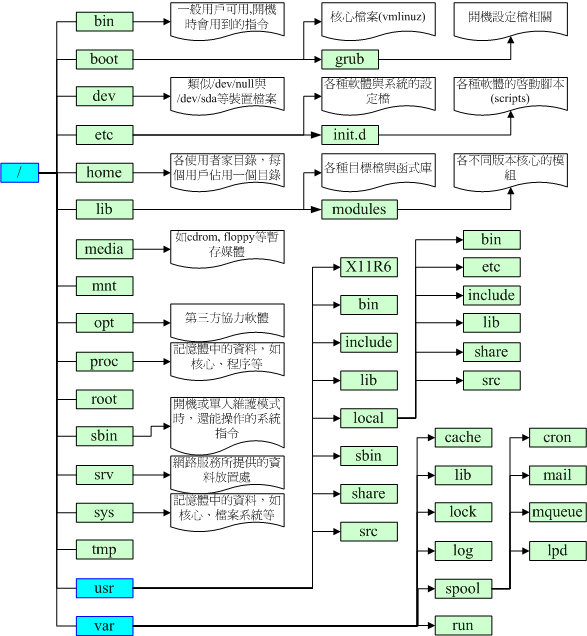

# Linux文件系统和相关指令

## 一、搜索文件指令

```
find / -mtime 0                 #0代表目前的时间
find /etc -newer /etc/passwd    #-newer file ：列出比 file 还要新的文件名
find /home -user jaysunxiao     #搜寻/home底下属于jaysunxiao的文件
find / -nouser                  #搜寻系统中不属亍任何人的文件
find / -name testfile           #搜寻某个文件名，'*httpd*'可以使用通配符
find / -size +1000k             #找出系统中，大于1MB的文件
find . -type f | xargs -n 10 grep "dir"     #当前文件夹下，包含dir关键字的文档，每次取10个
find . -type f | xargs -n 10 grep -l "dir"  #只取出文件的名称
```

## 二、创建文件/删除文件/移动文件/更改文件权限

### 1.创建文件

```
mkdir -p test1/test2/test3      #如果没有test2，则创建。没有-p选项则不创建
mkdir -m 711 test2              #建立权限为rwx--x--x的目录
mkdir testdir                   #建立新目录
touch testdir/testfile          #建立空的文件


ln /tmp/test.txt hard.txt       #hard link链接，硬链接就是同一个文件使用了多个别名，更改如何一个文件，两者都会改变
                                #解决了文件的共享使用，还带来了隐藏文件路径、增加权限安全及节省存储
ln -s /tmp/test.txt soft.txt    #建立一个符号链接，类似windows下的快捷方式类似
```

### 2.删除文件

```
rmdir -p test1/test2/test3      #全部删除
rm  -i  test*                   #将当前文件夹底下开头为test的文件和目录通通删除
rm  -r  /tmp/etc                # 将/tmp/etc/这个目录删除掉，如果不加-r删除不掉
rm  -rf ./test                  #将test文件夹强制删除，不询问
rm  -f  test.txt                #将test.txt文件强制删除
```

### 3.移动文件

```
cp  ~/.bashrc  /tmp/bashrc      #将家目录下的 .bashrc复制到/tmp下，并更名为bashrc
cp  -i  ~/.bashrc  /tmp/bashrc  #-i ：若目标文件已经存在时，会先询问是否进行(常用)
cp  -a ~/.bashrc  /tmp/bashrc   #-a将文件的所有特性都一起复制过来

mv mvtest mvtest2                   #将目录名称mvtest更名为mvtest2	
rename testfile newfile testfile    #将testfile文件重命名为newfile

```

### 4.更改文件权限

```
chmod 744 testdir               #变更权限r:4，w:2，x:1
chmod 600 testdir/testfile

su - jaysunxiao                 #switch user
chown jaysunxiao testdir        #改变档案拥有者，-R递归，文件夹下全部的归属都改变
chgrp                           #改变档案所属群组

umask 002                       #umask的分数是默认值需要减掉的权限，文件：666，文件夹：777
chattr +a testfile              #-a:文件将只能增加数据，不能删除也不能修改数据，root才能设定
                                #-i:让文件不能被删除、改名、无法写入或新增资料！』root才能设定
                                    
lsattr testfile                 #显示文件的隐藏属性
file testfile                   #观察文件的类型

# -rwxrw-r‐-
第一个字符代表文件（-）、目录（d），链接（l）
其余字符每3个一组（rwx），读（r）、写（w）、执行（x）
第一组rwx：文件所有者的权限是读、写和执行
第二组rw-：与文件所有者同一组的用户的权限是读、写但不能执行
第三组r--：不与文件所有者同组的其他用户的权限是读不能写和执行

#对文件来说，权限的效能为：
r：可读取此一档案的实际内容，如读取文本文件的文字内容等；
w：可以编辑、新增戒者是修改该文件的内容(但不能删除该文件)；
x：该档案具有可以被系统执行的权限。
对目录来说，权限的效能为：
r：(read contents in directory)
w：(modify contents of directory)
x：(access directory)
要开放目录给任何人浏览时，应该至少也要给予r及x的权限，但w权限不可随便给
```

## 三、查看文件指令

```
pwd                             #显示当前目录print working directory
du -sh file                     #disk usage以人类可读的方式显示文件大小，file可以为空表示当前目录
ls -al ~                        #列出/home/jaysunxiao目录下的所有文件，-l，包括文件夹下的文件夹和文件
cat testfile                    #concatenate  [kɒn'kætɪneɪt]，使连续，显示文件内容
cat -n testfile                 #显示文件内容，包括行号
tac testfile                    #从最后一行开始显示，可以看出tac是cat倒着写
nl testfile                     #类似cat -n testfile
more testfile                   #一页一页的显示文件内容，space向下翻页
less                            #和more类似，但是比more更好的是可以往前翻页，pagedown，pageup
head -n 20 testfile             #显示文件的头几行，默认显示10行
tail -n 20 testfile             #显示末尾几行
od testfile                     #以二进制的方式读取文件内容
od -t x testfile                # d：十进制；f ：浮点float；o ：八进制；x：十六进制
test -e testfile && echo "exist" || echo "Not exist"  
                                #存在，-f文件，-d文件夹，-e两者之和
```

## 四、vim指令

```
vim /etc/vimrc  #vim的配置文件
vim testfile    #用vim打开testfile
:set nu         #在vim中打开行号
:u              #回复到原始状态
:q!             #不存储直接离开
:sp testfile    #在新窗口中打开testfile文件，同时打开两个窗口
:%d             #删除全部的内容
/searchContent  #n向下搜索，N向上搜索

dd              #删除当前行
gg最后一行，yy复制当前行，p粘贴，dd删除当前行
G第一行，gg最后一行
yy复制当前行，p粘贴，dd删除当前行
ctrl+v选择，y复制，p粘贴，通用的规则
```

## 五、文件压缩/解压

- gzip

```
gzip -v file.txt        # 压缩file文件，只能压缩文件，不能压缩文件夹
gzip -d file.txt.gz     # 解压缩file的压缩文件file.gz
```

- tar

```
tar -cvf test.tar test      # -c: --create create a new archive 创建一个归档文件，x解压，v显示进度，f文件名
tar -xvf test.tar           # 解压
tar -xvf test.tar -C /tmp   # 将压缩文件test.tar解压到/tmp
```

- zip

```
# 需要先yum install zip，yum install unzip
zip -r test.zip testdir     # 压缩 testdir 目录，压缩成 test.zip 文件
unzip test.zip -d testdir   # 解压test.zip到testdir目录里面
unzip test.zip              # 如果不指定解压到的目录，则默认为解压到当前目录的test目录
```

## 六、文件下载和上传,linxu to windows

```
#lrzsz包安装完成后包括上传rz、下载sz命令。yum install lrzsz

#从Windows上传文件到Linux，输入rz命令后会弹出对话框，选择你要上传的文件，选择打开就上传到Linux主机。上传完可以使用ls 查看；
rz             

#从Linux主机下载文件，下载命令为sz，后面跟要下载的文件名；可以选择下载的保存文件夹；
sz myfile.sh

```

## 七、文件同步

- Rsync（remote synchronize）是一个远程数据同步工具，可通过LAN/WAN快速同步多台主机间的文件。 Rsync使用所谓的“Rsync算法”来使本地和远
  程两个主机之间的文件达到同步，这个算法只传送两个文件的不同部分，而不是每次都整份传送，因此速度相当快。

- 本地间同步

```
mkdir src
touch src/{1,2,3,4}
mkdir dest
rsync -av src/ dest/    #将src目录里的所有的文件同步至dest目录（目录带/，表示不包含src本身）
rsync -av src dest/     #将src目录包括自己整个同步至dest目录
```

- 不同主机之间同步

```
rsync -av 10.16.41.128:/app/b/ '-e ssh -l root -p 22' /app/a/
                        #通过ssh同步文件夹，将本机/app/a/文件夹下的文件同步到ip为128:/app/b路径下
```

## 八、Linux文件系统

```
unix2dos -k testfile  
                #转换为dos换行格式
dos2unix -k testfile
                #转换为unix的换行格式
```



```
/ (root, 根目录)：与开机系统有关；
/usr (unix software resource)：与软件安装/执行有关；
/var (variable)：与系统运作过程有关。

因此FHS标准建议：根目录(/)所在分割槽应该越小越好，且应用程序所安装的软件最好不要与根目录放在同一个分割槽内，保持根目录越小越好。 如此不但效能较佳，根目录所在的文件系统也较不容易发生问题。
开机过程中仅有根目录会被挂载，其他分割槽则是在开机完成之后才会持续的进行挂载的行为。就是因为如此，因此根目录下与开机过程有关的目录，就不能够与根目录放到不同的分割槽去！那哪些目录不可与根目录分开呢？有底下这些： 
/etc：配置文件，使用者合法shells，passwd，登入提示issue，vim配置文件vimrc
/bin：重要执行档
/dev：所需要的装置档案
/lib：执行档所需的函式库与核心所需的模块
/sbin：重要的系统执行文件

```
