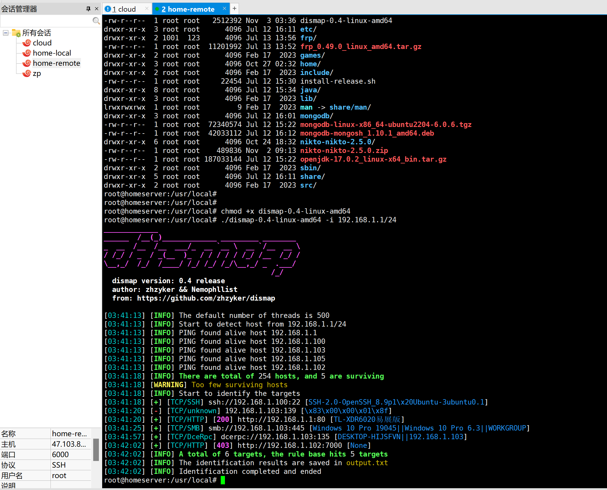

## nmap 主机地址和端口探测

```
# syn 测活 syn 扫描
nmap -PS -sS 192.168.1.1/24

# ack 测活 syn 扫描
nmap -PA -sS 192.168.1.1/24

# udp 测活 syn 扫描
nmap -PU -sS 192.168.1.1/24

# SCTP 测活 syn 扫描
nmap -PY -sS 192.168.1.1/24

# 不测活 syn 扫描
nmap -Pn -sS 192.168.1.1/24

# 扫描所有端口
nmap -p 1-65535 192.168.1.1
```

```
nmap localhost              #使用预设参数扫瞄本机所启用的 port (只会扫瞄 TCP)
nmap -sTU localhost         #同时扫瞄本机的 TCP/UDP 端口
nmap nmap -sP 192.168.1.0/24#透过 ICMP 封包的检测，分析区网内有几部主机是启动的
nmap 192.168.1.0/24         #将各个主机的启动的 port 作一番侦测
```

## dismap

- Dismap 定位是一个资产发现和识别工具，他可以快速识别 Web/tcp/udp 等协议和指纹信息，定位资产类型，适用于内外网，辅助红队人员快速定位潜在风险资产信息

- dismap -i 192.168.1.1/24

- 

## nikto 漏洞筛选

## xray

- Xray是一款功能强大的安全评估工具，支持主动、被动多中扫描方式，支持常见web漏洞的自动化测试，可以灵活定义POC，功能丰富，调用简单，支持多种操作系统
- 检测速度快，多线程，比较吃电脑性能

- xray webscan --url https://ws.jiucai.fun

