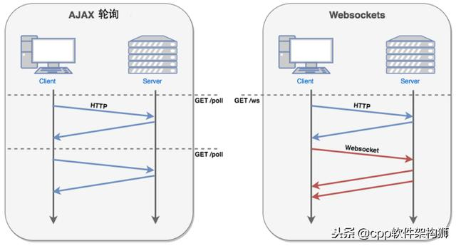
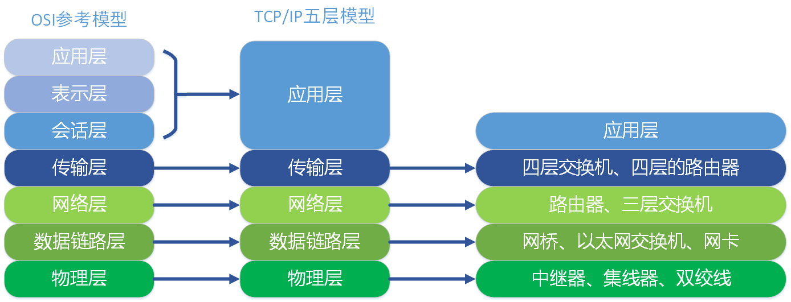

#网络状态查询

##一、网络常用
###1.指令

```
netstat -a      #网络状态
netstat -tlnp   #找出目前系统上已在监听的网络联机及其PID，tcp，listening，numeric，program
netstat -tulnp  #tcp,udp都显示出来
netstat -anp |grep tcp |wc -l   #查看tcp的连接数


vim /etc/hosts  #增加ip对应的地址，如localhost

ping ip         #ping通常是用来检查网络是否通畅或者网络连接速度的命令
telnet ip port  #telnet是用来探测指定ip是否开放指定端口的

tcpdump port 22         #监视指定主机和端口的数据包
tcpdump -i eth1         #监视指定网络接口的数据包
tcpdump tcp and port x  #指定协议和端口，xx为端口号，and可以省略不写
tcpdump host x          #指定来源IP或目标IP的包
```

###2.网络相关配置

- 系统配置，vim /etc/sysctl.conf

```

/sbin/sysctl -p     # 执行以下命令，使配置生效
```

- 文件句柄配置

```
cat /proc/sys/fs/file-nr    # 已经使用句柄查看，已分配文件句柄的数目，已分配未使用文件句柄的数目，文件句柄的最大数目
cat /proc/sys/fs/file-max   # 内核级句柄查看
ulimit -a                   # 系统级句柄查看
cat /proc/进程号/limits      # 程序级句柄查看

vim /etc/security/limits.d/20-nproc.conf    # 设置句柄，相同字段会覆盖下边的配置，重启服务器生效
```

- vim /etc/security/limits.conf # 设置句柄，重启服务器生效，设置如下

```
root soft nofile 65535
root hard nofile 65535
* soft nofile 65535
* hard nofile 65535
```

###3.端口查询

- ss -lptn 查看所有进程的端口占用情况

##二、ip & route

###1. 相关指令

```
route -n        #查看路由信息
route add -net 192.168.5.0 \ > netmask 255.255.255.0 dev eth0    #增加一个路由，必须网卡能够联系的到


arp -n                      #列出目前主机上面记载的 IP/MAC 对应的 ARP 表格
dmesg | grep -in eth        #观察核心所捉到的网卡信息

ifconfig                    #查看ip相关信息
ifconfig wlp3s0             #查看wlp3s0这个网卡的相关信息
ifconfig wlp3s0:0 192.168.25.141    #那就是在该实体网卡上，再仿真一个网络接口
ifconfig wlp3s0:0 192.168.25.141 netmask 255.255.255.0 up
ifconfig eth0:0 down        #关掉 eth0:0 这个界面

ethtool eth0                #查询eth0网卡设置信息

/etc/init.d/network restart #将手动的处理全部取消，使用原有的设定值重建网络参数
```

###2. iptables防火墙相关操作

- 关闭防火墙，这个便于测试环境测试（线上阿里云有自己的安全组，没有iptables也没有firewalld，这两个都是基于数据包的过滤）

```
centos7 中才开始引用firewalld的概念，它是iptables的升级版，Centos7默认是firewalld，一般可以禁用iptables，用默认的firewalld即可
systemctl status iptables                   # 查看防火墙的状态
systemctl stop iptables                     # 关闭防火墙
systemctl disable                           # 设置开启不自动启动
systemctl status firewalld
systemctl stop firewalld                    # 临时关闭防火墙
systemctl disable firewalld                 # 禁止开机启动
```

- 防火墙常用指令（zone是firewalld的单位，默认使用public zone）

```
firewall-cmd --state                        # running 表示运行
firewall-cmd --reload                       # 更新防火墙规则
firewall-cmd --get-default-zone             # 查看默认的zone
firewall-cmd --get-zones                    # 查看所有的zone
firewall-cmd --get-active-zones             # 查看区域信息
firewall-cmd --get-zone-of-interface=eth0   # 查看指定接口所属区域
firewall-cmd --zone=public --add-interface=eth0             # 给指定网卡设置zone，给eth0网卡的zone设置成pubilc
firewall-cmd --zone=dmz --change-interface=eth0             # 针对网卡更改zone，更改eth0网卡的zone为dmz
firewall-cmd --zone=dmz --remove-interface=eth0             # 针对网卡删除zone，删除eth0网卡的zone
```

- 防火墙开启某个端口

```
firewall-cmd --list-all                                     # 查看所有信息
firewall-cmd --permanent --zone=public --list-ports         # 查看所有打开的端口
firewall-cmd --permanent --zone=public --list-services      # 服务空格隔开 例如 dhcpv6-client https ss

firewall-cmd --permanent --add-service="http"               # 永久开启http
firewall-cmd --zone=public --query-port=80/tcp              # 查看80端口
firewall-cmd --permanent --zone=public --add-port=6379/tcp  # 开启80端口，返回success。
firewall-cmd --permanent --zone=public --remove-port=80/tcp # 删除80端口
iptables -nL | grep 80                                      # 检查设定是否生效

Secure SHell protocol  SSH安全的壳程序协议=shell + ftp  
```

- firewalld 的9个zone

```
public (公共) 在公共区域内使用，不能相信网络内的其它计算机不会对你的计算机造成危害，只接收经过选取的连接，如ssh。
drop (丢弃) 任何接收到的网络数据都被丢弃，没有任何回复，公有发送出去的网络连接
external （外部）特别是为路由器启用了伪装功能的外部网。你不能信任来自网络的其它计算，不能信任它们不会对你的计算机造成危害，只能接收经过选择的连接。
dmz (非军事区) 用于你的非军事区的电脑 ，此区域内可公开访问，可以有限的进入你的内部网络，仅接收经过选择的连接。
work (工作) 可以基本信任网络内的其它计算机不会危害你的计算机，仅接收经过选择的连接。
home (家庭) 用于家庭网络，可以基本信任网络内的其它计算机不会危害你的计算机，仅接收经过选择的连接，如ssh，dhcp。
internal （内部）用于内部网络，可以基本信任网络内的其它计算机不会危害你的计算机，仅接收经过选择的连接。
trusted (信任) 可接收所有的网络连接。
block（限制）任何接收的网络连接都被IPV4 的icmp-host-prohibited信息和IPV6的icmp6-adm-prohibited信息所拒绝。
```

###3. ip地址的分类


```
  IP:设定为 192.168.100.1~192.168.100.253 ，但 IP 不可重复；
  Netmask：255.255.255.0
  Network：192.168.100.0、Broadcast：192.168.100.255
  Default Gateway：192.168.100.254 (路由器的 IP)
  DNS：暂时使用 168.95.1.1


IP 的分级：

Class A :
 0xxxxxxx.xxxxxxxx.xxxxxxxx.xxxxxxxx ==> NetI_D 的开头是 0
|--net--|---------host------------|

Class B :
 10xxxxxx.xxxxxxxx.xxxxxxxx.xxxxxxxx ==> NetI_D 的开头是 10
|------net-------|------host------|

Class C : 
110xxxxx.xxxxxxxx.xxxxxxxx.xxxxxxxx ==> NetI_D 的开头是

Class D : 
1110xxxx.xxxxxxxx.xxxxxxxx.xxxxxxxx ==> NetI_D 的开头是

Class E : 
1111xxxx.xxxxxxxx.xxxxxxxx.xxxxxxxx ==> NetI_D 的开头是

Class A : 0.xx.xx.xx ~ 127.xx.xx.xx
Class B : 128.xx.xx.xx ~ 191.xx.xx.xx
Class C : 192.xx.xx.xx ~ 223.xx.xx.xx
Class D : 224.xx.xx.xx ~ 239.xx.xx.xx
Class E : 240.xx.xx.xx ~ 255.xx.xx.xx

Class D 是用来作为群播(multicast) 的特殊功能之用 (最常用在大批计算机的网络还原)
Class E 则是保留没有使用的网段
能够用来设定在一般系统上面的，就只有 Class A, B, C三种等级的 IP

Public IP : 公共IP，经由INTERNIC所统一规划的IP，有这种IP才可以连上 Internet

Private IP : 不能直接连上 Internet 的IP，主要用于局域网络内的主机联机规划:
Class A：10.0.0.0 - 10.255.255.255
Class B：172.16.0.0 - 172.31.255.255
Class C：192.168.0.0 - 192.168.255.255

loopback IP 网段：127.0.0.1
没有安装网络卡在的机器上面， 但是你又希望可以测试一下在你的机器上面设定的服务器环境到底可不可以顺利运作

子网掩码由连续的1和0组成，连续的1表示网络地址，连续的0表示主机地址，通过0的个数可以计算出子网的容量。
子网掩码的主要作用是用于划分子网的.
一个子网掩码没有任何意义，必须加上一个网段地址（子网第一个ip）或广播地址（子网最后一个ip）才有意义。

如：
Broadcast: 192.168.0.255
Netmask: 255.255.255.0
可推出：
网段地址为：192.168.0.0，只有同一个网段才能互相访问
同一个子网可容纳254个可用地址（去掉网段地址和广播地址）


如：
IP：192.168.0.50
Netmask: 255.255.255.0
可推出：
网段地址为：192.168.0.0，只有同一个网段才能互相访问
广播地址：192.168.0.255
同一个子网可容纳254个可用地址（去掉网段地址和广播地址）


Netmask: 255.255.255.0 <==网域定义中，最重要的参数
Network: 192.168.0.0 <==指定第一个 IP，就可以计算出下面的数值
Broadcast: 192.168.0.255 <==最后一个 IP
可用以设定成为主机的 IP 数：
192.168.0.1 ~ 192.168.0.254
```

##三、SELinux

```
ls -Z           #观察安全性文本
getenforce      #查看SELinux是否开启，建议关闭，
                #enforcing：强制模式，代表 SELinux 运作中；disabled：关闭
vim /etc/selinux/config   
                #设置SELinux的开启和关闭，必须要重新启动
```

#网络协议

##一、TCP
世界上不存在完全可靠的通信协议，即使是TCP，它的断开连接也是不安全的。

###1. 连接与断开

- TCCP的三次握手指的是客户端和服务器的连接与断开的过程，三次握手和四次挥手的简单版本如下面这张图所示：
  

- 前两次挥手用于断开一个方向的连接，后两次挥手用于断开另一方向的连接
  

- 使用wireshark抓包工具可以观察基本网络协议，这一过程中的三种报文是：SYN，SYN/ACK，ACK。可以轻松分辨出3次握手信号。

```
比如访问一个网站，可以看到浏览器所有的访问请求，如DNS解析，网站请求，资源下载。。。
```

###2. DOS攻击

```
SYN洪水攻击属于DOS攻击的一种，它利用TCP协议缺陷，通过发送大量的半连接请求，耗费CPU和内存资源。
客户端在短时间内伪造大量不存在的IP地址，向服务器不断地发送SYN报文，服务器回复ACK确认报文，并等待客户的确认，
由于源地址是不存在的，服务器需要不断的重发直至超时，这些伪造的SYN报文被丢弃，目标系统运行缓慢，严重者引起网络堵塞甚至系统瘫痪。
```

###3. ping攻击

```
许多操作系统的TCP/IP协议栈规定ICMP包大小为64KB，且在对包的标题头进行读取之后，要根据该标题头里包含的信息来为有效载荷生成缓冲区。
ping命令是ICMP的一种形式，它属于ICMP。
”死亡值ping”就是故意产生畸形的测试ping包，声称自己的尺寸超过ICMP上限，也就是加载的尺寸超过64KB上限，
使未采取保护措施的网络系统出现内存分配错误，导致TCP/IP协议栈崩溃，最终接收方宕机。 
```

###4. TCP粘包和拆包产生的原因

```
原因：
1）应用程序写入数据的字节大小大于套接字发送缓冲区的大小。
2）进行MSS大小的TCP分段。MSS是最大报文段长度的缩写。MSS是TCP报文段中的数据字段的最大长度。数据字段加上TCP首部才等于整个的TCP报文段。
   所以MSS并不是TCP报文段的最大长度，而是：MSS=TCP报文段长度-TCP首部长度
3）以太网的payload大于MTU进行IP分片。MTU指：一种通信协议的某一层上面所能通过的最大数据包大小。
  如果IP层有一个数据包要传，而且数据的长度比链路层的MTU大，那么IP层就会进行分片，把数据包分成托干片，让每一片都不超过MTU。
  注意，IP分片可以发生在原始发送端主机上，也可以发生在中间路由器上。

解决办法：
1）消息定长。例如100字节。
2）在包尾部增加回车或者空格符等特殊字符进行分割，典型的如FTP协议
3）消息分为消息头和消息尾。
```

###5. TCP的可靠性

```
TCP通过以下方式提供数据传输的可靠性：
（1）TCP在传输数据之前，都会把要传输的数据分割成TCP认为最合适的报文段大小。在TCP三次我握手的前两次握手中（也就是两个SYN报文段中），
    通过一个“协商”的方式来告知对方自己期待收到的最大报文段长度（MSS），结果使用通信双发较小的MSS为最终的MSS。
    在SYN=1的报文段中，会在报文段的选项部分来指定MSS大小（相当于告知对方自己所能接收的最大报文段长度）。在后续通信双发发送应用层数据之前，如果发送数据超过MSS，会对数据进行分段。

（2）使用了超时重传机制。当发送一个TCP报文段后，发送发就会针对该发送的段启动一个定时器。如果在定时器规定时间内没有收到对该报文段的确认，发送方就认为发送的报文段丢失了要重新发送。

（3）确认机制。当通信双发的某一端收到另一个端发来的一个报文段时，就会返回对该报文段的确认报文。

（4）首部校验和。在TCP报文段首部中有16位的校验和字段，该字段用于校验整个TCP报文段（包括首部和数据部分）。IP数据报的首部校验和只对IP首部进行校验。
    TCP详细的校验过程如下，发送TCP报文段前求一个值放在校验位，接收端接受到数据后再求一个值，如果两次求值形同则说明传输过程中没有出错；
    如果两次求值不同，说明传输过程中发生错误，无条件丢弃该报文段引发超时重传。

（5）使用滑动窗口流量控制协议。

（6）由于在TCP发送端可能对数据分段，那么在接收端会对接收到的数据重新排序。
```

###6. TCP报文长度是由什么确定的

- MSS: Maxitum Segment Size 最大分段大小
- MTU: Maxitum Transmission Unit 最大传输单元
- MSS就是TCP数据包每次能够传输的最大数据分段。为了达到最佳的传输效能TCP协议在建立连接的时候通常要协商双方的MSS值，这个值TCP协议在实现的时候往往用MTU值代替

```
这个跟具体传输网络有关，以太网的MTU为1500字节，Internet的MTU为576字节。
MTU是网络层的传输单元，那么MSS = MTU - 20字节（IP首部） - 20字节（TCP首部）。所以以太网的MSS为1460字节，而Internet的MSS为536字节。
```

###7. 滑动窗口协议

- 用于网络数据传输时的流量控制，以避免拥塞的发生。该协议允许发送方在停止并等待确认前发送多个数据分组。
  由于发送方不必每发一个分组就停下来等待确认，因此该协议可以加速数据的传输，提高网络吞吐量。
  

##二、HTTP
###1. HTTP命令

```
/etc/resolv.conf                            #DNS 服务器地址查询


curl https://www.baidu.com                  #网址的html会显示在屏幕上,这个方法也经常用于测试一台服务器是否可以到达一个网站
curl http://www.baidu.com >> /linux.html
curl -o /linux.html http://www.baidu.com    #两条命令都是保存访问的网页
curl -o /dev/null -s -w %{http_code} www.baidu.com  #测试网页返回的状态码，在脚本中，这是很常见的测试网站是否正常的用法
                
                
traceroute -n www.baidu.com                 #UDP:侦测本机到baidu去的各节点联机状态
traceroute -w 1 -n -T www.baidu.com         #TCP:侦测本机到baidu去的各节点联机状态
                
dig www.baidu.com                           #查看DNS服务器配置是否成功
dig -x 120.114.100.20                       #查询 120.114.100.20 的反解信息结果

whois baidu.com                             #查询领域管理者相关信息
```

###2. HTTP状态码分类

```
HTTP状态码由三个十进制数字组成，第一个十进制数字定义了状态码的类型，后两个数字没有分类的作用。
HTTP状态码共分为5种类型：
分类	分类描述
1**	信息，服务器收到请求，需要请求者继续执行操作
2**	成功，操作被成功接收并处理
3**	重定向，需要进一步的操作以完成请求
4**	客户端错误，请求包含语法错误或无法完成请求
5**	服务器错误，服务器在处理请求的过程中发生了错误

200 OK请求已成功，请求所希望的响应头或数据体将随此响应返回。出现此状态码是表示正常状态。

301 永久重定向，即URL已经发生了改变
302 临时重定向，即URL只是暂时发生改变
304 自从上次请求后，请求的网页未修改过。服务器返回此响应时，不会返回网页内容，进而节省带宽和开销。
    如果网页自请求者上次请求后再也没有更改过，您应将服务器配置为返回此响应（称为 If-Modified-Since HTTP 标头）。
    
401 请求需要进行验证
403 页面访问被禁止
404 请求的资源不存在
```

###3. HTTP的内容


###4. HTTP的持久连接和管线化
####持久连接
前面我们在说HTTP特点的时候说过， HTTP是一种无连接，无状态的协议。而TCP是有状态的长连接，为什么HTTP是基于TCP，但HTTP却是无连接？
因为HTTP每次请求完成后就会关闭TCP协议，但是我们可以通过编程自己控制TCP的关闭时间。由于每次请求都要连接TCP协议，效率很低，所以从HTTP/1.1过后，就开启了一个keep-Alive来保持连接，但是这个连接也是有时间限制的，不同的服务器有不同的处理，自己也可以设置。

####管线化
以前请求和响应模式基本是这样的：
请求1 -> 响应1 -> 请求2 -> 响应2 。。。
有了管线化过后请求和响应模式就变成了这样：
请求1 -> 请求2 -> 响应1 -> 响应2 。。。
也就是说，现在可以先一次进行很多次请求，而不是像以前那样，只有上一次的响应成功后才可以下一次请求，这样大大的提高了效率。

###5. HTTP,Webscoket，AJAX的关系
随着WEB信息量越来越大，HTTP的性能优化也变得越来越重要了，其中AJAX就是为了解决HTTP每次发送请求都会更新整个页面的问题，有的时候只是改变了一点点，甚至是无关紧要的东西时都会发生整个页面的更新，这样会造成很大的浪费。
所以出现了AJAX，AJAX是一个异步刷新技术，其核心在于XMLHttpRequest，如果不了解AJAX的可以看看我之前的这篇文章。
我们会发现无论怎么改，服务器都是处于被动状态，只能接受客户端的请求，这样客户端只有通过经常发送请求来确认是否有数据更新，但是大多数时候都是没有数据更新的，这样会造成很大的浪费.
所以就产生了webSocket协议，这个协议就是为了改变服务器的被动状态，使用这个协议后，服务端可以主动给客户端发送信息，这样就意味着客户端只需要一次请求，就可以保证数据的实时更新，而不是像之前那样定时发送AJAX请求的来实现定时更新
运用的最多的地方有网页上的聊天系统，游戏。


###6. get与post请求的区别

- get重点在从服务器上获取资源,post重点在想服务器发送数据;
- get传输数据是通过URL请求,以filed(字段)=value的形式,置于URL后,并用"?"连接,多个请求数据之间用
  "&"连接,如http://127.0.0.1/Test/login.action?name=admin&password=admin，这个过程用户是可见的

- get传输量小,因为受URL长度限制,但效率较低，post可以传输大量数据,所以上传文件时只能用post方式
- get是不安全的,因为URL是可见的,可能会泄露私密信息,如密码等
- post较get安全

#OSI参考模型

- OSI（Open System Interconnect），即开放式系统互联。 一般都叫OSI参考模型，是ISO（国际标准化组织）组织在1985年研究的网络互连模型。
  
  
  
