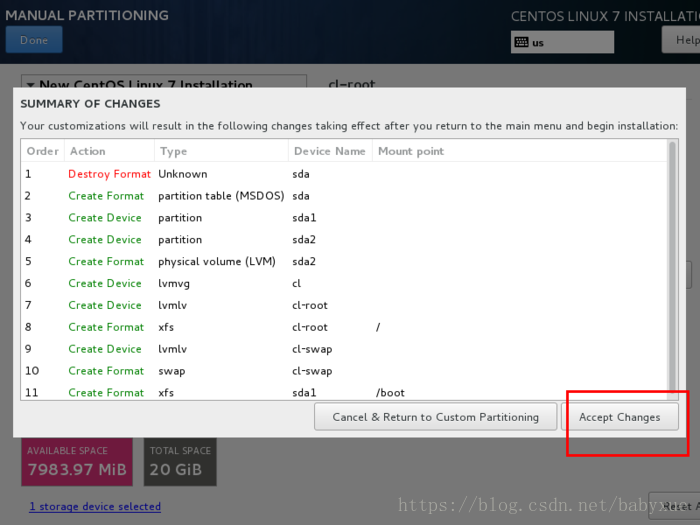

# 一、VMware安装
- 选择默认的安装方式，版本：VMware® Workstation 15 Pro

# 二、Linux安装
- 选择的Linux版本：CentOS-7-x86_64-DVD-1708.iso

## 1. 安装一个虚拟机
- 在主页选择，创建新的虚拟机->自定义(高级)
```
典型安装：VMwear会将主流的配置应用在虚拟机的操作系统上，对于新手来很友好。
自定义安装：自定义安装可以针对性的把一些资源加强，把不需要的资源移除。避免资源的浪费。
```
- 新建虚拟机向导->硬件兼容性，选择最高的即可
- 新建虚拟机向导->稍后安装操作系统
- 新建虚拟机向导->客户机操作系统的选择

- 新建虚拟机向导->虚拟机命名，选择合适的位置安装虚拟机，取一个好记的名字
- 新建虚拟机向导->处理器分配，处理器分配要根据自己的实际需求来分配。在使用过程中CPU不够的话是可以再增加的。我的：2-2-4
- 新建虚拟机向导->虚拟机内存，内存也是要根据实际的需求分配。我的：2g
- 新建虚拟机向导->网络类型，使用桥接网络。
```
桥接：选择桥接模式的话虚拟机和宿主机在网络上就是平级的关系，相当于连接在同一交换机上。
NAT：NAT模式就是虚拟机要联网得先通过宿主机才能和外面进行通信。
仅主机：虚拟机与宿主机直接连起来
```
- 新建虚拟机向导->其余两项按虚拟机默认选项即可
- 新建虚拟机向导->磁盘容量
```
磁盘容量暂时分配100G即可后期可以随时增加，不要勾选立即分配所有磁盘，否则虚拟机会将100G直接分配给CentOS，会导致宿主机所剩硬盘容量减少。
勾选将虚拟磁盘拆分成多个文件，这样可以使虚拟机方便用储存设备拷贝复制。
```

- 新建虚拟机向导->磁盘名称，默认即可
- 新建虚拟机向导->取消不需要的硬件，选择声卡、打印机等不需要的硬件然后移除。


## 2. 安装CentOS
- 连接光盘，右击刚创建的虚拟机，选择设置
- 先选择CD/DVD，再选择使用ISO映像文件，最后选择浏览找到下载好的镜像文件。启动时连接一定要勾选上后确定。

- 设置完成后，点击开启此虚拟机
- 安装操作系统，点击自动分配，系统会根据内存和磁盘合理的分配空间
```
DATE&TIME->Asia-ShangHai
SOFT SELECTION->Minmal Install
INSTALLATION DESTINATION->
/        50g    xfs  LVM   类似于windows的C盘系统位置 
/home   40g    xfs  LVM     日志存放的位置
swap     2g     swap LVM    一般和内存相等
LVM：这是一种可以弹性增加/削减文件系统容量的设备设置，我们会在后面的章节持续介绍 LVM 这个有趣的东西！
```
- 给其他三个区分配好空间后点击Done，然后会弹出摘要信息，点击AcceptChanges(接受更改)

- 打开网卡，然后查看是否能获取到IP地址(我这里是桥接)，再更改主机名后点击Done。

- Begin Installation(开始安装)，设置root密码

# 三、桥接模式网络配置,设置固定IP的方法
## 1. 虚拟网络编辑器设置
- 只需要设置桥接模式
```
现在的VMware比较智能，桥接到直接用自动就可以了，VMware会自动桥接到可用的网卡，如果有多个网卡，选择一个你用到的网卡
```


## 2. Linux配置文件设置
- 修改/etc/sysconfig/network-scripts/ifcfg-ens33
```
TYPE="Ethernet"             # 网络类型为以太网
BOOTPROTO="static"          # static静态ip，而不是dhcp自动获取ip地址
NAME="ens33"                # 网卡设备名，设备名一定要跟文件名ifcfg-ens33一致
DEVICE="ens33"              # 网卡设备名，设备名一定要跟文件名ifcfg-ens33一致
IPADDR="192.168.1.10"       # 设置我想用的静态ip地址，要和物理主机在同一网段，但又不能相同。需要在使用ipconfig查看物理主机的信息。
GATEWAY="192.168.1.1"       # 网关和物理主机一样
NETMASK="255.255.255.0"     # 子网掩码，和物理主机一样就可以
DNS1="8.8.8.8"              # DNS，8.8.8.8为Google提供的免费DNS服务器的IP地址，114.114.114.114为中国移动提供的DNS
ONBOOT="yes"                # 开机启用网络配置
```


## 3. 配置公共DNS服务(可选)
- 修改/etc/resolv.conf文件里增加如下配置
```
nameserver 8.8.8.8
```

## 4. 配置网络工作
- 修改/etc/sysconfig/network文件里增加如下配置
```
NETWORKING=yes # 网络是否工作，此处一定不能为no
```

## 5. 关闭防火墙
```
systemctl stop firewalld # 临时关闭防火墙
systemctl disable firewalld # 禁止开机启动
```

## 6. 重启网络服务
```
systemctl restart network
```

## 7. 测试
```
虚拟机 ping 物理主机
物理主机 ping 虚拟机
虚拟机测试外网：www.baidu.com
```

# 四、VMware克隆虚拟机
1. 在需要克隆的虚拟机上右键：管理->克隆->下一步->虚拟机中的当前状态->创建完整克隆
2. vim /etc/sysconfig/network-scripts/ifcfg-ens33，修改IPADDR地址，桥接模式为自动的话，可以不用设置HWADDR
3. 设置好ip后还需要把ip与主机名对应起来
4. systemctl restart network
```
hostname        # 查看主机名使用命令

vim /etc/sysconfig/network，修改主机名，在最后一行加上HOSTNAME=rocketmq-singleton，其它的服务器同理

vim /etc/hosts，修改为我们设置的主机名，不同的主机对应不同的mongodb-config0
127.0.0.1   localhost rocketmq-singleton localhost4 localhost4.localdomain4
::1         localhost rocketmq-singleton localhost6 localhost6.localdomain6

192.168.1.10 centos-root
192.168.1.15 centos-root-test


192.168.1.25 centos-all

192.168.1.30 mongodb0
192.168.1.31 mongodb1
192.168.1.32 mongodb2

192.168.1.40 mongodb-config0
192.168.1.41 mongodb-config1
192.168.1.42 mongodb-config2

192.168.1.45 mongodb-route0
192.168.1.46 mongodb-route1
192.168.1.47 mongodb-route2

192.168.1.50 mongodb-shard0
192.168.1.51 mongodb-shard1
192.168.1.52 mongodb-shard2
192.168.1.55 mongodb-shard3-replica0
192.168.1.56 mongodb-shard3-replica1
192.168.1.57 mongodb-shard3-replica2

192.168.1.60 rocketmq-singleton
192.168.1.61 rocketmq-cluster-nameserver0
192.168.1.62 rocketmq-cluster-nameserver1
192.168.1.65 rocketmq-cluster-broker0
192.168.1.66 rocketmq-cluster-broker1
```
