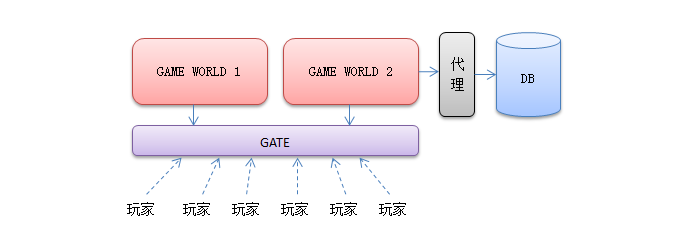
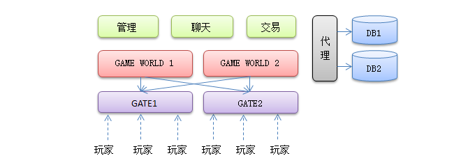

# 第1代游戏服务器


- MUDOS是采用C语言开发的文字游，因为玩家和玩家之间有比较强的交互（聊天，交易，PK），MUDOS使用单线程无阻塞套接字来服务所有玩家，所有玩家的请求都发到同一个线程去处理
- 用户使用 Telnet之类的客户端用 Tcp协议连接到 MUDOS上，使用纯文字进行游戏，每条指令用回车进行分割。
- 每个用户登录时，从文本文件里把用户的数据全部加载进来，操作全部在内存里面进行

# 第2代游戏服务器


- 最先承受不住的其实是很多小文件，用户上下线，频繁的读取写入用户数据，导致负载越来越大。因此第一步就是拆分文件存储到数据库去。

# 第3代游戏服务器


- 上层开始使用用扩展性更好的Python或者Lua来代替
- 开始拆分游戏世界

# 第4代游戏服务器


- 游戏服务器压力拆分后得意缓解，但是两台游戏服务器同时访问数据库，大量重复访问，大量数据交换，使得数据库成为下一个瓶颈。
- 于是形成了数据库前端代理（DB Proxy），游戏服务器不直接访问数据库而是访问代理，再有代理访问数据库，同时提供内存级别的cache。

# 第5代游戏服务器



- 游戏服务器多了以后，相互之间数据交互又会变得比较麻烦，于是人们拆分了网络功能，独立出一个网关服务Gate
- 让用户统一去连接一个网关服务器，再有网关服务器转发数据到后端游戏服务器
- 游戏服务器之间数据交换也统一连接到网管进行交换
- 这是目前应用最广的一个模型，到今天任然很多新项目会才用这样的结构来搭建。

# 第6代游戏服务器



- 继续拆分，逻辑功能可以拆分聊天交易，微服务
- 继续拆分，数据库可以搞分布式

```
现今在游戏成功率不高的情况下，一开始上一套比较复杂的架构需要考虑投资回报率，比如你的游戏上线半年内流水能到多少？
如果一个APRG游戏，每组服务器5千人都到不了的话，那么选择一套更为贴近实际情况的结构更为经济。
即使后面你的项目真的超过5千人朝着1万人目标奔的话，相信那个时候你的项目已经挣大钱了，到时候可以继续升级你的服务器架构.
```

**以上资料来源，[端游、手游服务端常用的架构是什么样的？ - 韦易笑的回答 - 知乎](https://www.zhihu.com/question/29779732/answer/45791817)**