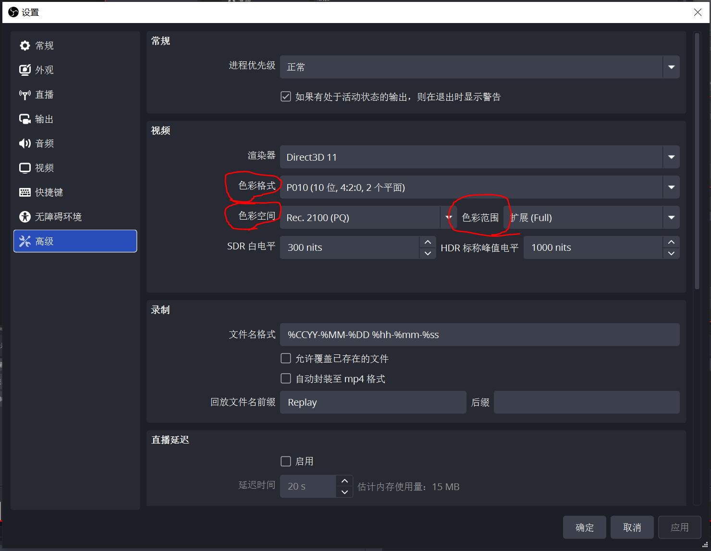
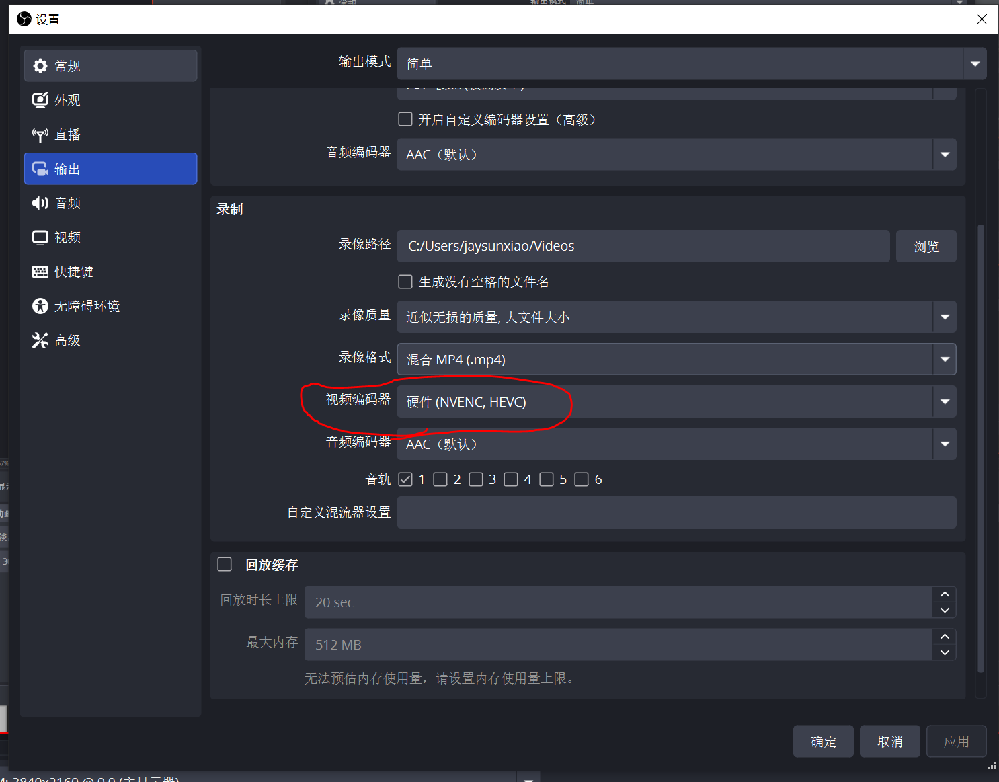
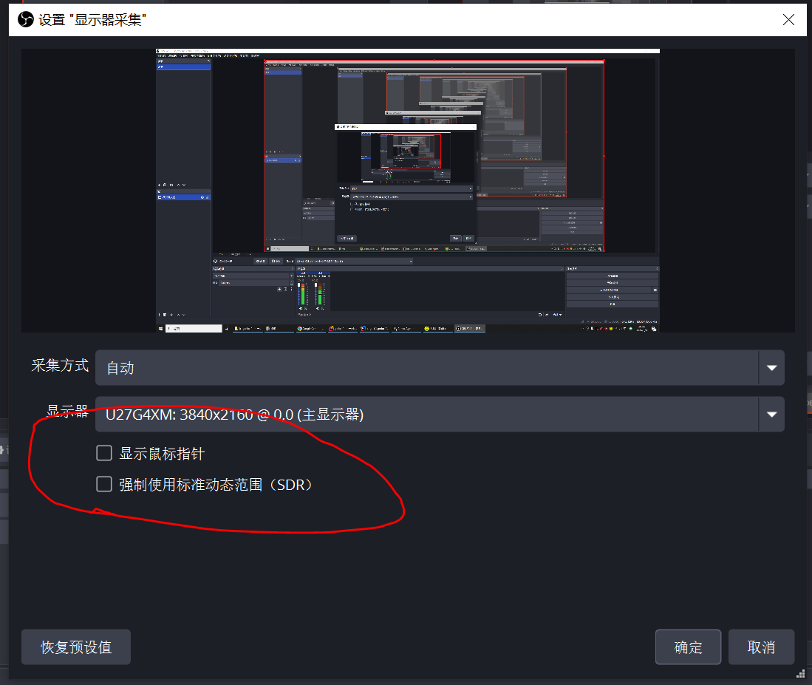

### 因为现在的高端显示器都是HDR

如果你的显卡较新（例如 RTX 30系列、RTX 40系列或更新的显卡），但依然报错，说明是**编码器选错了或没开启对应的 HEVC/AV1 支持**：

1. **检查输出编码器设置：**
* 打开 **“设置” -> “输出”**（输出模式选为“高级”）。
* 在“录像”标签页中，将编码器（Encoder）从旧的 H.264 改为 **`Hardware (NVENC, HEVC)`**（H.264 编码器通常不支持 10-bit，必须使用 HEVC 或 AV1 才能做 10-bit 编码）。

2. **确保高级设置中的格式匹配：**
* 回到 **“高级”** 设置页，确保色彩格式是 `P010`，色彩空间是 `Rec. 2100 (PQ)` 或 `Rec. 2100 (HLG)`。

