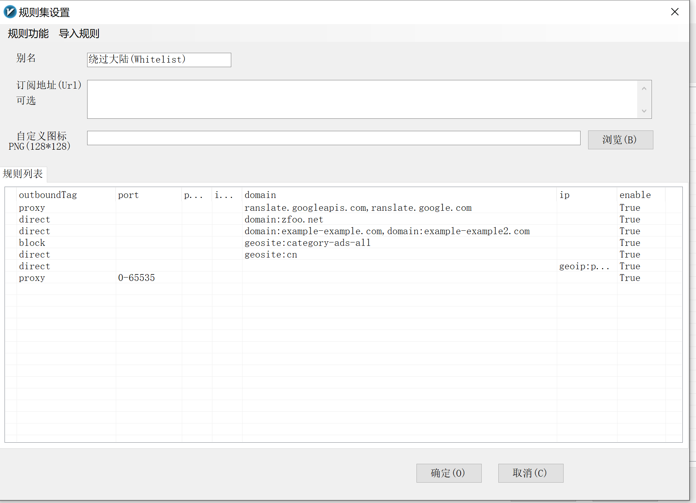
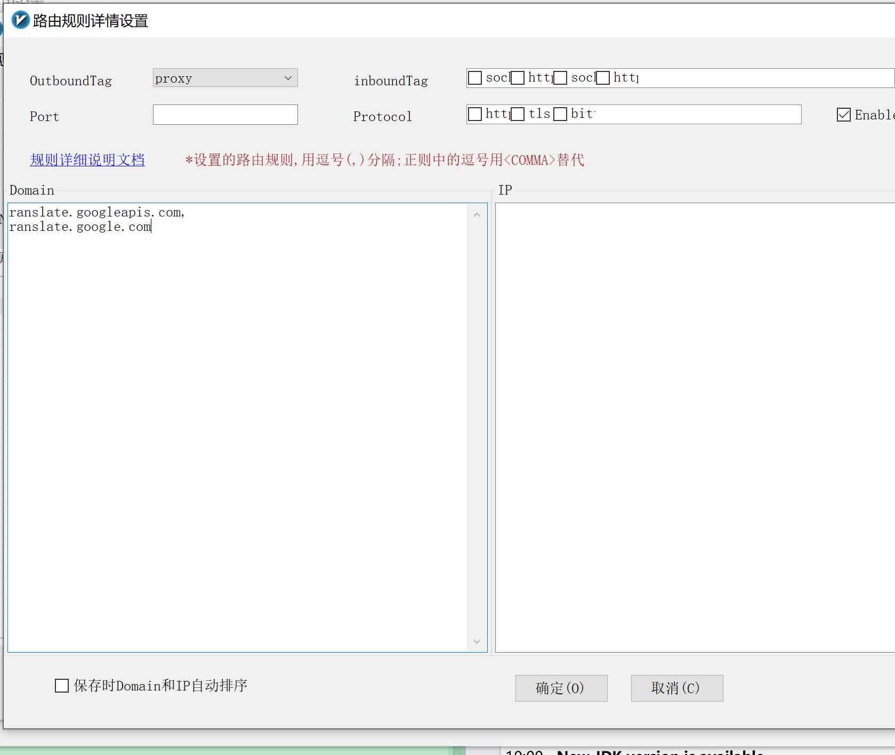

### Windows



- proxy新加，适配google翻译
  

```
ranslate.googleapis.com,
ranslate.google.com
```

- direct，直接访问，设置自己的本地域名，这个不需要新建，v2ray一般自己带了一个默认的设置

```
domain:zfoo.net,
domain:jiucai.fun,
domain:cls.cn,
domain:xf-yun.com,
domain:eastmoney.com,
```

### Linux

- https://www.v2fly.org/
```
# 网络不好就多试几次，这个是从github安装的，有时候容易抽风
bash <(curl -L https://raw.githubusercontent.com/v2fly/fhs-install-v2ray/master/install-release.sh)
bash <(curl -L https://github.com/v2fly/fhs-install-v2ray/master/install-release.sh)

# 如果上面的脚本因为网络问题安装不成功，则从 https://github.com/v2fly/fhs-install-v2ray 直接下载安装脚本直接运行
# 如果github.com下载文件过慢则多试几次
```

- 在 Linux 中，配置文件通常位于 /etc/v2ray/ 或 /usr/local/etc/v2ray/ 目录下
```
原生的V2ray并不支持订阅，反正我本来就在windows下用的，
直接在v2rayN的客户端，服务器列表中中右键->【导出所选服务器为客户端配置】，保存成config.json文件。
然后把这个config.json文件也上传到 /usr/local/etc/v2ray/ 目录中。
```

- 启动v2ray服务
```
# 启动V2ray
systemctl start v2ray

# 检查V2ray状态
systemctl status v2ray

# 设置V2ray开机自启动
systemctl enable v2ray

```

- 检验代码是否生效

```
curl -x socks5://127.0.0.1:10808 https://www.google.com -v
```
