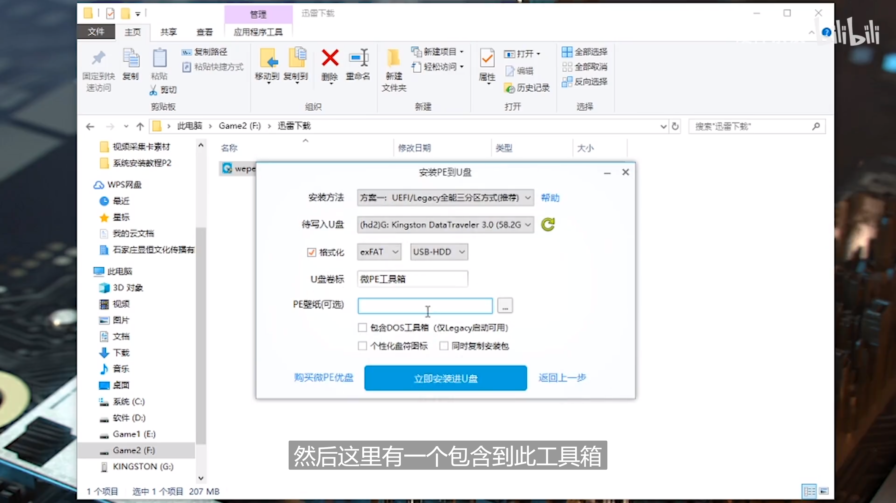
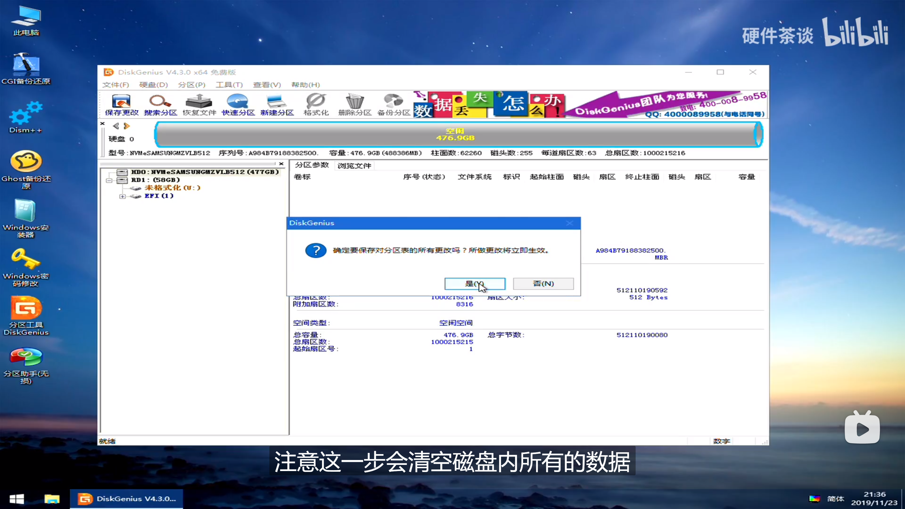

### U盘启动器

- 格式化U盘备用

### 安装wepe

- 下载wepe，然后启动安装到U盘，注意是安装到U盘，使用默认的安装方式

### Windows镜像文件

- 从 next.itellyou.cn 下载windows的 ISO 镜像文件，优先选择ISO文件
- 将操作系统 iso 或者 gho 文件复制到U盘中
- 至此U盘制作工具完成

### 分区

- 重启电脑，按住DEL进入BIOS界面，将U盘制作工具设置为启动盘
- 重启电脑，进入PE操作系统
- 使用分区工具，给已经有分区的硬盘，删除所有分区，并且重新分区硬盘

- 转换分区表的类型，UEFI对应GUID即GPT分区，Legacy对应MBR分区

- 快速分区，然后4k对齐，选择4096，确定保存
- 如果是ISO文件操作系统，则直接安装
- 如果是GHO 文件操作系统，则使用备份还原，然后装系统

### 激活

- KMS
- Windows Update Blocker，停止更新

### Windows 10 优化策略

- 设置 | 更新和安全 | 传递优化，这个会占用网络带宽，全部关闭

- 设置 | 系统 | 电源和睡眠 | 其它电源设置 | 选择电源按钮的功能，快速启动会占用大量C盘空间，关闭快速启动

- 设置 | 系统 | 远程桌面，远程桌面会启动端口，有隐私泄露风险，关闭设置

- 设置 | 隐私 | 常规，全部关闭，没有什么用的功能

- 设置 | 应用 | 应用和功能，将安装软件来源的任何位置，改为安装不是Microsoft Store提供的应用前向我发出警告，可以避免安装垃圾软件
