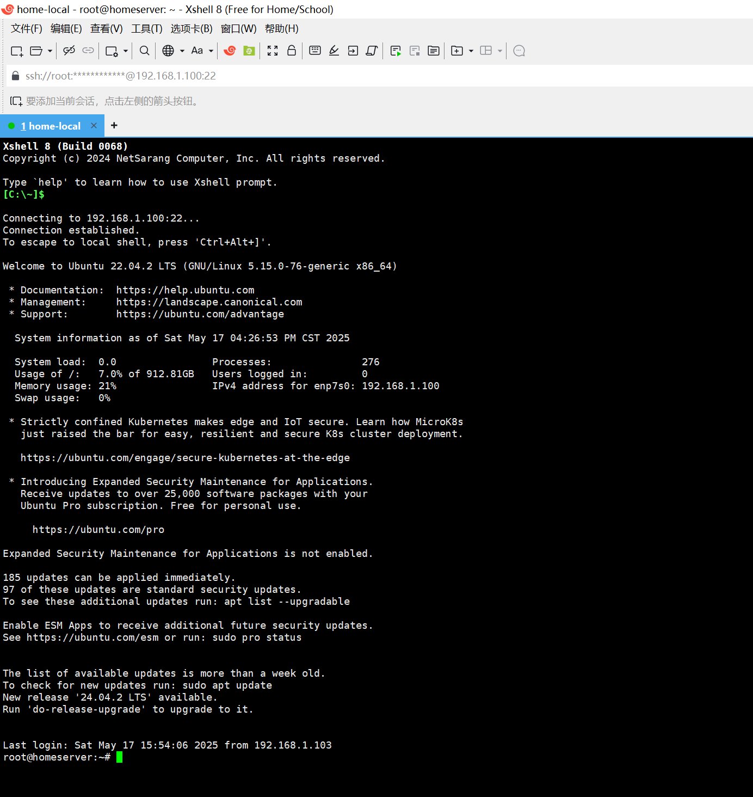
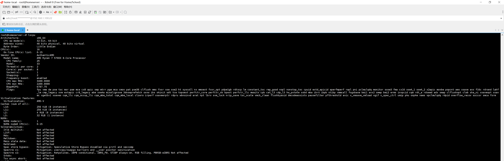
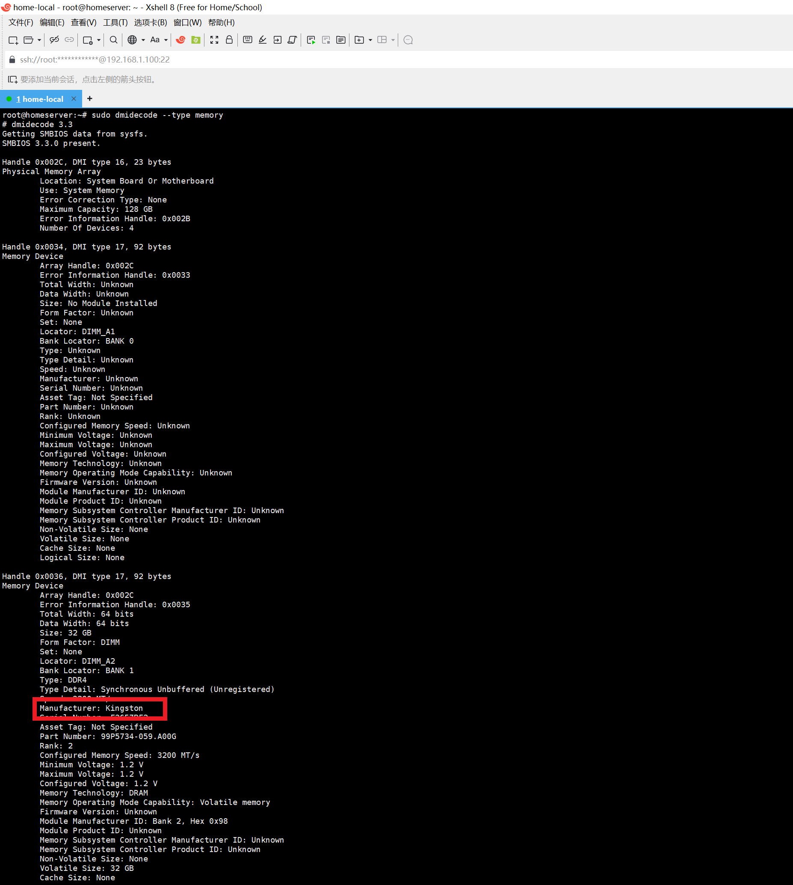
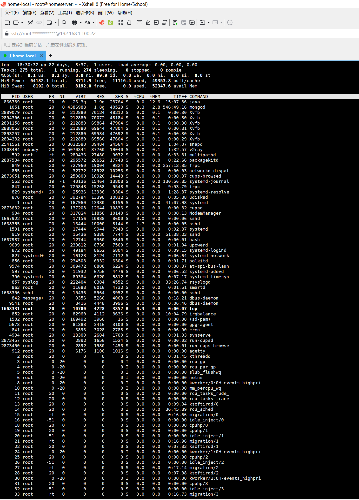

# 系统信息

# Cpu信息

# 内存信息

# 运行程序

## 内容

两年前，我在家里搭建了一台服务器，做了一个AI网站。

从零开始，我把ChatGPT、Stable Diffusion、Midjourney、DeepSeek……一个个搬上去，全部免费。

那时候每天都有人来用，我修Bug、加新功能，和很多人交流AI的可能性。

我只是想做点有趣的事，给大家一个可以自由探索AI的空间。

这两年，走得不算快，但走得很踏实。

只是现在，流量渐渐少了。维护的成本、时间，变得有点吃力。

所以，是时候说再见了。这个服务器，将在近期关闭。

但这一段旅程，我会一直记着。

谢谢曾经用过、支持过、鼓励过的人。

这是结束，也是新的开始。

——再见，我的AI小站。

