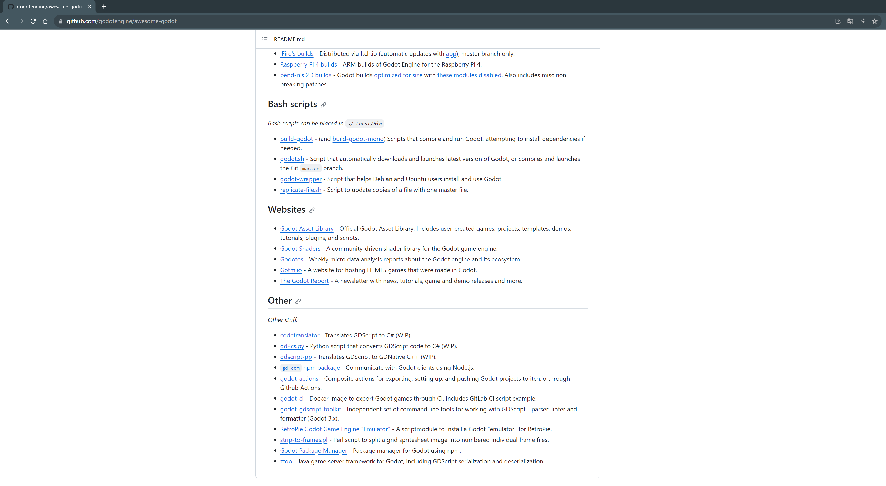

# 1. Background of zfoo

## For security reasons, many industries do not need to disclose the protocol format of network communication protocols.


- For example, the securities and finance industry involves financial transactions, and it is preferable to keep these transactions as private as possible, to avoid others from seeing them.

```
1. High Security Requirements: The financial industry deals with a significant amount of sensitive information, such as bank accounts and transaction records. To ensure data security, financial institutions typically use proprietary communication protocols developed in-house or provided by specific vendors to ensure security and prevent malicious attacks.

2. Fixed Partnerships: Financial institutions often have fixed business partners, such as other financial institutions and payment providers, and the communication requirements between these parties are stable. Therefore, using undisclosed protocol formats can improve the efficiency and stability of network communication.

3. Market Competition and Trade Secrets: The financial industry is highly competitive, and each institution wants to protect its business secrets, including trading strategies and algorithms. Public communication protocol formats may expose these trade secrets, so the financial industry tends to use undisclosed protocol formats.
```


- Similarly, the gaming industry has strict security requirements for network communication protocols.

```
1. Copyright Protection: The gaming industry is highly creative and competitive. Game developers often use their own unique network communication protocols to protect their intellectual property and copyrights, preventing other developers from illegally copying or imitating their games. Therefore, undisclosed protocol formats can increase the difficulty of piracy prevention and copyright protection.

2. High Security Requirements: Games involve sensitive data like user information and in-game transactions. To safeguard player account security and prevent cheating, game developers typically use proprietary communication protocols developed in-house or provided by specific vendors to ensure security and prevent malicious attacks.

3. Game Customization: Different games have significant differences in functionality and gameplay. Game developers often need to customize network communication protocols to meet the specific requirements of their games. Therefore, using undisclosed protocol formats can better achieve game customization and personalization.
```

## Performance considerations: Many industries have high network performance requirements.


- The financial industry's network communication protocols require high performance because the speed of transactions and data transmission is crucial in financial markets. In the financial industry, every second of transaction speed and real-time data delivery latency is of paramount importance to traders and investors.

```
1. The performance of network communication protocols directly affects the speed of trade execution and the real-time nature of data. Higher performance means faster transmission speed and lower latency, enabling more timely execution of trades and receipt of market data.

2. Fast trade execution speed is particularly important for high-frequency traders. High-frequency trading involves executing a large number of trades quickly to profit from small price movements. This strategy requires extremely fast trade execution, and the performance of communication protocols directly impacts efficiency and profits.

3. Additionally, the financial industry has high requirements for real-time data transmission. Traders and investors need timely access to market data, including stock prices, futures quotes, economic indicators, and more. Poor protocol performance can lead to delayed data transmission, affecting trading decisions and investment outcomes.
```


- The gaming industry's network communication protocols require high performance because online games demand low latency, fast data transmission, and stable connections.

```
1. Games require low-latency network communication protocols to ensure that players' in-game actions are immediately relayed to the server and the real-time updates of other players' states. Lower latency allows players' actions to be perceived by the server and other players more quickly, enhancing gameplay and realism.

2. Games require fast data transmission, especially in large-scale multiplayer online games or games that involve a significant amount of real-time data transmission (such as shooting games). High-speed data transmission ensures a smooth gaming experience, avoiding lag or high latency issues.

3. Online games necessitate stable connections to prevent players from encountering disconnections or network issues during gameplay. A stable connection is fundamental to the gaming experience, as interruptions or connectivity problems can significantly impact the player's experience.
```

- [How to view the popularity of "Genshin Impact" private servers?](https://www.zhihu.com/question/531266095/answer/2502012979)

# 2. Introduction to zfoo


- [A communication network library with decentralized protocols, allowing everyone to have a unique protocol](https://github.com/zfoo-project/zfoo)

- zfoo is an application-layer network protocol that allows for custom protocol rules while balancing compatibility and performance.



- [Already submitted to awesome godot](https://github.com/godotengine/awesome-godot), currently, there is no backend framework with better support for GdScript than zfoo.

# 3. Why did zfoo go open source and then seemingly disappear?

- This year, the focus is primarily on researching AI technology and has led to new considerations.

- Technically, zfoo has already reached a stable state with no significant updates needed.

- There will mainly be maintenance rather than major updates, and this is not a strict "disappearance." The focus is shifting towards game development using the Godot engine.

- Open-source projects involve more than one developer, and more responsibilities are being delegated to other developers.